# AI 时代

##### 2020/03/22

机器学习是什莫: 用已有的数据 来训练某种模型,利用此模型预测未来

机器学习Machine Learning 是人工智能的核心


机器学习  ====>数据为王 思想   (同时数据要多)   

机器学习要素  数据要多 数据要好  合适的算法  

 模型越准 预测的越精确

古人云 :  历史往往不一样,但历史总是惊人的相似	

特征工程  算法参数调优


机器学习 是一门交叉学科  

> > > 模式识别   == 机器学习
> > >
> > > 数据挖掘 ETL == 机器学习+数据库
> > >
> > > 计算机视觉 == 机器学习+图像处理
> > >
> > > 语音识别 == 机器学习+语音处理
> > >
> > > 统计学习  == 近似等于机器学习
> > >
> > > 自然语言处理 NLP  == 机器学习+文本处理


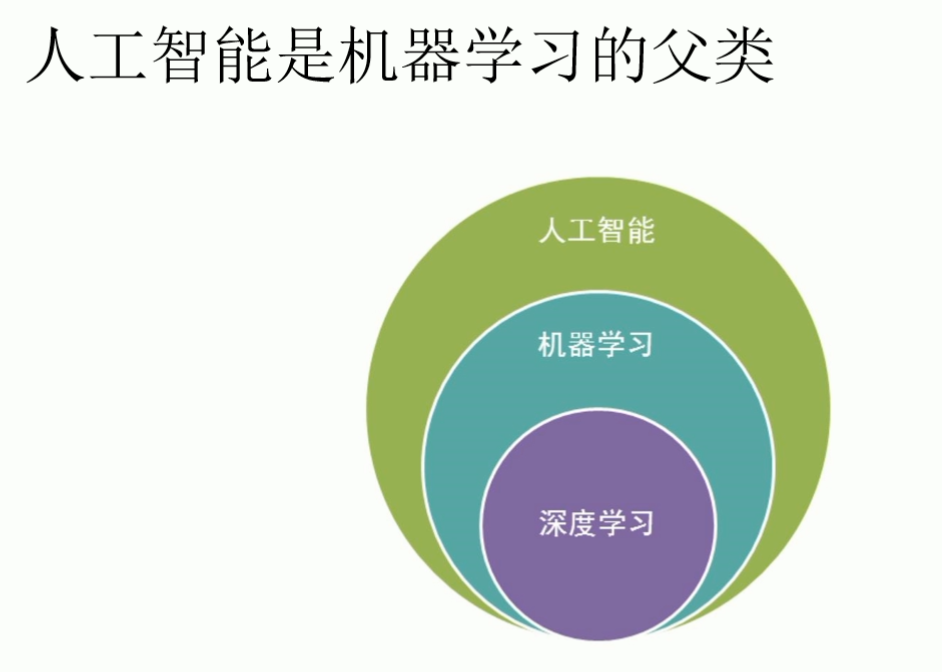 


人工智能 是一个很宽泛的概念

example :有监督的机器学习  预测人的健康状况  


w  为权重 

a 近似等于 

健康状况 y   预测的健康状况     (hat) 

 误差  =| -  |  希望误差越小越好 


有监督机器学习 

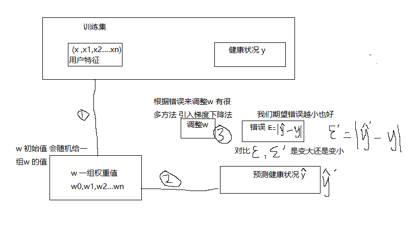

训练集 (x ,y)   数据量大

 y = ax+b    将用户特征 与 权重w 相乘再相加 得到y 的预测值  ,与y 相减 的绝对值为     得到   来调整w  很多方法 可以调整w  就用一个常用的方法  梯度下降法 调整w  然后继续重试第一步,得到健康预测值 与真实值相减 得到误差     比较前一次的误差  如果比之前大 则说明你调的方式是错误的 ,导致误差变大   如果比之前的小  说明误差在变小  继续按照这个方式  循环迭代 1>>>2 >>>3 直到 某一时刻  ,不变了 说明w  是最优解  是最好的模型 

有了这个最优解的之后  带入新数据 看看是否过拟合 之类的  就能达到预测未来


AI 用的较多的是python 语言 

scikit -learn 简单有效的预测数据分析工具每个人都可以访问，并且可以在各种上下文中重用基于NumPy、SciPy和matplotlib构建开源，商用-BSD许可证

scijit-learn  单机版 数据量不打的可以选择  海量数据的话可以选择 spark 的 mLlib  或者深度学习的tensflow   

> > > scikit-learn 分为以下模块 :
> > >
> > > classfication 分类 
> > >
> > > regression 回归 
> > >
> > > clusterubf  聚类
> > >
> > > dimensionality reduction 降维 
> > >
> > > model selection 模型选择
> > >
> > > preprocessing 预处理


数据量越大  考虑维度越多,,模型越精准  但是计算量也随之 越大  如何权衡 保证最大信息量的情况下 减少维度


特征转化 和归一化都属于 预处理的一部分


理解回归: 大自然让我们回归到一定的区间之内

线性: 两个变量之间存在一次方函数关系就称他们之间存在线性关系

线性: 线性linear 指量与量之间按比例.成直线的关系 ,在空间和事件上代表规则和光滑的运动


线性回归的本质 基于两个假设  :

1  假设数据 x y 程线性变化

2 假设数据服从一个正态分布


Normal-distribution  红色曲线为正态分布

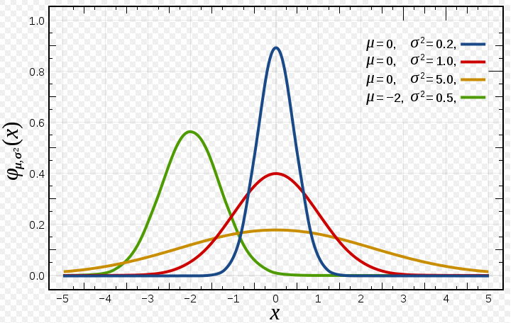


# ANN  

Artificial Neural Network  人工神经网络  

机器学习 浅层模型 相对应的是深度学习  深 

numpy  关于数学计算的库 

scipy 基于numpy 的物理方面的计算 傅里叶计算

Pandas是一个强大的分析结构化数据的工具集；它的使用基础是Numpy（提供高性能的矩阵运算）；用于数据挖掘和数据分析，同时也提供数据清洗功能。 突出一个数据  

### 面向开发的机器学习   不是面向研究的机器学习

> > >  有监督机器学习: 有y
> > >
> > >  ​	回归(y 区间是正无穷到负无穷)  y  是连续的
> > >
> > >  ​     分类(y 是分类号)  y 是离散的 


> > >  无监督机器学习  :无y
> > >
> > >   聚类
> > >
> > >  降维

numpy 数学计算框架 

scipy物理计算框架

pandas数据分析框架

scikit-learn 机器学习框架

tensorflow 谷歌开源出来的深度学习的框架

keras 开源出来的深度学习的框架


#### 线性回归 

线性 y  =  a*下+b 一次方的变化 

回归 : 回归到平均值 

做机器学习 没有完美解 只有最优解 做机器学习就是要以最快的速度 找到误差最小的最优解

行向量 列向量 相乘在相加 


最大似然估计: 是一种统计方法 它用来求一个样本集的相关概率密度函数的参数


大自然让我们回归到一定区间之内

x1 .. xn  那个特征 (feature)


中心极限定理 : 是概率论中 讨论随机变量序列部分和分布趋近正态分布的一类定理

概率密度函数 :

​	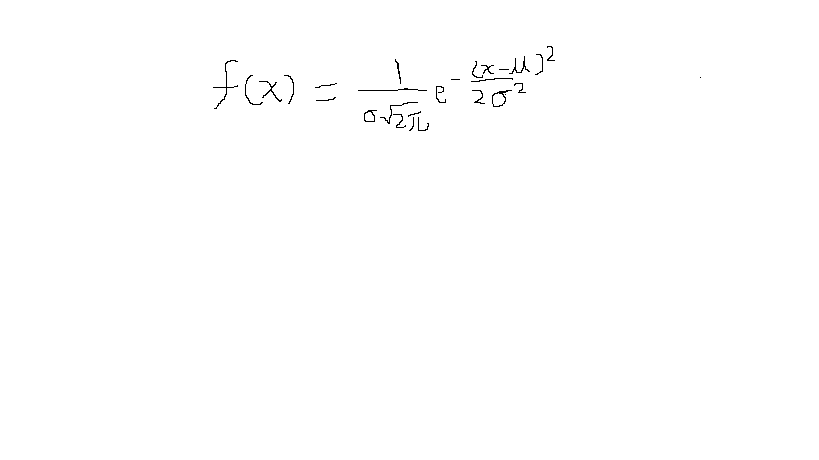

μ  和б确定就能确定正态分布的轨迹  f(x)是概率密度函数  但不是密度

P(A * B ) = P (A) * P(B)   成立的条件是  A  B 事件独立


Q: 为什么求总似然的时候 要用正态分布的概率密度函数?

A: 中心极限定理 ,如果假设样本之间是独立事件,误差变量随机产生 那么就服从正态分布 

Q : 总似然不是概率相乘吗? 为什莫用了概率密度函数的f(xi) 进行了相乘

A : 因为概率不好求 所以当我们可以找到概率密度相乘最大的时候,就相当于找到了概率相乘最大的时候!

Q: 为什么概率不好求?

A : 因为求的是面积,需要积分 麻烦,不需要管数学上如何根据概率密度函数去求概率

Q: 总似然最大和最优解的关系

A: 我们找到可以使的总似然最大的条件,也就是可以找到我们的DataSet数据集最吻合某个正态分布  并且找到了最优解

通过最大似然估计的思想,利用了正太分布的概率密度函数,推导出了损失函数

Q:何为损失函数

A: 一个函数最小,就对应了模型最优解!预测历史数据可以最准

Q:线性回归的损失函数是什莫

A:最小二乘法 MSE mean squared error 平方均值损失函数  均方误差


Q:线性回归的损失函数有哪些假设

A:样本独立,随机变量 服从正态分布 

机器学习特点不强调模型 100% 正确 但必须是有价值,堪用的

通过对损失函数求导 来找到最小值 求出theta 的最优解  

凸函数的极值  就是极小值 


> > >  求最优解 两种方式 
> > >
> > >  ​	1 不断的迭代不断地去试 得到最优解
> > >
> > >  	2 通过数学公式 θ = 

### pip 是什莫

pip 是一个现代ma通用的 Python包管理工具。提供了对 Python 包的查找、下载、安装、卸载的功能。

之前用的python 版本较低 ,每次更新的时候,pip 对应的版本也需要更新


##### BUG : Requirement already satisfied: numpy in g:\mlana\lib\site-packages (1.16.3) 

 因为你的pip  之前下载的模块也需要更新 此时需要重新下载 

比如 pip install numpy 报上面的错 需要加上路径

pip install --target=g:\mlana\lib\site-packages numpy 


__init.py__的作用是简化导入语句。

Question : 查看python 某个模块的源码 发现点进去 都是 __init__的文件  为何呢

首先了解下 init 文件 

```
.　　#　main.py所在目录
|- main.py

|- my_module1.py
　　|- my_function1()　　#　my_module.py中的一个函数

|- my_package　　#　my_package是一个文件夹
　　|- my_module2.py
　　　　|- my_function2()

想要在main.py中调用my_function1()和my_function2()，可以输入下面语句进行导入：


import my_module1
from my_package import my_module2

### 调用my_function1()和my_function2()
my_module1.my_function1()
my_module2.my_function2()

没有__init.py__时，导入其他模块的函数，需要一层层地去找，所以导入语句长度也与文件夹层数成正比
```

有了__init__.py 呢

```
from my_package import my_function2
```

Question  比较好奇为甚末要加上. 呢

```
我们运行的是main.py，当前工作目录就在main.py所在的目录，不加点的话，__init__.py就会从当前工作目录中找模块my_module2，这当然找不到，因为my_module2在my_package文件夹下。所以__init__.py的导入一般都会带上点（.），表示从__init__.py的目录下导入模块。
```

matplotlib 绘图

rand 均匀分布 [0,1)

数学公式解析解 求最优解 


```
np.ones(5)
array([1., 1., 1., 1., 1.])
```

```
数学公式解析解 求最优解 


#! /usr/bin/env python
# -*- coding :utf-8 -*-
# numpy  数学计算框架
import numpy as np
#绘图
import matplotlib.pyplot as plt


#相当于是随机x 维度x1 ,rand 是随机均分布
# 查看源码 rand 方发产生一个   100 行 1列 的 均匀分布[0,1) 左开右闭  x1  x0 恒为 1
X =2 * np.random.rand(100,1)

# 人为的设置真实的Y 一列,  randn 标准正态分布  μ = 0 σ平方= 1 也就是方差为1
# y 为真实值 y head = 4 + 3 * X 即Wt x    误差 e 浦西龙  np.random.randn(100,1)
# 4,3 其实对应的模型 w0 = 4 x0 =1 w1 = 3
y= 4 + 3 *X + np.random.randn(100,1)
# 整合 x0 和 x1  c  comboine
X_b = np.c_[np.ones((100,1)),X]  # 得到的是一个二维矩阵 100 行 2列
print(X_b)
## linear algebra 线性代数  linalg  缩写 inv 求逆 inverse   dot 点积 T转置
# Θ 一步到位 通过数学公式求出最优解
theta_best = np.linalg.inv(X_b.T.dot(X_b)).dot(X_b.T).dot(y)
print(theta_best)

# 得到的结果如下
# [[4.1029393] W0 接近于4 但不是4
#  [2.8879596]] W1 接近于3 但不是3

# 因为已经算出了 模型需要指定未来的数据进行预测
X_new = np.array([[0],[2]]) # 少一个x0 模型不能直接代入数据
X_new_b = np.c_[(np.ones((2,1)),X_new)]
print(X_new_b)
y_predict = X_new_b.dot(theta_best)
print(y_predict)

## 绘图
plt.plot(X_new,y_predict,'r-')  #红色直线
plt.plot(X,y,'b.')  #蓝色  点  
plt.axis([0,2,0,15]) 0-2 x 轴  0-15 y轴  axis 轴线   坐标轴 
plt.show() # 展示

```

打印结果 

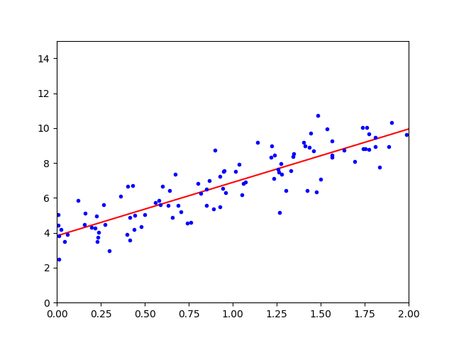


gradient  梯度 


梯度下降法 : 1 初始化 θ 

​			2  求梯度 

​			3 
$$
θ (t+1) = θ (t) -g * η
$$
​			根据这个公式 ,调整新的θ 

​			4 有了新的 θ带到第二步 求得新梯度 继续第三步不断重复直到收敛   g  = 0

主要取决于η  学习率  太小迭代次数会变多  太大 会振荡

梯度g 近似为0 的时候 可以停止迭代    有多近似  这个时候叫 超参数 threshold  阈值  |g | < threshold 


Q :  梯度下降法是干嘛的

A:梯度下降法是一种以最快速度额找到最优解的方法

bgd批量梯度下降 sgd 随机梯度下降


批量梯度下降 维度特别多的话 可以选择   m 个样本 全部都用  

随机梯度下降  优先选择随机梯度下降 速度快 m 个样本 随机选一个


折衷方案min-batch -g-d 随机一部分梯度下降


Q: 随机梯度下降 ,怎末随机的呢?

A:其实就是在求梯度的时候,不再用所有的m 个样本数据来计算  二十随机的选择一条数据来计算梯度

Q: 随机梯度下降的好处是什莫? 缺点是什莫

A: 在求梯度的时候速度快, 迭代次数有可能更多,最终可能落不到全局最优解上

Q:Mini --Batch- GD 是什莫

A:就是在求梯度的时候做了一个折衷 不用所有的数据 而是随机选择一部分数据求梯度

Q: 为甚末要不断的调整步长

A: 就是为了让越接近最优解的时候,调整的幅度与越小 避免来回震荡

Q: 如果我们不人为的调小步长,会不会随着迭代的次数增多,调整的幅度自动减小

A:调整的幅度取决于谁?  取决于学习率和梯度 梯度事实上越接近于最优解梯度的绝对值越小

Q:为什么要做归一化?

A:只要是基于梯度来进行下降求最优解 都需要归一化目的是各个维度梯度可以同时收敛


归一: 就是把数据缩放 比如原来数据是 负无穷 到正无穷  把它缩放到0 - 1 之间   数据缩放 x-x_min / x_max - x_min

g = (y-head - y) *x. T

Q:不做归一化,产生的问题是什莫?

A: 如果 X1<< X2 那魔W1>>W2 那么我们W1初始化之后要达到最优解的位置走的距离就远大于W1初始化之后要达到最优解的位置走的距离

因为 X1<< X2 那魔 g1 = (y_head) * X1,g2 = (y_head-y)* X2 那魔g1 << g2 因为g1 << g2 那魔W 调整的幅度等于W_t+1 - W_t = -alpha * g

所以g 越小 调整的幅度就越小

Q: 怎末让多个维度对应的W基本上在同一时刻收敛

A:对多个维度X来进行统一的归一化比如说 最大值最小值归一化的方法

Q:何为最大值最小值归一化呢?

A:(X-X_min) / (X - X_max  - X_min) 最大值最小值归一化的特点是一定可以把一列数据归到 (0,1)之间

异常值 /离群值


Q:什莫是过拟合?

A: 拟合过度    用算法生成的模型,很好的拟合了你以有的数据,训练集数据  ,但是当来新的数据时候 比如测试集的数据 越策的准确率反而降低了很多 那这个时候就是发生了过拟合现象

Q:如何防止过拟合呢 ?

A:防止过拟合 等价于提高模型的泛化能力 或者推广能力 或者说白了就是举一反三的能力  提高了模型的容错能力


学霸 :有监督的机器学习!

学神:有很强的学习能力 能自己找到学习的方法!无监督的机器学习

学渣:你的算法压根就没选对 数据预处理也没对 学习方法不对

学痴:做练习题都会 考试稍微一变化就挂了 过拟合了 没有泛化能力


Q:如何在机器学习里面防止过拟合呢?

A:模型参数W个数 越少越好 

模型参数W 的值越小越好,这样如果X 输入有误差 也不会太影响y 的预测结果

通过正则化惩罚项人为的修改已有的损失函数 , 比如使用L1 ,L2正则添加到loss func 里面去


L1  = n 个维度的W绝对值加和

L2  = n个维度W的平方和

让我们的sgd (随机梯度下降) 再找最优解的过程中 考虑惩罚项的影响


泛化能力和正确性    鱼和熊掌不可兼得


Q:当使用惩罚项 会产生什么影响?

A:使用惩罚项 会提高模型的泛化能力 但是因为人为的改变了损失函数 所以在一定程度上牺牲了正确率 即对训练集已有数据的拟合效果 但是美没关系 因为我们的模型目的是对未来新的数据进行预测 在惩罚项里面 会有个alpha  即 惩罚项的权重,我们可以通过调整alpha超参数 ,根据需求来决定是 更看重模型的正确率还是 模型的泛化能力


归一化 : 在预处理阶段处理x

正则化 :是在 sgd 训练优化的时候给loss  func 函数加上正则项

intercept 截距 coef  系数


#### Bug 

```
ValueError: Expected 2D array, got scalar array instead:
array=1.5.
Reshape your data either using array.reshape(-1, 1) if your data has a single feature or array.reshape(1, -1) if it contains a single sample.

print(sgd_reg.predict(1.5))
## 传入两个值就行   需要一个2维数组
print(sgd_reg.predict([[0],[1.5]]))
```


Ridge regression 岭回归  L2 正则化

lasso  L1

ElasticNet L1 L2


先用 ridge 再用  ElasticNet L1 L2 再用 lasso  L1

线性回归 : 算法选择顺序 Ridge Regression(L2正则化)--->ElasticNet(即包含L1 又包含L2) --->Lasso Regression(L1正则化)

Q:L1 和L2有什莫区别

A:L1是w绝对值加和,

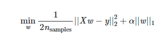

L2是w 平方加和,

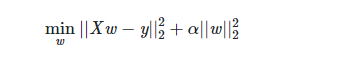

L1的有趣的现象是会使得w有的接近0,有的接近1

L1 更多的会用在降维上面 ,因为有的是0 有的是1,我们也称之为稀疏编码

L2是更常用的正则化手段他会是的w整体变小

超参数alpha 在 Ridge 类里面就直接是L2正则的权重

超参数alpha 在Lasso 类里面就直接是L1正则的权重

超参数alpha 在ElasticNet和SGDRegressor里面是损失函数里面的alpha

超参数l1_ration 在ElasticNet和SGDRegressor 里面是损失函数的p

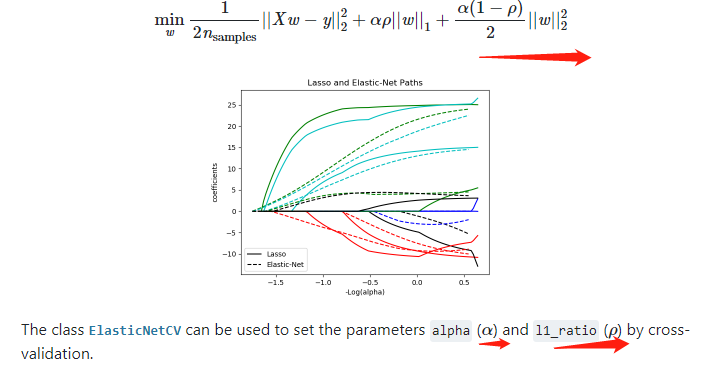

多项式回归   涉及到升维 对数据的一种改变


pandas  中dataframe数据框 

多项式回归: 叫回归但并不是去做拟合的算法

PolynomialFeatures 是来做预处理的来转换我们的数据 把数据进行升级 

Q:升级有什莫用

A: 1 升维就是增加更多的影响Y结果的因素,这样考虑的更全面 最终是增        加准确率

2 还有的时候 就像 PolynomialFeatures 去做升维 是为了让线性模型去拟合非线性的数据 

Q:Polynomial_Features是怎样升维的

A:可以传入degree超 参数 如果等于2  那么就会在原有维度基础上增加二阶的数据变化更高阶的依次类推

Q: 如果数据是非线性的变化,但是就想用线性的模型去拟合这个非线性的数据 怎末办

A : 1 非线性的数据去找非线性的算法生成的模型去拟合

​    2 可以把非线性的数据进行变化 变成类似线性的变化,然后使用线性的模型去拟合  Q:Polynomial_Features类其实就是这种方式


#### 保险案例 

目的 : 未来 来一个新的人可以通过模型来观测他的医疗花销

所以 要把 charges 列作为y 其他列作为x 维度

Q: 数据为什莫没有人名

A : 人名不会对最终的Y 结果产生影响 所以可以不用

Q: 为甚末观测要注意数据得多样性,采样均匀?

A: 因为要的模型功能是对任何年龄段的人都有一个好的观测,那魔你的模型在训练的时候读取的数据集,就得包含各个年龄段的数据.而且各个年龄段 也得数据均匀 防止过拟合

```
print(data.corr()) corr 相关性 
源码     def corr(self, method='pearson', min_periods=1):
 默认采用的是皮尔逊相关系数   相关性为1 
相关性的取值范围  [-1,1] 
			< 0  负相关
			> 0 正相关  
			= 0  不相关 对模型没有影响
```

```

大胆假设  细心求证 
s = pd.Series(['apple', '1.0', '2', -3])
 pd.to_numeric(s, errors='coerce')
    0    NaN
    1    1.0
    2    2.0
    3   -3.0
    
    
  x = x.apply(pd.to_numeric,errors = 'coerce')  
         age  sex     bmi  children  smoker  region
0      19  NaN  27.900         0     NaN     NaN
1      18  NaN  33.770         1     NaN     NaN
2      28  NaN  33.000         3     NaN     NaN
3      33  NaN  22.705         0     NaN     NaN
4      32  NaN  28.880         0     NaN     NaN
5      31  NaN  25.740         0     NaN     NaN
6      46  NaN  33.440         1     NaN     NaN
#把为 NaN 的数据装换成 0
x.fillna(0,inplace=True)

    age  sex     bmi  children  smoker  region
0      19  0.0  27.900         0     0.0     0.0
1      18  0.0  33.770         1     0.0     0.0
2      28  0.0  33.000         3     0.0     0.0
3      33  0.0  22.705         0     0.0     0.0
4      32  0.0  28.880         0     0.0     0.0
5      31  0.0  25.740         0     0.0     0.0


```


如上图 是多项式回归的模型 线性模型 去拟合非线性数据  用了poly_features = PolynomialFeatures(degree=2,include_bias=False)  升维的思想 b 真实值  r  预测值  这个模型预测的 不好

Q: 什莫是Pearson的相关系数?

A:Pearson 相关系数是来测量两组变量之间的线性相关性的 Pearson 相关系数的区间范围是-1到1之间如果接近于-1 说明两组变量负相关 一个变大,另一个变小 反之如果越接近于1,说明两组变量正相关一个变大另一个也跟着变大 如果越接近于0,说明越不相关 即一个变大或变小 另一个没什莫影响


通过Pearson 相关系数 ,如果发现两个维度之间 相关系数越接近于1 ,可以把其中一个去掉,做到降维 

通过Pearson相关系数如果发现某个维度和结果y 之间的相关系数越接近于0,可以吧这个维度去掉 降维

逻辑回归 是多元线性回归的缩放  用来做二分类

多元线性回归(Ridge Lasso ElasticNet)是来做回归预测的

逻辑回归(Logistic Regression ) 是做分类的

Q:做回归预测损失函数是什莫?

 AMSE: 平方均值损失函数

Q:做分类损失函数是什莫?

A:做分类损失函数是交叉熵

Q:什莫是熵 

A: 化学中提到过 熵是一种测量分子不稳定性的指标,分子运动,越不稳定,熵就越大  来自热力学

熵是一种测量信息量的单位 信息熵,包含的信息越多,熵就越大,来子信息论 香农

熵是一种测量不确定性的单位,不确定性越大,熵就越大    概率越小 熵就越大

逻辑回归的损失函数  是交叉熵

#### 逻辑回归

Q:为什莫本质是多元线性回归

A: 1 公式,首先应用了多元线性回归的公式,其次菜是把多元线性回归的结果,交给sigmoid 函数进行缩放

2 导函数  逻辑回归的损失函数推导的导函数,整个形式上和多元线性回归基本一致,只是y_hat 求解公式包含了一个sigmodid 过程而已

Q:逻辑回归的损失函数  是什莫 

A :  是交叉熵  做分类就用交叉熵 -y*logP 因为逻辑回归是二分类,所以 loss func = (-y * logP + -(1-y) * log(1-p))也就是说我们期望这个损失最小然后找到最优解 ,事实上我们就可以利用前面血过的梯度下降法来求解最优解

Q:逻辑回归为什莫阈值是  0.5

A:因为线性回归区间是负无穷偶倒正无穷,所以区间可以按照0 来分成两部分,所以带到sigmod公式里面去 z = 0 的话 y 就等于0.5

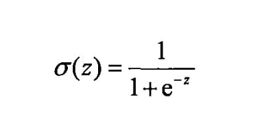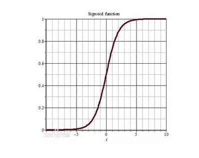


```
dataset linspace 
X_new_  = np.linspace(0,3,1000) 
0 到 3  之间 按顺序去1000个数 

a = np.array([1,2,3,4,5,6,7,8])
d = a.reshape((2,4))2行4列的二维 数组
[[1,2,3,4],
[5,6,7,8]]

reshape(1,-1)转化成1行：

reshape(2,-1)转换成两行：

reshape(-1,1)转换成1列：

reshape(-1,2)转化成两列

```

逻辑回归 解决二分类问题  --->>>解决多分类问题时候 -->>>  就是把多分类问题 转换为 多个二分类问题    

逻辑回归解决多分类问题的本质  是二分类


```
multi_class : {'auto, 'ovr', 'multinomial'}, default='auto'
    If the option chosen is 'ovr', then a binary problem is fit for each
    label. For 'multinomial' the loss minimised is the multinomial loss fit
    across the entire probability distribution, *even when the data is
    binary*. 'multinomial' is unavailable when solver='liblinear'.
    'auto' selects 'ovr' if the data is binary, or if solver='liblinear',
    and otherwise selects 'multinomial'.
```

Q:逻辑回归做多分类

A: 逻辑回归做到分类,把多分类的问题,转化成多个二分类的问题,如果要分三个类别,就需要同时训练三个互不影响的模型  比如我们n 个维度,那魔三分类,w 参数的个数就会是(n+1)*3个参数 上面所谓的互不影响,指的是模型在梯度下降的时候,分别去训练,分别去下降,三个模型互相不需要传递数据,也不需要等待收敛


Q:文字本身是几维的数据?音乐是几维的数据 图片本身是几维的数据 ?视频本身是几维的数据?

### 小结 

多元线性回归 : 回归/预测 

逻辑回归 分类

神经网络  预测   都属于有监督的机器学习

神经网络算法是深度学习的基础


ANN_>>>> Artificial Neural Network 人工神经网络 

MLP multiple layer perception  多层感知机 

Q:激活函数有哪些?

A:Sigmoid 函数 0 到1 之间 tanh (双曲正切函数) -1 到1 之间 Relu函数max(0,x)


#### 神经网络 

网络拓扑层 --- 单层网络

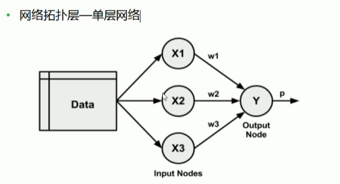


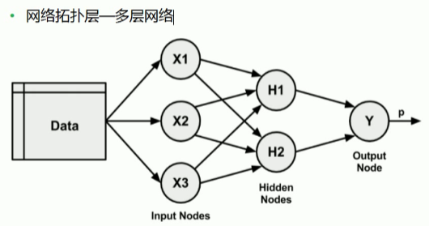


Q:神经网络算法的隐藏层意义何在?

A:1 如果有隐藏层的话,就多了推理有演绎的能力 

   2 每多一个隐藏层,推理和演绎的过程更多,考虑的更深入

  3 隐藏层的隐藏节点如果比之前的层上面的节点数要多 ,相当于进行了升维,考虑的因素更多

4 隐藏层的隐藏节点如果比之前的层上面的节点数要少,相当于进行了降维,对前面进行了归纳总结 