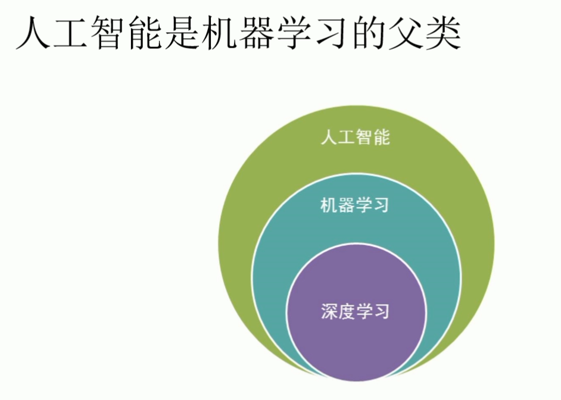
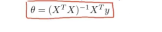
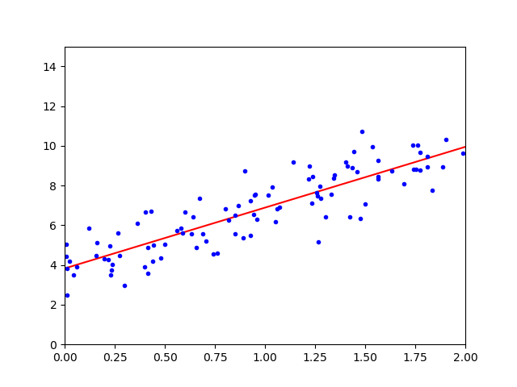
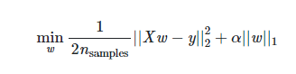
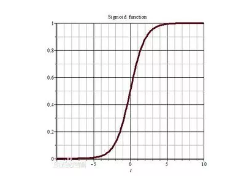
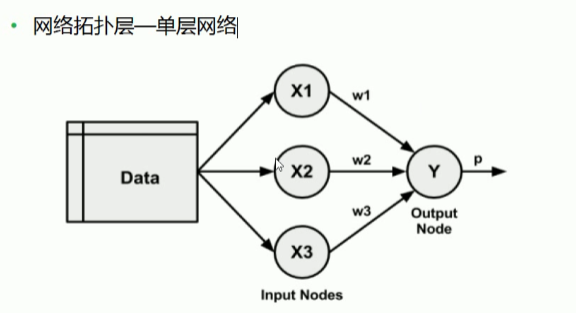

  

# AI 时代

##### 2020/03/22

机器学习是什莫: 用已有的数据 来训练某种模型,利用此模型预测未来

机器学习Machine Learning 是人工智能的核心


机器学习  ====>数据为王 思想   (同时数据要多)   

机器学习要素  数据要多 数据要好  合适的算法  

 模型越准 预测的越精确

古人云 :  历史往往不一样,但历史总是惊人的相似	

特征工程  算法参数调优


机器学习 是一门交叉学科  

> > > 模式识别   == 机器学习
> > >
> > > 数据挖掘 ETL == 机器学习+数据库
> > >
> > > 计算机视觉 == 机器学习+图像处理
> > >
> > > 语音识别 == 机器学习+语音处理
> > >
> > > 统计学习  == 近似等于机器学习
> > >
> > > 自然语言处理 NLP  == 机器学习+文本处理


 


人工智能 是一个很宽泛的概念

example :有监督的机器学习  预测人的健康状况  


w  为权重 

a 近似等于 

健康状况 y   预测的健康状况     (hat) 

 误差  =| -  |  希望误差越小越好 


有监督机器学习 


训练集 (x ,y)   数据量大

 y = ax+b    将用户特征 与 权重w 相乘再相加 得到y 的预测值  ,与y 相减 的绝对值为     得到   来调整w  很多方法 可以调整w  就用一个常用的方法  梯度下降法 调整w  然后继续重试第一步,得到健康预测值 与真实值相减 得到误差     比较前一次的误差  如果比之前大 则说明你调的方式是错误的 ,导致误差变大   如果比之前的小  说明误差在变小  继续按照这个方式  循环迭代 1>>>2 >>>3 直到 某一时刻  ,不变了 说明w  是最优解  是最好的模型 

有了这个最优解的之后  带入新数据 看看是否过拟合 之类的  就能达到预测未来


AI 用的较多的是python 语言 

scikit -learn 简单有效的预测数据分析工具每个人都可以访问，并且可以在各种上下文中重用基于NumPy、SciPy和matplotlib构建开源，商用-BSD许可证

scijit-learn  单机版 数据量不大的可以选择  海量数据的话可以选择 spark 的 mLlib  或者深度学习的tensflow   

> > > scikit-learn 分为以下模块 :
> > >
> > > classfication 分类 
> > >
> > > regression 回归 
> > >
> > > clusterubf  聚类
> > >
> > > dimensionality reduction 降维 
> > >
> > > model selection 模型选择
> > >
> > > preprocessing 预处理


数据量越大  考虑维度越多,,模型越精准  但是计算量也随之 越大  如何权衡 保证最大信息量的情况下 减少维度


特征转化 和归一化都属于 预处理的一部分


理解回归: 大自然让我们回归到一定的区间之内

线性: 两个变量之间存在一次方函数关系就称他们之间存在线性关系

线性: 线性linear 指量与量之间按比例.成直线的关系 ,在空间和事件上代表规则和光滑的运动


线性回归的本质 基于两个假设  :

1  假设数据 x y 程线性变化

2 假设数据服从一个正态分布


Normal-distribution  红色曲线为正态分布


# ANN  

Artificial Neural Network  人工神经网络  

机器学习 浅层模型 相对应的是深度学习  深 

numpy  关于数学计算的库 

scipy 基于numpy 的物理方面的计算 傅里叶计算

Pandas是一个强大的分析结构化数据的工具集；它的使用基础是Numpy（提供高性能的矩阵运算）；用于数据挖掘和数据分析，同时也提供数据清洗功能。 突出一个数据  

### 面向开发的机器学习   不是面向研究的机器学习

> > >  有监督机器学习: 有y
> > >
> > >  ​	回归(y 区间是正无穷到负无穷)  y  是连续的
> > >
> > >  ​     分类(y 是分类号)  y 是离散的 


> > >  无监督机器学习  :无y
> > >
> > >   聚类
> > >
> > >  降维

numpy 数学计算框架 

scipy物理计算框架

pandas数据分析框架

scikit-learn 机器学习框架

tensorflow 谷歌开源出来的深度学习的框架

keras 开源出来的深度学习的框架


#### 线性回归 

线性 y  =  a*x+b 一次方的变化 

回归 : 回归到平均值 

做机器学习 没有完美解 只有最优解 做机器学习就是要以最快的速度 找到误差最小的最优解

行向量 列向量 相乘在相加 


最大似然估计: 是一种统计方法 它用来求一个样本集的相关概率密度函数的参数


大自然让我们回归到一定区间之内

x1 .. xn  那个特征 (feature)


中心极限定理 : 是概率论中 讨论随机变量序列部分和分布趋近正态分布的一类定理

概率密度函数 :

​	

μ  和б确定就能确定正态分布的轨迹  f(x)是概率密度函数  但不是密度

P(A * B ) = P (A) * P(B)   成立的条件是  A  B 事件独立


Q: 为什么求总似然的时候 要用正态分布的概率密度函数?

A: 中心极限定理 ,如果假设样本之间是独立事件,误差变量随机产生 那么就服从正态分布 

Q : 总似然不是概率相乘吗? 为什莫用了概率密度函数的f(xi) 进行了相乘

A : 因为概率不好求 所以当我们可以找到概率密度相乘最大的时候,就相当于找到了概率相乘最大的时候!

Q: 为什么概率不好求?

A : 因为求的是面积,需要积分 麻烦,不需要管数学上如何根据概率密度函数去求概率

Q: 总似然最大和最优解的关系

A: 我们找到可以使的总似然最大的条件,也就是可以找到我们的DataSet数据集最吻合某个正态分布  并且找到了最优解

通过最大似然估计的思想,利用了正太分布的概率密度函数,推导出了损失函数

Q:何为损失函数

A: 一个函数最小,就对应了模型最优解!预测历史数据可以最准

Q:线性回归的损失函数是什莫

A:最小二乘法 MSE mean squared error 平方均值损失函数  均方误差


Q:线性回归的损失函数有哪些假设

A:样本独立,随机变量 服从正态分布 

机器学习特点不强调模型 100% 正确 但必须是有价值,堪用的

通过对损失函数求导 来找到最小值 求出theta 的最优解  

凸函数的极值  就是极小值 


> > >  求最优解 两种方式 
> > >
> > >  ​	1 不断的迭代不断地去试 得到最优解
> > >
> > >  	2 通过数学公式 θ = 

### pip 是什莫

pip 是一个现代ma通用的 Python包管理工具。提供了对 Python 包的查找、下载、安装、卸载的功能。

之前用的python 版本较低 ,每次更新的时候,pip 对应的版本也需要更新


##### BUG : Requirement already satisfied: numpy in g:\mlana\lib\site-packages (1.16.3) 

 因为你的pip  之前下载的模块也需要更新 此时需要重新下载 

比如 pip install numpy 报上面的错 需要加上路径

pip install --target=g:\mlana\lib\site-packages numpy 


__init.py__的作用是简化导入语句。

Question : 查看python 某个模块的源码 发现点进去 都是 __init__的文件  为何呢

首先了解下 init 文件 

```
.　　#　main.py所在目录
|- main.py

|- my_module1.py
　　|- my_function1()　　#　my_module.py中的一个函数

|- my_package　　#　my_package是一个文件夹
　　|- my_module2.py
　　　　|- my_function2()

想要在main.py中调用my_function1()和my_function2()，可以输入下面语句进行导入：


import my_module1
from my_package import my_module2

### 调用my_function1()和my_function2()
my_module1.my_function1()
my_module2.my_function2()

没有__init.py__时，导入其他模块的函数，需要一层层地去找，所以导入语句长度也与文件夹层数成正比
```

有了__init__.py 呢

```
from my_package import my_function2
```

Question  比较好奇为甚末要加上. 呢

```
我们运行的是main.py，当前工作目录就在main.py所在的目录，不加点的话，__init__.py就会从当前工作目录中找模块my_module2，这当然找不到，因为my_module2在my_package文件夹下。所以__init__.py的导入一般都会带上点（.），表示从__init__.py的目录下导入模块。
```

matplotlib 绘图

rand 均匀分布 [0,1)

数学公式解析解 求最优解 



```
np.ones(5)
array([1., 1., 1., 1., 1.])
```

```
数学公式解析解 求最优解 


#! /usr/bin/env python
# -*- coding :utf-8 -*-
# numpy  数学计算框架
import numpy as np
#绘图
import matplotlib.pyplot as plt


#相当于是随机x 维度x1 ,rand 是随机均分布
# 查看源码 rand 方发产生一个   100 行 1列 的 均匀分布[0,1) 左开右闭  x1  x0 恒为 1
X =2 * np.random.rand(100,1)

# 人为的设置真实的Y 一列,  randn 标准正态分布  μ = 0 σ平方= 1 也就是方差为1
# y 为真实值 y head = 4 + 3 * X 即Wt x    误差 e 浦西龙  np.random.randn(100,1)
# 4,3 其实对应的模型 w0 = 4 x0 =1 w1 = 3
y= 4 + 3 *X + np.random.randn(100,1)
# 整合 x0 和 x1  c  comboine
X_b = np.c_[np.ones((100,1)),X]  # 得到的是一个二维矩阵 100 行 2列
print(X_b)
## linear algebra 线性代数  linalg  缩写 inv 求逆 inverse   dot 点积 T转置
# Θ 一步到位 通过数学公式求出最优解
theta_best = np.linalg.inv(X_b.T.dot(X_b)).dot(X_b.T).dot(y)
print(theta_best)

# 得到的结果如下
# [[4.1029393] W0 接近于4 但不是4
#  [2.8879596]] W1 接近于3 但不是3

# 因为已经算出了 模型需要指定未来的数据进行预测
X_new = np.array([[0],[2]]) # 少一个x0 模型不能直接代入数据
X_new_b = np.c_[(np.ones((2,1)),X_new)]
print(X_new_b)
y_predict = X_new_b.dot(theta_best)
print(y_predict)

## 绘图
plt.plot(X_new,y_predict,'r-')  #红色直线
plt.plot(X,y,'b.')  #蓝色  点  
plt.axis([0,2,0,15]) 0-2 x 轴  0-15 y轴  axis 轴线   坐标轴 
plt.show() # 展示

```

打印结果 




gradient  梯度 


梯度下降法 : 1 初始化 θ 

​			2  求梯度 

​			3 
$$
θ (t+1) = θ (t) -g * η
$$
​			根据这个公式 ,调整新的θ 

​			4 有了新的 θ带到第二步 求得新梯度 继续第三步不断重复直到收敛   g  = 0

主要取决于η  学习率  太小迭代次数会变多  太大 会振荡

梯度g 近似为0 的时候 可以停止迭代    有多近似  这个时候叫 超参数 threshold  阈值  |g | < threshold 


Q :  梯度下降法是干嘛的

A:梯度下降法是一种以最快速度额找到最优解的方法

bgd批量梯度下降 sgd 随机梯度下降


批量梯度下降 维度特别多的话 可以选择   m 个样本 全部都用  

随机梯度下降  优先选择随机梯度下降 速度快 m 个样本 随机选一个


折衷方案min-batch -g-d 随机一部分梯度下降


Q: 随机梯度下降 ,怎末随机的呢?

A:其实就是在求梯度的时候,不再用所有的m 个样本数据来计算  二十随机的选择一条数据来计算梯度

Q: 随机梯度下降的好处是什莫? 缺点是什莫

A: 在求梯度的时候速度快, 迭代次数有可能更多,最终可能落不到全局最优解上

Q:Mini --Batch- GD 是什莫

A:就是在求梯度的时候做了一个折衷 不用所有的数据 而是随机选择一部分数据求梯度

Q: 为甚末要不断的调整步长

A: 就是为了让越接近最优解的时候,调整的幅度与越小 避免来回震荡

Q: 如果我们不人为的调小步长,会不会随着迭代的次数增多,调整的幅度自动减小

A:调整的幅度取决于谁?  取决于学习率和梯度 梯度事实上越接近于最优解梯度的绝对值越小

Q:为什么要做归一化?

A:只要是基于梯度来进行下降求最优解 都需要归一化目的是各个维度梯度可以同时收敛


归一: 就是把数据缩放 比如原来数据是 负无穷 到正无穷  把它缩放到0 - 1 之间   数据缩放 x-x_min / x_max - x_min

g = (y-head - y) *x. T

Q:不做归一化,产生的问题是什莫?

A: 如果 X1<< X2 那魔W1>>W2 那么我们W1初始化之后要达到最优解的位置走的距离就远大于W1初始化之后要达到最优解的位置走的距离

因为 X1<< X2 那魔 g1 = (y_head) * X1,g2 = (y_head-y)* X2 那魔g1 << g2 因为g1 << g2 那魔W 调整的幅度等于W_t+1 - W_t = -alpha * g

所以g 越小 调整的幅度就越小

Q: 怎末让多个维度对应的W基本上在同一时刻收敛

A:对多个维度X来进行统一的归一化比如说 最大值最小值归一化的方法

Q:何为最大值最小值归一化呢?

A:(X-X_min) / (X - X_max  - X_min) 最大值最小值归一化的特点是一定可以把一列数据归到 (0,1)之间

异常值 /离群值


Q:什莫是过拟合?

A: 拟合过度    用算法生成的模型,很好的拟合了你以有的数据,训练集数据  ,但是当来新的数据时候 比如测试集的数据 越策的准确率反而降低了很多 那这个时候就是发生了过拟合现象

Q:如何防止过拟合呢 ?

A:防止过拟合 等价于提高模型的泛化能力 或者推广能力 或者说白了就是举一反三的能力  提高了模型的容错能力


学霸 :有监督的机器学习!

学神:有很强的学习能力 能自己找到学习的方法!无监督的机器学习

学渣:你的算法压根就没选对 数据预处理也没对 学习方法不对

学痴:做练习题都会 考试稍微一变化就挂了 过拟合了 没有泛化能力


Q:如何在机器学习里面防止过拟合呢?

A:模型参数W个数 越少越好 

模型参数W 的值越小越好,这样如果X 输入有误差 也不会太影响y 的预测结果

通过正则化惩罚项人为的修改已有的损失函数 , 比如使用L1 ,L2正则添加到loss func 里面去


L1  = n 个维度的W绝对值加和

L2  = n个维度W的平方和

让我们的sgd (随机梯度下降) 再找最优解的过程中 考虑惩罚项的影响


泛化能力和正确性    鱼和熊掌不可兼得


Q:当使用惩罚项 会产生什么影响?

A:使用惩罚项 会提高模型的泛化能力 但是因为人为的改变了损失函数 所以在一定程度上牺牲了正确率 即对训练集已有数据的拟合效果 但是美没关系 因为我们的模型目的是对未来新的数据进行预测 在惩罚项里面 会有个alpha  即 惩罚项的权重,我们可以通过调整alpha超参数 ,根据需求来决定是 更看重模型的正确率还是 模型的泛化能力


归一化 : 在预处理阶段处理x

正则化 :是在 sgd 训练优化的时候给loss  func 函数加上正则项

intercept 截距 coef  系数


#### Bug 

```
ValueError: Expected 2D array, got scalar array instead:
array=1.5.
Reshape your data either using array.reshape(-1, 1) if your data has a single feature or array.reshape(1, -1) if it contains a single sample.

print(sgd_reg.predict(1.5))
## 传入两个值就行   需要一个2维数组
print(sgd_reg.predict([[0],[1.5]]))
```


Ridge regression 岭回归  L2 正则化

lasso  L1

ElasticNet L1 L2


先用 ridge 再用  ElasticNet L1 L2 再用 lasso  L1

线性回归 : 算法选择顺序 Ridge Regression(L2正则化)--->ElasticNet(即包含L1 又包含L2) --->Lasso Regression(L1正则化)

Q:L1 和L2有什莫区别

A:L1是w绝对值加和,



L2是w 平方加和,


L1的有趣的现象是会使得w有的接近0,有的接近1

L1 更多的会用在降维上面 ,因为有的是0 有的是1,我们也称之为稀疏编码

L2是更常用的正则化手段他会是的w整体变小

超参数alpha 在 Ridge 类里面就直接是L2正则的权重

超参数alpha 在Lasso 类里面就直接是L1正则的权重

超参数alpha 在ElasticNet和SGDRegressor里面是损失函数里面的alpha

超参数l1_ration 在ElasticNet和SGDRegressor 里面是损失函数的p


多项式回归   涉及到升维 对数据的一种改变


pandas  中dataframe数据框 

多项式回归: 叫回归但并不是去做拟合的算法

PolynomialFeatures 是来做预处理的来转换我们的数据 把数据进行升级 

Q:升级有什莫用

A: 1 升维就是增加更多的影响Y结果的因素,这样考虑的更全面 最终是增        加准确率

2 还有的时候 就像 PolynomialFeatures 去做升维 是为了让线性模型去拟合非线性的数据 

Q:Polynomial_Features是怎样升维的

A:可以传入degree超 参数 如果等于2  那么就会在原有维度基础上增加二阶的数据变化更高阶的依次类推

Q: 如果数据是非线性的变化,但是就想用线性的模型去拟合这个非线性的数据 怎末办

A : 1 非线性的数据去找非线性的算法生成的模型去拟合

​    2 可以把非线性的数据进行变化 变成类似线性的变化,然后使用线性的模型去拟合  Q:Polynomial_Features类其实就是这种方式


#### 保险案例 

目的 : 未来 来一个新的人可以通过模型来观测他的医疗花销

所以 要把 charges 列作为y 其他列作为x 维度

Q: 数据为什莫没有人名

A : 人名不会对最终的Y 结果产生影响 所以可以不用

Q: 为甚末观测要注意数据得多样性,采样均匀?

A: 因为要的模型功能是对任何年龄段的人都有一个好的观测,那魔你的模型在训练的时候读取的数据集,就得包含各个年龄段的数据.而且各个年龄段 也得数据均匀 防止过拟合

```
print(data.corr()) corr 相关性 
源码     def corr(self, method='pearson', min_periods=1):
 默认采用的是皮尔逊相关系数   相关性为1 
相关性的取值范围  [-1,1] 
			< 0  负相关
			> 0 正相关  
			= 0  不相关 对模型没有影响
```

```

大胆假设  细心求证 
s = pd.Series(['apple', '1.0', '2', -3])
 pd.to_numeric(s, errors='coerce')
    0    NaN
    1    1.0
    2    2.0
    3   -3.0
    
    
  x = x.apply(pd.to_numeric,errors = 'coerce')  
         age  sex     bmi  children  smoker  region
0      19  NaN  27.900         0     NaN     NaN
1      18  NaN  33.770         1     NaN     NaN
2      28  NaN  33.000         3     NaN     NaN
3      33  NaN  22.705         0     NaN     NaN
4      32  NaN  28.880         0     NaN     NaN
5      31  NaN  25.740         0     NaN     NaN
6      46  NaN  33.440         1     NaN     NaN
#把为 NaN 的数据装换成 0
x.fillna(0,inplace=True)

    age  sex     bmi  children  smoker  region
0      19  0.0  27.900         0     0.0     0.0
1      18  0.0  33.770         1     0.0     0.0
2      28  0.0  33.000         3     0.0     0.0
3      33  0.0  22.705         0     0.0     0.0
4      32  0.0  28.880         0     0.0     0.0
5      31  0.0  25.740         0     0.0     0.0


```


如上图 是多项式回归的模型 线性模型 去拟合非线性数据  用了poly_features = PolynomialFeatures(degree=2,include_bias=False)  升维的思想 b 真实值  r  预测值  这个模型预测的 不好

Q: 什莫是Pearson的相关系数?

A:Pearson 相关系数是来测量两组变量之间的线性相关性的 Pearson 相关系数的区间范围是-1到1之间如果接近于-1 说明两组变量负相关 一个变大,另一个变小 反之如果越接近于1,说明两组变量正相关一个变大另一个也跟着变大 如果越接近于0,说明越不相关 即一个变大或变小 另一个没什莫影响


通过Pearson 相关系数 ,如果发现两个维度之间 相关系数越接近于1 ,可以把其中一个去掉,做到降维 

通过Pearson相关系数如果发现某个维度和结果y 之间的相关系数越接近于0,可以吧这个维度去掉 降维

逻辑回归 是多元线性回归的缩放  用来做二分类

多元线性回归(Ridge Lasso ElasticNet)是来做回归预测的

逻辑回归(Logistic Regression ) 是做分类的

Q:做回归预测损失函数是什莫?

 AMSE: 平方均值损失函数

Q:做分类损失函数是什莫?

A:做分类损失函数是交叉熵

Q:什莫是熵 

A: 化学中提到过 熵是一种测量分子不稳定性的指标,分子运动,越不稳定,熵就越大  来自热力学

熵是一种测量信息量的单位 信息熵,包含的信息越多,熵就越大,来子信息论 香农

熵是一种测量不确定性的单位,不确定性越大,熵就越大    概率越小 熵就越大

逻辑回归的损失函数  是交叉熵

#### 逻辑回归

Q:为什莫本质是多元线性回归

A: 1 公式,首先应用了多元线性回归的公式,其次菜是把多元线性回归的结果,交给sigmoid 函数进行缩放

2 导函数  逻辑回归的损失函数推导的导函数,整个形式上和多元线性回归基本一致,只是y_hat 求解公式包含了一个sigmodid 过程而已

Q:逻辑回归的损失函数  是什莫 

A :  是交叉熵  做分类就用交叉熵 -y*logP 因为逻辑回归是二分类,所以 loss func = (-y * logP + -(1-y) * log(1-p))也就是说我们期望这个损失最小然后找到最优解 ,事实上我们就可以利用前面血过的梯度下降法来求解最优解

Q:逻辑回归为什莫阈值是  0.5

A:因为线性回归区间是负无穷偶倒正无穷,所以区间可以按照0 来分成两部分,所以带到sigmod公式里面去 z = 0 的话 y 就等于0.5




```
dataset linspace 
X_new_  = np.linspace(0,3,1000) 
0 到 3  之间 按顺序去1000个数 

a = np.array([1,2,3,4,5,6,7,8])
d = a.reshape((2,4))2行4列的二维 数组
[[1,2,3,4],
[5,6,7,8]]

reshape(1,-1)转化成1行：

reshape(2,-1)转换成两行：

reshape(-1,1)转换成1列：

reshape(-1,2)转化成两列

```

逻辑回归 解决二分类问题  --->>>解决多分类问题时候 -->>>  就是把多分类问题 转换为 多个二分类问题    

逻辑回归解决多分类问题的本质  是二分类


```
multi_class : {'auto, 'ovr', 'multinomial'}, default='auto'
    If the option chosen is 'ovr', then a binary problem is fit for each
    label. For 'multinomial' the loss minimised is the multinomial loss fit
    across the entire probability distribution, *even when the data is
    binary*. 'multinomial' is unavailable when solver='liblinear'.
    'auto' selects 'ovr' if the data is binary, or if solver='liblinear',
    and otherwise selects 'multinomial'.
```

Q:逻辑回归做多分类

A: 逻辑回归做到分类,把多分类的问题,转化成多个二分类的问题,如果要分三个类别,就需要同时训练三个互不影响的模型  比如我们n 个维度,那魔三分类,w 参数的个数就会是(n+1)*3个参数 上面所谓的互不影响,指的是模型在梯度下降的时候,分别去训练,分别去下降,三个模型互相不需要传递数据,也不需要等待收敛


Q:文字本身是几维的数据?音乐是几维的数据 图片本身是几维的数据 ?视频本身是几维的数据?

### 小结 

多元线性回归 : 回归/预测 

逻辑回归 分类

神经网络  预测   都属于有监督的机器学习

神经网络算法是深度学习的基础


ANN_>>>> Artificial Neural Network 人工神经网络 

MLP multiple layer perception  多层感知机 

Q:激活函数有哪些?

A:Sigmoid 函数 0 到1 之间 tanh (双曲正切函数) -1 到1 之间 Relu函数max(0,x)


#### 神经网络 

网络拓扑层 --- 单层网络




Q:神经网络算法的隐藏层意义何在?

A:1 如果有隐藏层的话,就多了推理有演绎的能力 

   2 每多一个隐藏层,推理和演绎的过程更多,考虑的更深入

  3 隐藏层的隐藏节点如果比之前的层上面的节点数要多 ,相当于进行了升维,考虑的因素更多

4 隐藏层的隐藏节点如果比之前的层上面的节点数要少,相当于进行了降维,对前面进行了归纳总结 


decision_tree决策树  可视化 

```
下载  graphviz  修改系统变量  path ,自己的bin  目录  ,pip  install  graphviz  

写代码的时候 会报  pydotplus.graphviz.InvocationException: GraphViz's executables not found win10解决办法


  import osos.environ["PATH"] += os.pathsep + 'E:/graphviz/bin/'  #注意修改你的路径

```


鸢尾花数据集 随机森林 为什莫选花 萼 呢   因为花瓣的相关性太大 不管你怎末分 区分度不高 

baggingClassier 并行 分类

相关性有哪几种  

1 皮尔逊相关系数 

2 L1正则 

3  feature_importances

```
iris = load_iris()
rnd_clf = RandomForestClassifier(n_estimators=500,n_jobs=-1)
rnd_clf.fit(iris["data"],iris["target"])

for name ,score in zip(iris['feature_names'],rnd_clf.feature_importances_):
	print(name,score)
	
	

sepal length (cm) 0.09876917168158565
sepal width (cm) 0.02499075273651172

选取花瓣没有太大意义,无论怎末分 花瓣的相关性都很大
petal length (cm) 0.43379976467366044
petal width (cm) 0.44244031090824226

```

决策树 用来做分类  也可以做回归  均值 

准确率 和召回率

F1-score 

准确率的 召回率的使用场景


1 如果训练分类器去检测视频是否对应小孩是很安全的,宁愿拒绝很多好的视频,低召回率去保证好的视频,也就是要高准确率

如果监视录像中去检测商店小偷,那么我们可以高召回率 所以有   tradeoff


机器学习的评估指标有哪些

混淆矩阵

|  TP  |  FP  |
| :--: | :--: |
|  FN  |  TN  |

真正(True Positive , TP)：被模型预测为正的正样本。

假正(False Positive , FP)：被模型预测为正的负样本。

假负(False Negative , FN)：被模型预测为负的正样本。

真负(True Negative , TN)：被模型预测为负的负样本。

-----

真正率(True Positive Rate,TPR)：TPR=TP/(TP+FN)，即被预测为正的正样本数 /正样本实际数。

假正率(False Positive Rate,FPR) ：FPR=FP/(FP+TN)，即被预测为正的负样本数 /负样本实际数。

假负率(False Negative Rate,FNR) ：FNR=FN/(TP+FN)，即被预测为负的正样本数 /正样本实际数。

真负率(True Negative Rate,TNR)：TNR=TN/(TN+FP)，即被预测为负的负样本数 /负样本实际数/2

-----


2 准确率  Accuracy  看的是**全局** 

准确率是最常用的分类性能指标

Accuracy = (TP+TN)/(TP+TN+FP+FN)

即正确预测的正反例数 / 总数

3 精确率 Precision   **只看正例** 

Precision = TP/(TP+FP)  

即正确预测的正例 数/ 预测正例总数

4 召回率 Recall

Recall = TP(TP+FN)

```
print(cross_val_score(never_5_clf, X_train, y_train_5, cv=3, scoring='accuracy'))
print(cross_val_score(never_5_clf, X_train, y_train_5, cv=3, scoring='precision '))

accuracy 和 precision 关系 
输出结果 如下
[0.9324,0.9612,0.9625]
[0.5859,0.8920,0.9262]


print(cross_val_score(never_5_clf, X_train, y_train_5, cv=3, scoring='accuracy'))
print(cross_val_score(never_5_clf, X_train, y_train_5, cv=3, scoring='precision '))
print(cross_val_score(never_5_clf, X_train, y_train_5, cv=3, scoring='precision '))

accuracy  precision recall 关系  
用数据说话
[0.96025 ,0.96435 ,0.96445]
[0.8315 ,0.8589 ,0.9132]
[0.7022,0.7244,0.6701]

accuracy 准确率 包含 正例判对的和负例判错的 比较大
precisio 只包含正例 判对的  比较低 
precision  大 recall小  
precision 小 recall 大 ]


y_scores = sgd_clf.decision_function([some_digit])
print(y_scores)
[98492.0305]  值越大 越有信心 判断 
比如 你判断样本是否为0.5  ,0.51 就不好判断 相反 0.90 就很容易判断是否为0.5
```

做分类 随机森林比sgd 效果要好 

聚类 引出 簇 这个概念 

相似度 对于聚类特别重要 


数据 两两 之间相似性 欧氏距离

Jaccard 相似系数  


解决实际问题 : 网页去重 防考试作弊 论文抄袭检查

相似度 余弦距离

相似度 Person 相关系数  线性相关性

**聚类**  聚类是一种无监督的机器学习任务,它可以自动将数据分称类cluster 因此聚类分组不需要提前告知所划分的组应该是什莫样子的,因此我们甚至可能都不知道我们在寻找什莫,所以聚类是用于知识发现而不是预测

K-Means  K k个中心点  means 均值 

聚类的原则是一个组内的记录彼此必须非常相似,而与改组之外的记录截然不容,所有聚类的做的就是遍历所有数据然后找到这些相似性

 K  根据先验知识给的

**K-Means**  改进**K-Mediods**   


```
比如 数组 1,2 ,3,4 ,100 的均值为22  其实求均值的话,离里面大多数的值还是比较远的 
取 中位数的话是3 更好一些 因为100 可能是噪声
```

**二分 K-Means**  

适用于 哪些中心点比较近 数据量比较少  就合并在一起 

如中心点就一个 但数据量比较大 且数据 比较分散 那魔就进行分散

**K-Means ++**

肘部 法选取合适的k  

聚类100 次 就有100 中结果 全局最优解 局部最优解

```
#! /usr/bin/env python
# -*- coding :utf-8 -*-

import numpy as np
import matplotlib.pyplot as plt
import sklearn.datasets as ds
import matplotlib.colors
from sklearn.cluster import  KMeans
from sklearn.cluster import MiniBatchKMeans

def expand(a,b):
	d = (b -a ) * 0.1
	return a-d,b+d
if __name__ == "__main__":
	N = 400
	centers = 4
	# 模拟数据的时候就给k
	data ,y = ds.make_blobs(N,n_features= 2,centers =centers,random_state= 2 )
	data2,y2 = ds.make_blobs(N,n_features=2,centers = centers,cluster_std= (1,2.5,0.5,2),random_state= 2)
	data3 = np.vstack((data[y == 0][:],data[y == 1][:50],data[y == 2][:20],data[y == 3][:5]))
	y3 = np.array([0] * 100 + [1] * 50 + [2] * 20 + [3] * 5)
	cls = KMeans(n_clusters=4,init='k-means++')
	y_hat = cls.fit_predict(data)
	y2_hat = cls.fit_predict(data2)
	y3_hat = cls.fit_predict(data3)

	m = np.array(((1,1),(1,3)))
	data_r = data.dot(m)
	y_r_hat = cls.fit_predict(data_r)
	matplotlib.rcParams['font.sans-serif'] = [u'SimHei']
	matplotlib.rcParams['axes.unicode_minus'] = False
	cm = matplotlib.colors.ListedColormap(list('rgbm'))

	plt.figure(figsize=(9,10),facecolor='w')
	plt.subplot(421)
	plt.title(u'原始数据')
	# scatter  散点图
	plt.scatter(data[:,0],data[:,1],c = y, s = 30 ,cmap=cm ,edgecolors='none')
	x1_min,x2_min = np.min(data,axis=0)
	x1_max, x2_max = np.max(data, axis=0)
	x1_min, x2_max = expand(x1_min, x1_max)
	x2_min, x2_max = expand(x2_min, x2_max)
	plt.xlim((x1_min,x1_max))
	plt.ylim((x2_min,x2_max))
	plt.grid(True)

	plt.subplot(422)
	plt.title(u'KMeans++ 聚类')
	# scatter  散点图
	plt.scatter(data[:, 0], data[:, 1], c=y_hat, s=30, cmap=cm, edgecolors='none')
	plt.xlim((x1_min, x1_max))
	plt.ylim((x2_min, x2_max))
	plt.grid(True)

	plt.subplot(423)
	plt.title(u'旋转后的数据')
	# scatter  散点图
	plt.scatter(data[:, 0], data[:, 1], c=y, s=30, cmap=cm, edgecolors='none')
	x1_min, x2_min = np.min(data_r, axis=0)
	x1_max, x2_max = np.max(data_r, axis=0)
	x1_min, x1_max = expand(x1_min, x1_max)
	x2_min, x2_max = expand(x2_min, x2_max)
	plt.xlim((x1_min, x1_max))
	plt.ylim((x2_min, x2_max))
	plt.grid(True)

	plt.subplot(424)
	plt.title(u'旋转后KMeans++聚类')
	plt.scatter(data_r[:, 0], data_r[:, 1], c=y_r_hat, s=30, cmap=cm, edgecolors='none')
	plt.xlim((x1_min, x1_max))
	plt.ylim((x2_min, x2_max))
	plt.grid(True)

	plt.subplot(425)
	plt.title(u'方差不相等数据')
	plt.scatter(data2[:, 0], data2[:, 1], c=y2, s=30, cmap=cm, edgecolors='none')
	x1_min, x2_min = np.min(data2, axis=0)
	x1_max, x2_max = np.max(data2, axis=0)
	x1_min, x1_max = expand(x1_min, x1_max)
	x2_min, x2_max = expand(x2_min, x2_max)
	plt.xlim((x1_min, x1_max))
	plt.ylim((x2_min, x2_max))
	plt.grid(True)

	plt.subplot(426)
	plt.title(u'方差不相等KMeans++聚类')
	plt.scatter(data2[:, 0], data2[:, 1], c=y2_hat, s=30, cmap=cm, edgecolors='none')
	plt.xlim((x1_min, x1_max))
	plt.ylim((x2_min, x2_max))
	plt.grid(True)

	plt.subplot(427)
	plt.title(u'数量不相等数据')
	plt.scatter(data3[:, 0], data3[:, 1], s=30, c=y3, cmap=cm, edgecolors='none')
	x1_min, x2_min = np.min(data3, axis=0)
	x1_max, x2_max = np.max(data3, axis=0)
	x1_min, x1_max = expand(x1_min, x1_max)
	x2_min, x2_max = expand(x2_min, x2_max)
	plt.xlim((x1_min, x1_max))
	plt.ylim((x2_min, x2_max))
	plt.grid(True)

	plt.subplot(428)
	plt.title(u'数量不相等KMeans++聚类')
	plt.scatter(data3[:, 0], data3[:, 1], c=y3_hat, s=30, cmap=cm, edgecolors='none')
	plt.xlim((x1_min, x1_max))
	plt.ylim((x2_min, x2_max))
	plt.grid(True)

	plt.tight_layout(2, rect=(0, 0, 1, 0.97))
	plt.suptitle(u'数据分布对KMeans聚类的影响', fontsize=18)
	# https://github.com/matplotlib/matplotlib/issues/829
	# plt.subplots_adjust(top=0.92)
	plt.show()
# plt.savefig('cluster_kmeans')
```


Sklearn 和 TensorFlow 区别 

Sklearn 实现的是统计学的经典算法,尽管不如神经网络强大,但是在各个领域仍有非常广泛的作用,尤其是随机森林和 XGBoost等继承算法,TensorFlow则是深度学习框架

canopy  聚类  一次迭代 

主要目的 是为了找到初始的k个中心点 

T1 和T2 

K-Means **问题1** k 个中心点不一定均匀  

可以根据先验知识 人为设置    采用Canopy 聚类得到

**问题2** K =类别  多少合适

可以用canopy 先进行一把聚类  得到的聚类结果 


单独用到canopy  用来聚类很少见   主要用来解决K-Means 的两个问题

**聚类的评估**

Given Label

```
均一性 一个簇中只包含一个类别样本  比如一个班级全部是男生  
完整性 同类别样本 被归到同一个簇中 比如 一个班级中 男生女生都有 女的 2/3  男的 1/3

均一性和完整性互斥的
```

ARI 评估  

AMI 评估

轮廓系数 :

 a  计算同簇内每一个样本到同簇内样本的平均距离,可以度量这个样本和其它同簇样本的相似性   越小越好

b  计算一个簇内每一个样本到不同簇内所有样本的辑距离,不同簇的那些样本距离求平均 ,然后求最小的那个距离  

第一个值很小 ,第二个值很大,那就是簇内很典型的样本 

s(i) = b(i)-a(i) /max{a(i),b(j)}

s(i) 接近1 说明聚类合理,s(i) 接近于-1 说明样本更应该分到其它簇  s(i) 接近0 说明在簇分界上

https://pan.baidu.com/s/1Ijb75g5BkeC0BCIm7WJtHg 
提取码：ggsv


分类的层次聚类

 DIANA : 把原始数据集去不断的分裂,然后去计算每个子数据集里面的相似性,然后不断的分裂,把数据集分为很多的类别

凝聚的层次聚类

把一个个样本,不断地自底向上的聚类,然后一层一层的来聚,最后聚成一个完整的数据集,这种用的更多一些


密度聚类: 统计样本周边的密度,把密度给定一个阈值,不断的把样本添加到最近的簇 

适用场景: 人口密度,根据密度聚类出城市 

解决类似圆形的K-Means聚类的缺点,密度聚类缺点计算复杂度大,空间索引来降低计算时间,降低查询速度


谱和谱聚类

谱: Y= A * X ,矩阵X乘以A 对矩阵X 做了空间线性变换,那么Y= map(X),A就是map 这个线性算子,它的所有特征值的全体,称之为方阵的谱

方阵的谱半径为最大的特征值

谱聚类是一种基于图论的聚类方法,通过对样本数据得拉普拉斯矩阵的特征的特征向量进行聚类,从而达到对样本数据进行聚类的目的 


**TensorFlow**    可谓当前最火的深度学习框架，

- TensorFlow™ 是一个采用数据流图（data flow graphs），用于数值计算的开源软件库。
- 节点（Nodes）在图中表示数学操作，图中的线（edges）则表示在节点间相互联系的多维数据数组，即张量（tensor）。
- 它灵活的架构让你可以在多种平台上展开计算，例如台式计算机中的一个或多个CPU（或GPU），服务器，移动设备等等。TensorFlow 最初由Google大脑小组（隶属于Google机器智能研究机构）的研究员和工程师们开发出来，用于机器学习和深度神经网络方面的研究，但这个系统的通用性使其也可广泛用于其他计算领域。


pip install tensorflow 太卡 一直超时  

对于默认的pip源的速度 所以改成国内的镜像资源就行

pip install xxx -i url 就行 

对于已经安装过的 无需重复安装   

pip install --index-url http://mirrors.aliyun.com/pypi/simple/ tensorflow 

 Cannot uninstall ''. It is a distutils installed project and thus we cannot accurately.


pip install --index-url http://mirrors.aliyun.com/pypi/simple/ tensorflow  --ignore-installed  一步到位 安装tensorflow成功


报错AttributeError: module 'tensorflow' has no attribute 'Session'。这其实不是安装错误，是因为在新的Tensorflow 2.0版本中已经移除了Session这一模块，改换运行代码 

tf.compat.v1.Session()

tensorflow 和array 的区别

```
输入
a=tf.constant([[1,2],[3,4]],dtype=tf.float32)
print(a.dtype)
b=np.array([[1,2],[3,4]],dtype='float32')
print(b.dtype)

输出：
<dtype: 'float32'>  
float32

判断一个变量究竟是tensor还是array，直接输出它的dtype，输出上面那样的就是tensor，输出下面那样的就是array
```

tensor 和array相互转换

a 为tensor  ,b 是array

tensor 转array

a.eval()

array 转tensor 

tf.cpnvert_to_tensor(b)


设定trainable=False 可以防止该变量被数据流图的 GraphKeys.TRAINABLE_VARIABLES 收集, 

  


shape 函数 

```
shape(2,)和shape（2，1）
1：一般的数组如：【22，33】 shape是（2，）：表示他是一个一维数组，数组中有两个元素；注意他和shape（2，1）的区别，他两个不一样。

2：[[22],[33]]  他的shape是(2,1),表示二维数组，每行有一个元素

3：[[22,33]] shape是（1，2） 他表示一个二维数组，每行有两个元素

```

1维数组叫矢量，2维数组叫矩阵，3维及大于3维的数组就叫多维数组了

```
产生两个多维数组 3 行 3 列 
tf.zeros([2,3,3])
<tf.Tensor: shape=(2, 3, 3), dtype=float32, numpy=
array([[[0., 0., 0.],
        [0., 0., 0.],
        [0., 0., 0.]],

       [[0., 0., 0.],
        [0., 0., 0.],
        [0., 0., 0.]]], dtype=float32)>
```


```
tf.one_hot()进行独热编码
什么叫做独热编码（one-hot encoding），独热编码一般是在有监督学习中对数据集进行标注时候使用的，指的是在分类问题中，将存在数据类别的那一类用X表示，不存在的用Y表示，这里的X常常是1， Y常常是0。
比如我们有一个5类分类问题，我们有数据(Xi,Yi)，其中类别Yi有五种取值（因为是五类分类问题），所以如果Yj为第一类那么其独热编码为： [1,0,0,0,0]，如果是第二类那么独热编码为：[0,1,0,0,0]，也就是说只对存在有该类别的数的位置上进行标记为1，其他皆为0。这个编码方式经常用于多分类问题，特别是损失函数为交叉熵函数的时候。

y = tf.range(5)
y = tf.one_hot(y,depth=10)
<tf.Tensor: shape=(5, 10), dtype=float32, numpy=
array([[1., 0., 0., 0., 0., 0., 0., 0., 0., 0.],
       [0., 1., 0., 0., 0., 0., 0., 0., 0., 0.],
       [0., 0., 1., 0., 0., 0., 0., 0., 0., 0.],
       [0., 0., 0., 1., 0., 0., 0., 0., 0., 0.],
       [0., 0., 0., 0., 1., 0., 0., 0., 0., 0.]], dtype=float32)>
```

a = tf.random.normal([4,28,28,3])  # 4 张图片 28 行 28 列 3 通道

a.shape,a.ndim  (TensorShape([4, 28, 28, 3]), 4)   ndim   空间维度  4 维 


squeeze  skwiːz  挤压   Only squeeze for shape = 1 dim（只删除维度为1的维度）


## tf.random_normal 从正态分布中输出随机值。

## tf.random_uniform 从均匀分布中返回随机值。


TensorShape([1, 3, 4])   a2 = tf.tile(a2,[2,1,1])  # 复制一维2次，复制二、三维1次 

。a/*b*是取商,*a%b*是取余数。 

**手写数字识别**  

(x,y),_ = datasets.mnist.load_data()  网速不行拉不到数据


```
a= tf.ones([4,32,8])

b = tf.ones([4,32,8])

tf. ([a,b],axis =0).shape    # 堆叠 stack   要求必须一样  

TensorShape([2, 4, 32, 8])
```


eukl.norm 和L1 .Norm 不太懂


axis=0代表往**跨行（down)**，而axis=1代表**跨列（across)**

```

axis=1
pred = tf.cast(tf.argmax(a,axis=1),dtype=tf.int32)
pred.shape
TensorShape([2])

pred = tf.cast(tf.argmax(a,axis=0),dtype=tf.int32)
pred.shape
TensorShape([3])
```

shuffle   洗牌打乱  

**tf.random_shuffle:**沿着张量的第一维度随机打乱张量；

- top_k  Only return top-k values and indices

```
tf.pad(a, [[0, 0], [0, 0]])
<tf.Tensor: shape=(3, 3), dtype=int32, numpy=
array([[0, 1, 2],
       [3, 4, 5],
       [6, 7, 8]])>
       
tf.pad(a,[[1,1],[0,0]])
array([[0, 0, 0],
       [0, 1, 2],
       [3, 4, 5],
       [6, 7, 8],
       [0, 0, 0]])>
       上下左右进行填充     先行后列

```

```
aa = tf.expand_dims(a,axis=0)
aa
```

clip  削减


**BUG** : 遇到好几次了 加载mnist 数据集  直接下载 会因为网速问题 拉去不到资源  可以手动下载 ,在进行加载就行

```
import tensorflow as tf
from  tensorflow import keras 
from tensorflow.keras import datasets
import os


(x,y),_ = datasets.mnist.load_data(path="G:/AiDataSet/mnist.pkl")

A local file was found, but it seems to be incomplete or outdated because the auto file hash does not match the original value of 731c5ac602752760c8e48fbffcf8c3b850d9dc2a2aedcf2cc48468fc17b673d1 so we will re-download the data.
Downloading data from https://storage.googleapis.com/tensorflow/tf-keras-datasets/mnist.npz
11493376/11490434 [==============================] - 14s 1us/step
```


**切片操作** 

L[0:3]表示，从索引0开始取，直到索引3为止，但不包括索引3。即索引0，1，2，正好是3个元素。

如果第一个索引是0，还可以省略：

>>> L[:3]


tf.keras.layers.Dense()：

密集连接层。参数个数 = 输入层特征数× 输出层特征数(weight)＋ 输出层特征数(bias)


tf.linspace 和np.linspace 对比

​		tf.linspace(start, end, num)：这个函数主要的参数就这三个，start代表起始的值，end表示结束的值，num表示在这个区间里生成数字的个数，生成的数组是等间隔生成的。start和end**这两个数字必须是浮点数，不能是整数**，如果是整数会出错的，请注意！

​		np.linspace(start, end, num)：主要的参数也是这三个，我们平时用的时候绝大多数时候就是用这三个参数。start代表起始的值，end表示结束的值，num表示在这个区间里生成数字的个数，生成的数组是等间隔生成的。start和end这两个数字可以是**整数或者浮点数！**


有了Relu 函数 为何还要引入leak_relu 函数呢?

Relu的输入值为负的时候，输出始终为0，其一阶导数也始终为0，这样会导致神经元不能更新参数，也就是神经元不学习了，这种现象叫做“Dead Neuron”。

为了解决Relu函数这个缺点，在Relu函数的负半区间引入一个泄露（Leaky）值，所以称为Leaky  带泄露修正线性单元（Leaky ReLU）函数是经典（以及广泛使用的）的ReLu激活函数的变体，该函数输出对负值输入有很小的坡度。由于导数总是不为零，这能减少静默神经元的出现，允许基于梯度的学习（虽然会很慢），解决了Relu函数进入负区间后，导致神经元不学习的问题。


**tf.reduce_mean()**函数用于计算张量tensor沿着指定的数轴（tensor的某一维度）上的平均值，主要用作降维或者计算tensor（图像）的平均值


什莫是 kears

 Keras是一个高层神经网络API，Keras由纯Python编写而成并基于Tensorflow  ,Theano 以及CNTK后端。Keras 为支持快速实验而生，能够把你的idea迅速转换为结果，如果你有如下需求，请选择Keras：

- 简易和快速的原型设计（keras具有高度模块化，极简，和可扩充特性）

- 支持CNN和RNN，或二者的结合

- 无缝CPU和GPU切换  

  ​

Kears 设计原则  

​	用户友好 

​	模块性 

​	易扩展性

​	与python 协作

VGGNet是牛津大学计算机视觉组（Visual Geometry Group）和Google DeepMind公司的研究员一起研发的深度卷积神经网络。

VGGNet探索了卷积神经网络的深度与其性能之间的关系，通过反复堆叠3*3的小型卷积核和2*2的最大池化层，

VGGNet成功地构筑了16~19层深的卷积神经网络。VGGNet相比之前state-of-the-art的网络结构，错误率大幅下降，

VGGNet论文中全部使用了3*3的小型卷积核和2*2的最大池化核，

VGG-16 

1. VGG-16网络中的16代表的含义为：含有参数的有16个层，共包含参数约为1.38亿。

2. VGG-16网络结构很规整，没有那么多的超参数，专注于构建简单的网络，都是几个卷积层后面跟一个可以压缩图像大小的池化层。即：全部使用3*3的小型卷积核和2*2的最大池化层。

   卷积层：CONV=3*3 filters, s = 1, padding = same convolution。

   池化层：MAX_POOL = 2*2 , s = 2。

3. 优点：简化了卷积神经网络的结构；缺点：训练的特征数量非常大。

4. 随着网络加深，图像的宽度和高度都在以一定的规律不断减小，每次池化后刚好缩小一半，信道数目不断增加一倍。


实践出真知

```
import tensorflow as tf
from tensorflow.keras import layers


x = tf.random.normal([1,14,14,4])
x.shape

TensorShape([1, 14, 14, 4])
pool  = layers.MaxPool2D(2,strides=2)
out = pool(x)
out.shape

TensorShape([1, 7, 7, 4])

pool = layers.MaxPool2D(3, strides=2)
out = pool(x)
out.shape
TensorShape([1, 6, 6, 4])

```

效果如下  


3 X 3 卷积核   步长 2   输入数据 14 X 14  池化后  变成 6 X 6 

2 X 2卷积核   步长 2   输入数据 14 X 14  池化后  变成 7 X 7


升采样  降采样 概念

 > 降采样：按比例缩小图像（池化？）  --大多数情况下会降低图像质量，也有方法可以增加图像质量

\> 上采样（图像插值）： 放大图像，采用各种插值方法扩充图像矩阵


max-pooling  和 average-pooling 区别

**池化操作**时在卷积神经网络中经常采用过的一个基本操作，一般在卷积层后面都会接一个池化操作，但是近些年比较主流的ImageNet上的分类算法模型都是使用的**max-pooling**，很少使用average-pooling


特征提取的误差主要来自两个方面：

​	（1）邻域大小受限造成的估计值方差增大；

​	（2）卷积层参数误差造成估计均值的偏移

一般来说，average-pooling能减小第一种误差，更多的保留图像的背景信息，max-pooling能减小第二种误差，更多的保留纹理信息。average-pooling更强调对整体特征信息进行一层下采样，在减少参数维度的贡献上更大一点，更多的体现在信息的完整传递这个维度上，在一个很大很有代表性的模型中，比如说DenseNet中的模块之间的连接大多采用average-pooling，在减少维度的同时，更有利信息传递到下一个模块进行特征提取。


**Embedding** 嵌入 

```
from tensorflow.keras import layers


x = tf.range(5)
x = tf.random.shuffle(x)  随机打乱 
x
#   input_dim：大或等于0的整数，字典长度，即输入数据最大下标+1   x 的下标 即 0,1,2,3,4  所以输入必须最小是5 
#    output_dim：大于0的整数，代表全连接嵌入的维度
<tf.Tensor: shape=(5,), dtype=int32, numpy=array([4, 2, 1, 3, 0])>  # 效果如上  

net = layers.Embedding(5,6) 5  输入的,6  输出的维度  
net(x)

<tf.Tensor: shape=(5, 6), dtype=float32, numpy=
array([[ 0.01472174, -0.02735468,  0.03255906, -0.04731125,  0.00678366,
        -0.01761717],
       [ 0.02957808, -0.03579506,  0.04291166, -0.03866359,  0.0462671 ,
         0.02594611],
       [ 0.03509965,  0.03341999,  0.03980968,  0.02116736, -0.00497077,
        -0.01765434],
       [-0.03830831,  0.00532677,  0.03897681,  0.00823249, -0.01682144,
        -0.00039976],
       [ 0.03737178, -0.00983995,  0.03097491, -0.02628666, -0.02049766,
         0.00685478]], dtype=float32)>
```

什么要使用嵌入层 Embedding呢? 主要有这两大原因:

1. 使用One-hot 方法编码的向量会很高维也很稀疏。假设我们在做自然语言处理（NLP）中遇到了一个包含2000个词的字典，当时用One-hot编码时，每一个词会被一个包含2000个整数的向量来表示，其中1999个数字是0，要是我的字典再大一点的话这种方法的计算效率岂不是大打折扣？
2. 训练神经网络的过程中，每个嵌入的向量都会得到更新。  不太懂


在深度学习方面，图像识别、语音识别主要运用卷积神经网络（CNN），而文字语言处理主要运用循环神经网络（RNN）


**what are RNN ?**

https://zhuanlan.zhihu.com/p/30844905 

**TF1**

对tf1.X有经验的读者应该不会对让我们~~又爱~~又恨的计算图(`tf.Graph`)和执行会话(`tf.Session`)感到陌生, 一个常规的流程如下:

 1. 初始化一个计算图并且将该计算图设置为当前scope下的默认计算图

 2. 用TF API设计计算图(比如: `y=tf.matmul(a, x) + b`) 

 3. 提前界定好参数共享并划分相应的参数scope 

 4. 创建并配置好`tf.Session`

 5. 将计算图传给`tf.Session` 

 6. 初始化参数 

 7. 用`tf.Session.run`来执行计算图的节点, 被执行的节点会反向追踪所有依赖的需要执行的节点并**执行计算**.

    ​

    在TF 2.0中, 由于默认为动态图, 计算会直接被执行, 也就是说, 我们不需要

    - 定义计算图
    - 会话执行
    - 参数初始化
    - 用scope定义参数分享
    - 用`tf.control_dependencies`来声明节点的非直接依赖

在TF 2.0里面, 如果需要构建计算图, 我们只需要给python函数加上`@tf.function`的装饰器.


os.environ['TF_CPP_MIN_LOG_LEVEL'] = '2'   

类似与 bug 中的bug 等级

	base_loging	屏蔽信息	输出信息

	“0”	INFO	无	INFO + WARNING + ERROR + FATAL

	“1”	WARNING	INFO	WARNING + ERROR + FATAL

	“2”	ERROR	INFO + WARNING	ERROR + FATAL

	“3”	FATAL	INFO + WARNING + ERROR	FATAL

assert tf.__version__.startswith('2.') 断言函数 版本 

这个函数用于判断tf.__version__的版本信息是否以'2.0'开头，返回True或者False


batchsz = 128 样本子集数目 

调整barch size 之后 learning rate 也随之调整一下  有时候显存不足等问题 bs 要小一点 


 什莫是**epoch** : 

当一个完整的数据集通过了神经网络一次并且返回了一次，这个过程称为一次epoch。

CIFAR10 数据集有 50000 张训练图片，10000 张测试图片。现在选择 Batch Size = 256 对模型进行训练。

每个 Epoch 要训练的图片数量： 
训练集具有的 Batch 个数： 
每个 Epoch 需要完成的 Batch 个数： 
每个 Epoch 具有的 Iteration 个数： 
每个 Epoch 中发生模型权重更新的次数： 
训练  代后，模型权重更新的次数： 
不同代的训练，其实用的是同一个训练集的数据。第  代和第  代虽然用的都是训练集的五万张图片，但是对模型的权重更新值却是完全不同的。因为不同代的模型处于代价函数空间上的不同位置，模型的训练代越靠后，越接近谷底，其代价越小。


那个设置随机数种子的，是为了固定生成的随机数序列的，毕竟哪有什么真正的随机数，都是算法生成的

tf里加这个随机种子一般是为了复现别人代码的，毕竟模型初始化的值很容易影响你最后训练的结果。。

```
Eager Execution 
允许用户在不创建图形的情况下运行tensorflow 代码下`
```


为了实现的简便，keras只能接受长度相同的序列输入。因此如果目前序列长度参差不齐，这时需要使用**pad_sequences()**。该函数是将序列转化为经过填充以后的一个长度相同的新序列新序列

keras.preprocessing.sequence.pad_sequences(sequences, 
​	maxlen=None,
​	dtype='int32',
​	padding='pre',
​	truncating='pre', 
​	value=0.)


sequences：浮点数或整数构成的两层嵌套列表
maxlen：None或整数，为序列的最大长度。大于此长度的序列将被截短，小于此长度的序列将在后部填0.
dtype：返回的numpy array的数据类型
padding：‘pre’或‘post’，确定当需要补0时，在序列的起始还是结尾补`
truncating：‘pre’或‘post’，确定当需要截断序列时，从起始还是结尾截断
value：浮点数，此值将在填充时代替默认的填充值0

```
这个函数就是将输入的张量，按第一维度切分成多个小的张量

b = tf.random.normal([3, 1, 2, 1])
bb = tf.data.Dataset.from_tensor_slices(b)
print(bb)
print('-----------------------')
for i in bb:
    print(i)


<TensorSliceDataset shapes: (1, 2, 1), types: tf.float32>
-----------------------
tf.Tensor(
[[[ 0.38611013]
  [-0.66116554]]], shape=(1, 2, 1), dtype=float32)
tf.Tensor(
[[[-0.49640906]
  [ 2.3744533 ]]], shape=(1, 2, 1), dtype=float32)
tf.Tensor(
[[[-1.1388273]
  [-0.716239 ]]], shape=(1, 2, 1), dtype=float32)
```


#### 机器学习 shuffle 重要性

什莫是shuffle 

shuffle（中文意思：洗牌，混乱）。shuffle在机器学习与深度学习中代表的意思是，将训练模型的数据集进行打乱的操作。
原始的数据，在样本均衡的情况下可能是按照某种顺序进行排列，如前半部分为某一类别的数据，后半部分为另一类别的数据。但经过打乱之后数据的排列就会拥有一定的随机性，在顺序读取的时候下一次得到的样本为任何一类型的数据的可能性相同。


shuffle 为什莫重要

1   Shuffle可以防止训练过程中的模型抖动，有利于模型的健壮性
​		假设训练数据分为两类，在未经过Shuffle的训练时，首先模型的参数会去拟合第一类数据，当大量的连	续数据（第一类）输入训练时，会造成模型在第一类数据上的过拟合。当第一类数据学习结束后模型又开始对大量的第二类数据进行学习，这样会使模型尽力去逼近第二类数据，造成新的过拟合现象。这样反复的训练模型会在两种过拟合之间徘徊，造成模型的抖动，也不利于模型的收敛和训练的快速收敛


2       Shuffle可以防止过拟合，并且使得模型学到更加正确的特征
NN网络的学习能力很强，如果数据未经过打乱，则模型反复依次序学习数据的特征，很快就会达到过拟合状态，并且有可能学会的只是数据的次序特征。模型的缺乏泛化能力。
如：100条数据中前50条为A类剩余50条为B类，模型在很短的学习过程中就学会了50位分界点，且前半部分为A后半部分为B。则并没有学会真正的类别特征。


3.为使得训练集，验证集，测试集中数据分布类似
question：不同类别的data是在一起做shuffle，然后划分数据集；还是分开类别分别做对应的操作？
有知道的小伙伴可以在下面留言

**总结就两点**

1. 提升模型质量
2. 提升预测表现


------


# 2020-05-17

**音乐推荐系统**

import surprise  

import lightfm 

raw  原始的  未经加工 的


------

# 金融反欺诈训练模型 

金融本质:  资源的最合理化应用

互联网技术: 交易的边界成本趋向零

金融最终要的是定义你的用户人群

APR 年化利率 


金融要做到 **风险控制**  比如最近的 中行原油宝 

**反欺诈建模中的数据科学**


%matplotlib inline

　用在Jupyter notebook中具体作用是当你调用matplotlib.pyplot的绘图函数plot()进行绘图的时候，或者生成一个figure画布的时候，可以直接在你的python console里面生成图像。效果如下：


M1+ 信用风险   ,M3+ 欺诈风险 


**pandas.read_csv**参数整理


ix 切片操作

drop函数默认删除行，列需要加axis = 1

print(df.drop(['one'],axis=1)) 列 
print(df.drop(['a','c'],axis = 0)) 行


**inplace**  参数  

注意：凡是会对原数组作出修改并返回一个新数组的，往往都有一个 inplace可选参数。如果手动设定为True（默认为False），那么原数组直接就被替换。也就是说，采用inplace=True之后，原数组名（如2和3情况所示）对应的内存值直接改变；

而采用inplace=False之后，原数组名对应的内存值并不改变，需要将新的结果赋给一个新的数组或者覆盖原数组的内存位置（如1情况所示）。

有图有真相


numpy中的ravel()、flatten()、squeeze()都有将多维数组转换为一维数组的功能，区别： 
ravel()：如果没有必要，不会产生源数据的副本 
flatten()：返回源数据的副本 
squeeze()：只能对维数为1的维度降维

另外，reshape(-1)也可以“拉平”多维数组

```
import pandas as pd
import numpy as np

df = pd.DataFrame({'a': [1, 2] * 3,
                   'b': [True, False] * 3,
                    'c': [1.0, 2.0] * 3,
                    'e' : ['asian','white','black','white','asian','white'] ,
                  'd' :['low','low','low','median','high','high']})

df['d'] = df['d'].astype('category')
df
Out[46]: 
   a      b    c      e       d
0  1   True  1.0  asian     low
1  2  False  2.0  white     low
2  1   True  1.0  black     low
3  2  False  2.0  white  median
4  1   True  1.0  asian    high
5  2  False  2.0  white    high


d列为‘category’分类类型，

e列为‘object’字符串类型

```

```
describe 描述性统计
s = pd.Series([1, 2, 3])
>>> s.describe()
count    3.0
mean     2.0
std      1.0
min      1.0
25%      1.5
50%      2.0
75%      2.5
max      3.0
dtype: float64
```

```
>>> s = pd.Series(['a', 'a', 'b', 'c'])
>>> s.describe()
count     4  样本总数量
unique    3  种类三种
top       a 最大的频率 
freq      2 频率为2 
dtype: object
```

```
点积(也称为内积) ,外积的区别
 

两个向量的内积（有时候叫做点积），得到的是一个数

⟨u,v⟩=uTv，要求u和v的维数必须是一样的。


两个向量的外积，得到的是一个矩阵

如果把向量写成列向量的形式，那么外积就是u∘v=uvT
比如u是m×1的向量，v是n×1的向量，那么外积的结果就是m×n的矩阵。

比如说两个向量

x=(1,2), y=(3,4)
它们的内积是

1×3+2×4=11
它们的外积是

(1×32×31×42×4)=(3648)

```

**apply 用法 沿数据帧的轴应用函数。** 

axis = 0 axis =1 

**第0轴沿着行的垂直往下，第1轴沿着列的方向水平延伸。**

```
df
   A  B
0  4  9
1  4  9
2  4  9

df.apply(np.sum, axis=0)
A    12
B    27
dtype: int64
df.apply(np.sum, axis=1)
0    13
1    13
2    13
dtype: int64
```

```
# df.loan_status  删除空值 
df.dropna(subset=['loan_status'],inplace=True)
```

subset 子集 

```
Diagonal above which to zero elements. k = 0 (the default) is the main diagonal, k < 0 is below it and k > 0 is above.
triu()：返回上三角（Upper triangle）。用k 指定对角线，主对角线为k=0，右上的对角线用k>0，左下的对角线用k<0，返回包括该对角线的上三角。

tril()：返回下三角（Lower triangle）。用k 指定对角线，主对角线为k=0，右上的对角线用k>0，左下的对角线用k<0，返回包括该对角线的下三角。


In [1]: import numpy as np

In [2]: arr=np.arange(12).reshape(4,3)  #以非方阵为例

In [3]: arr
Out[3]:
array([[ 0,  1,  2],
       [ 3,  4,  5],
       [ 6,  7,  8],
       [ 9, 10, 11]])

In [4]: np.triu(arr,k=0)
Out[4]:
array([[0, 1, 2],
       [0, 4, 5],
       [0, 0, 8],
       [0, 0, 0]])

In [5]: np.triu(arr,k=1)
Out[5]:
array([[0, 1, 2],
       [0, 0, 5],
       [0, 0, 0],
       [0, 0, 0]])

In [6]: np.triu(arr,k=2)
Out[6]:
array([[0, 0, 2],
       [0, 0, 0],
       [0, 0, 0],
       [0, 0, 0]])

In [7]: np.tril(arr,k=0)
Out[7]:
array([[ 0,  0,  0],
       [ 3,  4,  0],
       [ 6,  7,  8],
       [ 9, 10, 11]])

In [8]: np.tril(arr,k=1)
Out[8]:
array([[ 0,  1,  0],
       [ 3,  4,  5],
       [ 6,  7,  8],
       [ 9, 10, 11]])

In [9]: np.tril(arr,k=-1)
Out[9]:
array([[ 0,  0,  0],
       [ 3,  0,  0],
       [ 6,  7,  0],
       [ 9, 10, 11]])

In [10]: np.tril(arr,k=-2)
Out[10]:
array([[ 0,  0,  0],
       [ 0,  0,  0],
       [ 6,  0,  0],
       [ 9, 10,  0]])

In [11]:


```

 pandas中，这三种方法都是用来对表格进行重排的，其中stack()是unstack()的逆操作

表格重排


pandas提供对one-hot编码的函数是：pd.get_dummies()  用来特征提取

```
In [8]: s=pd.Series(list('AABBCCABCDDEE'))
0     A
1     A
2     B
3     B
4     C
5     C
6     A
7     B
8     C
9     D
10    D
11    E
12    E
dtype: object

one - hot编码  类比8421码

In [9]: pd.get_dummies(s)
Out[9]: 
    A  B  C  D  E
0   1  0  0  0  0
1   1  0  0  0  0
2   0  1  0  0  0
3   0  1  0  0  0
4   0  0  1  0  0
5   0  0  1  0  0
6   1  0  0  0  0
7   0  1  0  0  0
8   0  0  1  0  0
9   0  0  0  1  0
10  0  0  0  1  0
11  0  0  0  0  1
12  0  0  0  0  1


```

**** %%time**** 

将会给出内核的代码运行一次所 花费的时间。

```
value_counts函数用于统计dataframe或series中不同数或字符串出现的次数

print(df1['a'].value_counts()) #加括号时可直接统计出a列每个元素出现的次数
```


------


**VQA视觉问答模型**


```
f.readlines()和f.read().splitlines()的区别


 f.read().splitlines()按行返回文件内容至列表  
 解决问题  直接readcsv 文件  内存占用率高  系统会卡  选用  splitlines 则 按照行返回内容
f.readlines()和f.read().splitlines()都是返回一个list，f.readlines()后面有加\n,f.read().splitlines()没有\n

 B_D = f.read().splitlines()  [‘100’, ‘90’, ‘89’, ‘50’, ‘78’, ‘50’, ‘60’] #后面没有\n
 
 B_D = f.readlines() [‘100\n’, ‘90\n’, ‘89\n’, ‘50\n’, ‘78\n’, ‘50\n’, ‘60\n’] #后面有\n
 

```

**defaultdict**

```
首先需要明确的一点是，defaultdict(int) 传递进来的类型参数，不是用来约束值的类型，更不是约束键的类型，而是实现一种值的初始化，如果未对该键赋值的话。所以，defaultdict 的真正意义实现一种全局的初始化，访问任何键都不会抛 KeyError 的异常；

（1）defaultdict(int)：初始化为 0
（2）defaultdict(float)：初始化为 0.0
（3）defaultdict(str)：初始化为 ”
```

**np_utils.to_categorical 稀疏矩阵**

```
np_utils.to_categorical用于将标签转化为形如(nb_samples, nb_classes)的二值序列。
假设num_classes = 10。
如将[1,2,3,……4]转化成：
[[0,1,0,0,0,0,0,0]
[0,0,1,0,0,0,0,0]
[0,0,0,1,0,0,0,0]
……
[0,0,0,0,1,0,0,0]]
这样的形态。

```

keras 中

 Dense 层:

用来对上一层的神经元进行全部连接，实现特征的非线性组合。

Dropout层( 推荐用Batch Normalization   批量正则化 )    

是过去几年非常流行的正则化技术，可有效防止过拟合的发生。但从深度学习的发展趋势看，Batch Normalizaton(简称BN)正在逐步取代Dropout技术，特别是在卷积层

​    那什么时候可能会发生呢？比如神经网络过深，或训练时间过长，或没有足够多的数据时。

​    那为什么dropout能有效防止过拟合呢？可以理解为，我们每次训练迭代时，随机选择一批单元不参与训练，这使得每个单元不会依赖于特定的前缀单元，因此具有一定的独立性；同样可以看成我们拿同样的数据在训练不同的网络，每个网络都有可能过拟合，但迭代多次后，这种过拟合会被抵消掉。


BatchNorm优势

①不仅仅极大提升了训练速度，收敛过程大大加快；

②还能增加分类效果，一种解释是这是类似于Dropout的一种防止过拟合的正则化表达方式，所以不用Dropout也能达到相当的效果；

③另外调参过程也简单多了，对于初始化要求没那么高，而且可以使用大的学习率等。**


IID 独立同分布假设  **independent and identically distributed (i.i.d.)**

.简单解释独立、同分布、独立同分布

（1）独立：每次抽样之间没有关系，不会相互影响

举例：给一个骰子，每次抛骰子抛到几就是几，这是独立；如果我要抛骰子两次之和大于8，那么第一次和第二次抛就不独立，因为第二次抛的结果和第一次相关。

（2）同分布：每次抽样，样本服从同一个分布

举例：给一个骰子，每次抛骰子得到任意点数的概率都是六分之一，这个就是同分布


tanhx双曲正切函数  奇函数  (-1,1) 之间

```
sklearn  模型保存
在训练模型后将模型保存的方法，以免下次重复训练。
使用pickle模块或者sklearn内部的joblib
一、使用pickle模块
from sklearn import svm
from sklearn import datasets
clf=svm.SVC()
iris=datasets.load_iris()
X,y=iris.data,iris.target
clf.fit(X,y)

import pickle
s=pickle.dumps(clf)
f=open('svm.txt','w')
f.write(s)
f.close()
f2=open('svm.txt','r')
s2=f2.read()
clf2=pickle.loads(s2)
clf2.score(X,y)
二、使用joblib
joblib更适合大数据量的模型，且只能往硬盘存储，不能往字符串存储
from sklearn.externals import joblib
joblib.dump(clf,'filename.pkl')
clf=joblib.load('filename.pkl')
```

```

python  字典 itemgetter(1) 和itemgetter(0 )有啥区别啊

a = {'food and drinks': 2, 'rubber band': 3, 'follow you': 1, 'blue and white': 134}
sorted_fq = sorted(a.items(),key = operator.itemgetter(1),reverse = True)
print(sorted_fq)

[('blue and white', 134), ('rubber band', 3), ('food and drinks', 2), ('follow you', 1)]


b = {'food and drinks': 2, 'rubber band': 3, 'follow you': 1, 'blue and white': 134}
sorted_fq1 = sorted(b.items(),key = operator.itemgetter(0),reverse = True)
[('rubber band', 3), ('food and drinks', 2), ('follow you', 1), ('blue and white', 134)]
print(sorted_fq1)

```


python zip zip(* )用法

```
a = [1,3,5,7,9]
b = [11,33,55,77,99]

c = list(zip(a,b))
print(c)
list
d, e = zip(*c)  #zip(*)相当于解压，是zip的逆过程
print(type(e))
print(d）
print(e)
打印结果：
[(1, 11), (3, 33), (5, 55), (7, 77), (9, 99)]
<class 'tuple'>
(1, 3, 5, 7, 9) 
(11, 33, 55, 77, 99)

```

编码种类  标签编码 labelencoder  和独热编码one-hot-encoder 

一. 什么是独热编码？


```
N 个状态码表示N 个特征 
比如 001 小学
	010 中学
	100 高中
	one-hot 编码 
	
	
	拓展  dummpy variable  
	 00 小学
	 01 中学
	 10 高中
```


标签编码

```
 le =preprocessing.LabelEncoder()  
print(le)
 le.fit(["paris", "paris", "tokyo", "amsterdam"])  
 print('标签个数:%s'% le.classes_)  
 print('标签值标准化:%s' % le.transform(["tokyo", "tokyo", "paris"]))  
print('标准化标签值反转:%s' % le.inverse_transform([2, 2, 1]))  
   
   
   LabelEncoder()
标签个数:['amsterdam' 'paris' 'tokyo']
标签值标准化:[2 2 1]
标准化标签值反转:['tokyo' 'tokyo' 'paris']
```


### 深度理解one-hot 编码 

```
https://www.cnblogs.com/Jerry-home/p/9824085.html

enc = preprocessing.OneHotEncoder()  # 创建对象
print(enc)
enc.fit([[0,0,3],[1,1,0],[0,2,1],[1,0,2]])   # 拟合
print(enc)
array = enc.transform([[0,1,3]]).toarray()  # 转化
print(array)
print(enc.feature_indices_)
print(enc.n_values_)
 
 ======================================================================================
 OneHotEncoder(categorical_features=None, categories=None, drop=None,
              dtype=<class 'numpy.float64'>, handle_unknown='error',
              n_values=None, sparse=True)
OneHotEncoder(categorical_features=None, categories=None, drop=None,
              dtype=<class 'numpy.float64'>, handle_unknown='error',
              n_values=None, sparse=True)
[[1. 0. 0. 1. 0. 0. 0. 0. 1.]]
[0 2 5 9]
[2 3 4]
```


