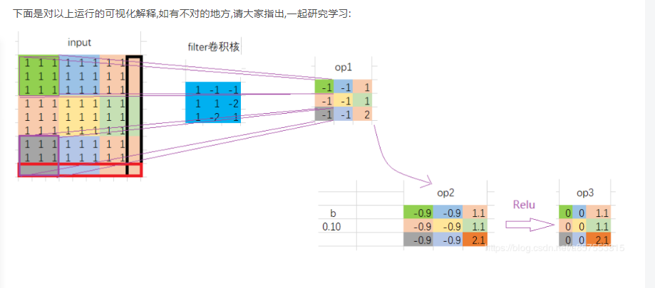
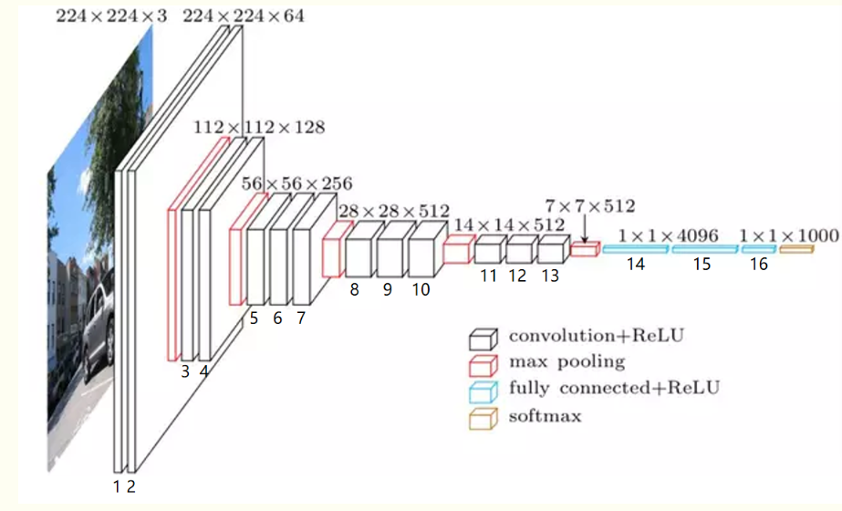

# 2020-05-27

**VGGNet**最重要的贡献是证明了分类任务可以通过使用**小的卷积核**增加CNN的**深度**来提高**精度**

VGG16处理过程如下： 
1、输入224x224x3的图片，经64个3x3的卷积核作两次卷积+ReLU，卷积后的尺寸变为224x224x64
2、作max pooling（最大化池化），池化单元尺寸为2x2（效果为图像尺寸减半），池化后的尺寸变为112x112x64
3、经128个3x3的卷积核作两次卷积+ReLU，尺寸变为112x112x128 
4、作2x2的max pooling池化，尺寸变为56x56x128 
5、经256个3x3的卷积核作三次卷积+ReLU，尺寸变为56x56x256
6、作2x2的max pooling池化，尺寸变为28x28x256
7、经512个3x3的卷积核作三次卷积+ReLU，尺寸变为28x28x512 
8、作2x2的max pooling池化，尺寸变为14x14x512
9、经512个3x3的卷积核作三次卷积+ReLU，尺寸变为14x14x512 
10、作2x2的max pooling池化，尺寸变为7x7x512 
11、与两层1x1x4096，一层1x1x1000进行全连接+ReLU（共三层） 
12、通过softmax输出1000个预测结果 


**输出通道维度跟输入通道维度没有计算上的关系  输出通道数只由卷积核个数决定**  


**训练的过程，本身就是不断调整参数来拟合复杂的非线性函数的过程**


**BUG1**

```
AttributeError: module 'tensorflow' has no attribute 'placeholder'

 tf 版本不对
 
import tensorflow.compat.v1 as tf
tf.disable_v2_behavior()
```

vgg16  fc 层 参数比较大 耗时 长 

由于池化只是下采样，没有权重，一般默认不计算层数


一维卷积用于:

自然语言处理（近义词反义词个数channel，词向量大小size，（chanel，size））
二维卷积用于：
图片处理（图通道数channel，图长Height，图宽weight，（channel，height，weight））
三维卷积用于：视频处理（帧通道数channel，帧数frame，图长Height，图宽weight，（channel，frame，height，weight））

**二维卷积**

tf.nn.conv2d(input, filter, strides, padding, use_cudnn_on_gpu=None, name=None)

```
input： 
指需要做卷积的输入图像，它要求是一个Tensor，具有[batch, in_height, in_width, in_channels]这样的shape，具体含义是[训练时一个batch的图片数量, 图片高度, 图片宽度, 图像通道数]，注意这是一个4维的Tensor，要求类型为float32和float64其中之一

filter： 
相当于CNN中的卷积核，它要求是一个Tensor，具有[filter_height, filter_width, in_channels, out_channels]这样的shape，具体含义是[卷积核的高度，卷积核的宽度，图像通道数，卷积核个数]，要求类型与参数input相同，有一个地方需要注意，第三维in_channels，就是参数input的第四维

strides：卷积时在图像每一维的步长，这是一个一维的向量，长度4

padding： 
string类型的量，只能是”SAME”,”VALID”其中之一，这个值决定了不同的卷积方式（后面会介绍）

use_cudnn_on_gpu： 
bool类型，是否使用cudnn加速，默认为true

```


最大池化操作

```
max pooling是CNN当中的最大值池化操作，其实用法和卷积很类似

tf.nn.max_pool(value, ksize, strides, padding, name=None)
参数是四个，和卷积很类似：
第一个参数value：需要池化的输入，一般池化层接在卷积层后面，所以输入通常是feature map，依然是[batch, height, width, channels]这样的shape

第二个参数ksize：池化窗口的大小，取一个四维向量，一般是[1, height, width, 1]，因为我们不想在batch和channels上做池化，所以这两个维度设为了1

第三个参数strides：和卷积类似，窗口在每一个维度上滑动的步长，一般也是[1, stride,stride, 1]

第四个参数padding：和卷积类似，可以取'VALID' 或者'SAME'

返回一个Tensor，类型不变，shape仍然是[batch, height, width, channels]这种形式


```

为什莫要有偏置项  **bias**  

 为了更好的拟合数据 

举个例子：
有点(2,3) 属于 A 类  点(3,4)属于 B 类，请问是否能从原点画一条线把他们分开？
不可以，
所以需要偏置值 b，这样线段就不从(0,0)点出发了


```
tf.constant  定义常量 

tensor=tf.constant([1, 2], shape=[1, 4, 3])
结果如下
 [[[1 2 2]
  [2 2 2]
  [2 2 2]
  [2 2 2]]]
tensor=tf.constant(-1, shape=[2, 3])


结果是：[[-1 -1 -1]
         [-1 -1 -1]]
```


**tf.concat** 拼接操作

```


import tensorflow as tf
a = tf.constant([[1,2,3],[4,5,6]])
b = tf.constant([[7,8,9],[10,11,12]])
ab1 = tf.concat([a,b],axis=0) # 往列的方向延深
ab2 = tf.concat([a,b], axis=1) 往行的方向延深
print(ab1)
print(ab2)
Tensor("concat_12:0", shape=(4, 3), dtype=int32)
Tensor("concat_13:0", shape=(2, 6), dtype=int32)
```

**tf.nn.conv2d, tf.nn.bias_add, tf.nn.relu的可视化**

```
import tensorflow as tf
input = tf.ones([1, 8, 8, 1], tf.float32)
a = [[[[1.]],[[-1]],[[-1]]],
     [[[1.]],[[1]],[[-2]]],
     [[[1.]],[[-2]],[[1]]] ]
filter = tf.Variable(a)
b = tf.constant([0.1])
op1 = tf.nn.conv2d(input, filter, strides=[1,3,3,1], padding='SAME')
op2 = tf.nn.bias_add(op1, b)
op3 = tf.nn.relu(op2) 
init = tf.initialize_all_variables() 
with tf.Session() as sess:
    sess.run(init)
    print("op1:",sess.run(op1))
    print("op2:",sess.run(op2))
    print("op3:",sess.run(op3))


op1: [[[[-1.],[-1.],[ 1.]]
       [[-1.],[-1.],[ 1.]]
       [[-1.],[-1.],[ 2.]]]]
 
op2: [[[[-0.9],[-0.9],[ 1.1]]
       [[-0.9],[-0.9],[ 1.1]]
       [[-0.9],[-0.9],[ 2.1]]]]
 
op3: [[[[0. ],[0. ],[1.1]]
       [[0. ],[0. ],[1.1]]
       [[0. ],[0. ],[2.1]]]]


```








学习率的大小会最终影响模型的效果