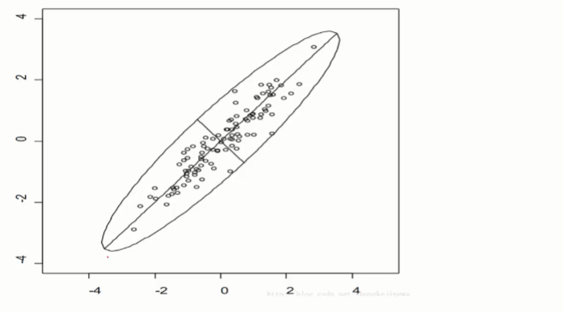

# PCA  && SVD 降维

鸢尾花数据集  花瓣长度 花瓣宽度  


petal花瓣 sepal花萼 

| sepal_len | sepal_wild | petal_len | petal_wild | class |
| --------- | ---------- | --------- | ---------- | ----- |
| 花萼长度      | 花萼宽度       | 花瓣长度      | 花瓣宽度       |       |

如何把一个四维的数据转换为二维的呢

请看鸢尾花数据集 



100个样本 4每个有4个特征 变为100 个样本 2 个特征 

添加一个  4X 2  的矩阵就可以

**pca**  的核心如何找到这个4 X 2 的矩阵 


# svd 

对于一个矩阵A   (m X n )  进行奇异值分解 u (m X m ) s (对角阵  m X n )   v   (n X n )

A = u * s * v   此为 奇异值分解

还有一个叫做特征值分解  适用性 不太广

.


# 回归算法


 #####  StandardScaler的transform和fit_transform 区别

```
tandardScaler类是一个用来将 数据进行归一化和标准化的类。
所谓归一化和标准化，即应用下列公式：
X= (x-μ)/σ
使得新的X数据集方差为1，均值为0

问题一：
StandardScaler类中transform和fit_transform方法有什么区别？

答：fit_transform方法是fit和transform的结合，fit_transform(X_train) 意思是找出X_train的 μ和 σ，并应用在X_train上。
这时对于X_test，我们就可以直接使用transform方法。因为此时StandardScaler已经保存了X_train的μ和 σ

问题二：
为什么可以用训练集的 μ 和  σ来transform 测试集的数据X_test?
答：我们家大王说，“机器学习中有很多假设，这里假设了训练集的样本采样足够充分”。我觉得颇有道理。

```

```
2.53560e-01  10  的-2 次方 

1、均方差就是标准差，标准差就是均方差 
2、均方误差不同于均方误差 
3、均方误差是各数据偏离真实值的距离平方和的平均数  MSE
```

# 决策树

 何为熵 ? 

熵是对混乱程度的度量 香农提出的   熵是概率的一个结果


不确定性的度量，值越大，不确定性越大。

一个事件的发生的概率离0.5越近，其熵就越大，概率为0或1就是确定性事件，不能为我们带信息量。也可以看作是一件事我们越难猜测是否会发生，它的信息熵就越大。


python  字典类型的数据  键值对的形式 key支持哈希 有个内置函数hash()可以检测bai是否支持可哈希

列表，是一个可变对象，支持原处修改。 能作为值 


python 中的copy  和deepcopy 的区别 

如果想用字面意思copy  就用deepcopy 

```
>>> import copy
>>> origin = [1, 2, [3, 4]]
#origin 里边有三个元素：1， 2，[3, 4]
>>> cop1 = copy.copy(origin)
>>> cop2 = copy.deepcopy(origin)
>>> cop1 == cop2
True
>>> cop1 is cop2
False 
#cop1 和 cop2 看上去相同，但已不再是同一个object
>>> origin[2][0] = "hey!" 
>>> origin
[1, 2, ['hey!', 4]]
>>> cop1
[1, 2, ['hey!', 4]]
>>> cop2
[1, 2, [3, 4]]
#把origin内的子list [3, 4] 改掉了一个元素，观察 cop1 和 cop2
```

copy  会跟随原对象的改变而改变   

deepcopy 不会跟随对象的改变改变而改变