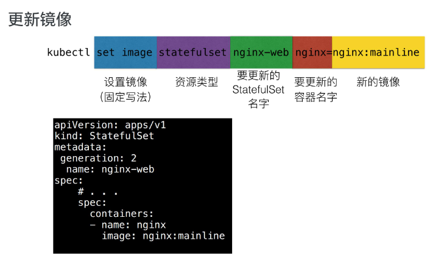
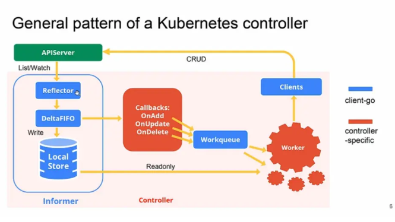

# CloudNative -3

## 22有状态应用编排：StatefulSet

 sts  statefulset缩写 

reclaim  回收 

Retain 保持

Recycle回收利用

​		注意：

- 目前只有NFS和HostPath支持Recycle;
- EBS,GCE PD, Azure Disk，Openstack Cinder支持Delete。

> Deployment用于部署无状态服务，StatefulSet用来部署有状态服务 
>
> 

replicas  期望数量

> > 升级策略字段解析
> >
> > > > > rollingUpdata 滚动升级
> > > > >
> > > > > onDelete 禁止主动升级
> > > > >
> > > > > partition 滚动升级时   保留旧版本pod  数量

单选 *1.以下关于ControllerRevision历史版本说法正确的是？**B***

A. 所有历史版本都会作为ControllerRevision保留

B. pod label中的controller-revision-hash与对应版本ControllerRevision name一致

C. revisionHistoryLimit字段不设置默认没有数量限制 

D. 更新了StatefulSet spec中字段，就会创建一个新的ControllerRevision单选 *2.创建StatefulSet spec中的template字段，用处不包括？*

A. 声明Pod容器的挂载目录

B. 声明Pod需要的pvc模板

C. 指定镜像版本

D. 指定Pod容器重启策略

正确答案： B

单选 *3.通过StatefulSet不能实现以下哪个功能？*

A. 应用扩缩容

B. 应用发布回滚

C. 应用重启

D. 应用副本数量维持

单选 *4.如果StatefulSet的podManagementPolicy设置为Parallel，则下列哪个说法错误？ C*

A. 不再严格按照顺序Ready的方式串行创建Pod

B. 不再严格按照倒序串行缩容Pod

C. 不再严格按照倒序串行升级Pod

D. podManagementPolicy是可选字段，yaml中可以不填

单选 *5.以下哪个不可能是名为nginx-web的StatefulSet扩容出来的pod/pvc name？D*

A. nginx-web-1

B. nginx-web-15

C. tmp-nginx-web-3

D. nginx-web-tmp-1

单选 *6.以下哪个是StatefulSet中要填写serviceName的根本原因？C*

A. 有状态应用必须配置service

B. 通过headless service来为StatefulSet提供服务

C. 通过headless service来为StatefulSet的每个Pod提供唯一hostname

D. 通过headless service来提高有状态服务的性能

判断 *7.通过配置StatefulSet，可以使每个Pod对应一个独立的PVC，也可以使所有Pod共用一个PVC。*  **正确**  pod 复用

正确

错误

多选 *8.以下关于StatefulSet和Deployment的区别说法正确的有哪些？ **CD***

A. StatefulSet的Pod能使用PVC，Deployment的Pod不能

B. StatefulSet有的发布能力，Deployment都有

C. StatefulSet发布前后Pod name不变，而Deployment会变

D. StatefulSet直接操作管理Pod资源，而Deployment则不会

多选 *9.关于StatefulSet中的volumeClaimTemplates，下列说法错误的有哪些？ **ABD***

A. 创建出的PVC name，就是volumeClaimTemplates中的metadata.name加一个order序号

B. 如果设置了volumeClaimTemplates，那么每次创建Pod之前都会发生PVC创建

C. volumeClaimTemplates里能设置多个PVC模板

D. 如果不设置volumeClaimTemplates，那么StatefulSet创建出的Pod就无法使用PVC

多选 *10.一个replicas=10、partition=8的StatefulSet，在某一个时刻status可能处于以下哪些状态？ **ABCD***

A. currentReplicas:8 updatedReplicas: 2

B. currentReplicas:9 updatedReplicas: 1

C. currentReplicas:10 updatedReplicas: 10

D. currentReplicas:6 updatedReplicas: 2

#  23 KubernetesAPI编程范式

##   CRD 

> > custom resources definition 指用户自定义资源
> >
> > ​																

 

单选 *4.自定义资源使用什么字段来嵌套其他子资源？*ACD都是yaml 配置中的常用字段  subresource  嵌套资源  添加状态

A. status

B. subresource

C. spec

D. metadata

正确答案： B

多选 *6.Controller一般具备哪几个函数来接受请求？**ABC***

A. AddFunc

B. UpdateFunc

C. DeleteFunc

D. PopFunc

多选 *7.关于Controller的描述，以下正确的有？*  **AB**

A. Controller是Kubernetes的大脑

B. Controller来完成具体的CRD操作

C. Controller完成全部的 CRD 功能

D. Controller必须配合 CRD 才能完成功能

多选 *8.Controller通过（ ）来同时处理多个对象的请求？ **AB***

A. Queue

B. Worker

C. Handler

D. Manager

多选 *9.Kubernetes自定义资源出现的原因是什么？*

A. 用户自定义资源需求比较多

B. Kubernetes 原生资源无法满足需求

C. Kubernetes APIServer 扩展比较复杂

D. 用户对Kubernetes架构不满意

正确答案： A B C

多选 *10.Kubernetes CRD可以和内置资源共享什么资源？  **AB**

A. kubectl

B. RBAC

C. Deployment

D. Pod

正确答案： A B

# 24 Kubernetes API编程利器：Operator和Operator Framework

  CRD  自定义资源类型  

CR 是CRD的具体实例  

真正完成业务逻辑的是 webhook 和controller 

mutate 突变 转变 转换 hook  钩子 

单选 *1.controller 入队逻辑针对可能丢失事件的正确处理方法是什么？*B

A. 无论什么事件都尽量入队

B. 给相关对象增加 finalizer

C. 定时轮询资源对象

D. 同一个事件入队多次

正确答案： B

单选 *2.大多数情况下只能工作在主备模式的是？D*

A. apiserver

B. validating webhook

C. mutating webhook

D. controller

单选 *3.在 webhook 业务逻辑中，下列哪些行为是不建议的？C*

A. 设置缺省值

B. 校验字段正确性

C. 调用外部api

D. 处理非 CRD 对象

单选 *4.在 controller 入队逻辑中，下列哪些行为是不建议的？D*

A. 查询 CRD 对象

B. 查询 CRD 关联对象

C. 根据对象字段做入队过滤

D. 处理业务逻辑

判断 *5.controller Reconcile 主循环返回错误会入队重试。*

正确

错误

正确答案： 正确

判断 *6.webhook 只能拦截处理 CRD 对象。**错误**

正确

错误

判断 *7.controller 的入队逻辑只取决于 CRD 的状态变化。错误

正确

错误

判断 *8.operator 模式中，webhook 组件和 controller 组件都是必须的。*错误

正确

错误

多选 *9.下列哪些设计是不可取的？*

A. controller 主循环函数不幂等

B. controller 实时更新 CRD status信息

C. 开发的多个 mutating webhook有顺序依赖

D. validating webhook 依赖 mutating webhook 先执行

正确答案： A C

多选 *10.下列哪些设计是不可取的？*

A. controller 主循环函数不幂等

B. controller 实时更新 CRD status信息

C. 开发的多个 mutating webhook有顺序依赖

D. validating webhook 依赖 mutating webhook 先执行

正确答案： A C

### 什莫是Operator

> > 引用官网的话，“An Operator is a method of packaging, deploying and managing a Kubernetes application.” Operator是一种打包、部署、管理K8S应用的方式。
> >
> >  **Operator与K8S Controller的关系**
> >
> > 所有的Operator都是用了Controller模式，但并不是所有Controller都是Operator。只有当它满足: controller模式 + API扩展 + 专注于某个App/中间件时，才是一个Operator。
> >
> > Operator就是使用CRD实现的定制化的Controller.  它与内置K8S Controller遵循同样的运行模式(比如 watch, diff, action)
> >
> > Operator是特定领域的Controller实现 
> >
> > > 所以要了解Operator的工作原理，首先要先了解K8S controller的原理。
> > >
> > > 
> > >
> > > Informer和workqueue是两个核心组件。Controller可以有一个或多个informer来跟踪某一个resource。Informter跟API server保持通讯获取资源的最新状态并更新到本地的cache中，一旦跟踪的资源有变化，informer就会调用callback。把关心的变更的Object放到workqueue里面。然后woker执行真正的业务逻辑，计算和比较workerqueue里items的当前状态和期望状态的差别，然后通过client-go向API server发送请求，直到驱动这个集群向用户要求的状态演化。

### DeltaFIFO

Delta其实就是kubernetes系统中对象的变化(增、删、改、同步)，FIFO是一个先入先出的队列，那么DeltaFIFO就是一个按序的(先入先出)kubernetes对象变化的队列。

### Finalizers 

Finalizers 是由字符串组成的列表，当 Finalizers 字段存在时，相关资源不允许被强制删除。存在 Finalizers 字段的的资源对象接收的第一个删除请求设置 `metadata.deletionTimestamp` 字段的值， 但不删除具体资源，在该字段设置后， `finalizer` 列表中的对象只能被删除，不能做其他操作。

当 `metadata.deletionTimestamp` 字段非空时，controller watch 对象并执行对应 finalizers 的动作，当所有动作执行完后，需要清空 finalizers ，之后 k8s 会删除真正想要删除的资源。

1. 如果资源对象未被删除且未设置 finalizers，则添加 finalizer并更新 k8s 资源对象；
2. 如果正在删除资源对象并且 finalizers 仍然存在于 finalizers 列表中，则执行 pre-delete hook并删除 finalizers ，更新资源对象；
3. 由于以上两点，需要确保 pre-delete hook是幂等的。