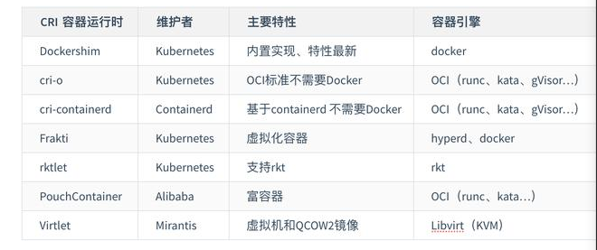

# CloudNative -3

## 22有状态应用编排：StatefulSet

 sts  statefulset缩写 

reclaim  回收 

Retain 保持

Recycle回收利用

​		注意：

- 目前只有NFS和HostPath支持Recycle;
- EBS,GCE PD, Azure Disk，Openstack Cinder支持Delete。

> Deployment用于部署无状态服务，StatefulSet用来部署有状态服务 
>
> 

replicas  期望数量

> > 升级策略字段解析
> >
> > > > > rollingUpdata 滚动升级
> > > > >
> > > > > onDelete 禁止主动升级
> > > > >
> > > > > partition 滚动升级时   保留旧版本pod  数量

单选 *1.以下关于ControllerRevision历史版本说法正确的是？**B***

A. 所有历史版本都会作为ControllerRevision保留

B. pod label中的controller-revision-hash与对应版本ControllerRevision name一致

C. revisionHistoryLimit字段不设置默认没有数量限制 

D. 更新了StatefulSet spec中字段，就会创建一个新的ControllerRevision单选 *2.创建StatefulSet spec中的template字段，用处不包括？*

A. 声明Pod容器的挂载目录

B. 声明Pod需要的pvc模板

C. 指定镜像版本

D. 指定Pod容器重启策略

正确答案： B

单选 *3.通过StatefulSet不能实现以下哪个功能？*

A. 应用扩缩容

B. 应用发布回滚

C. 应用重启

D. 应用副本数量维持

单选 *4.如果StatefulSet的podManagementPolicy设置为Parallel，则下列哪个说法错误？ C*

A. 不再严格按照顺序Ready的方式串行创建Pod

B. 不再严格按照倒序串行缩容Pod

C. 不再严格按照倒序串行升级Pod

D. podManagementPolicy是可选字段，yaml中可以不填

单选 *5.以下哪个不可能是名为nginx-web的StatefulSet扩容出来的pod/pvc name？D*

A. nginx-web-1

B. nginx-web-15

C. tmp-nginx-web-3

D. nginx-web-tmp-1

单选 *6.以下哪个是StatefulSet中要填写serviceName的根本原因？C*

A. 有状态应用必须配置service

B. 通过headless service来为StatefulSet提供服务

C. 通过headless service来为StatefulSet的每个Pod提供唯一hostname

D. 通过headless service来提高有状态服务的性能

判断 *7.通过配置StatefulSet，可以使每个Pod对应一个独立的PVC，也可以使所有Pod共用一个PVC。*  **正确**  pod 复用

正确

错误

多选 *8.以下关于StatefulSet和Deployment的区别说法正确的有哪些？ **CD***

A. StatefulSet的Pod能使用PVC，Deployment的Pod不能

B. StatefulSet有的发布能力，Deployment都有

C. StatefulSet发布前后Pod name不变，而Deployment会变

D. StatefulSet直接操作管理Pod资源，而Deployment则不会

多选 *9.关于StatefulSet中的volumeClaimTemplates，下列说法错误的有哪些？ **ABD***

A. 创建出的PVC name，就是volumeClaimTemplates中的metadata.name加一个order序号

B. 如果设置了volumeClaimTemplates，那么每次创建Pod之前都会发生PVC创建

C. volumeClaimTemplates里能设置多个PVC模板

D. 如果不设置volumeClaimTemplates，那么StatefulSet创建出的Pod就无法使用PVC

多选 *10.一个replicas=10、partition=8的StatefulSet，在某一个时刻status可能处于以下哪些状态？ **ABCD***

A. currentReplicas:8 updatedReplicas: 2

B. currentReplicas:9 updatedReplicas: 1

C. currentReplicas:10 updatedReplicas: 10

D. currentReplicas:6 updatedReplicas: 2

#  23 KubernetesAPI编程范式

##   CRD 

> > custom resources definition 指用户自定义资源
> >
> > ​																

 

单选 *4.自定义资源使用什么字段来嵌套其他子资源？*ACD都是yaml 配置中的常用字段  subresource  嵌套资源  添加状态

A. status

B. subresource

C. spec

D. metadata

正确答案： B

多选 *6.Controller一般具备哪几个函数来接受请求？**ABC***

A. AddFunc

B. UpdateFunc

C. DeleteFunc

D. PopFunc

多选 *7.关于Controller的描述，以下正确的有？*  **AB**

A. Controller是Kubernetes的大脑

B. Controller来完成具体的CRD操作

C. Controller完成全部的 CRD 功能

D. Controller必须配合 CRD 才能完成功能

多选 *8.Controller通过（ ）来同时处理多个对象的请求？ **AB***

A. Queue

B. Worker

C. Handler

D. Manager

多选 *9.Kubernetes自定义资源出现的原因是什么？*

A. 用户自定义资源需求比较多

B. Kubernetes 原生资源无法满足需求

C. Kubernetes APIServer 扩展比较复杂

D. 用户对Kubernetes架构不满意

正确答案： A B C

多选 *10.Kubernetes CRD可以和内置资源共享什么资源？  **AB**

A. kubectl

B. RBAC

C. Deployment

D. Pod

正确答案： A B

# 24 Kubernetes API编程利器：Operator和Operator Framework

  CRD  自定义资源类型  

CR 是CRD的具体实例  

真正完成业务逻辑的是 webhook 和controller 

mutate 突变 转变 转换 hook  钩子 

单选 *1.controller 入队逻辑针对可能丢失事件的正确处理方法是什么？*B

A. 无论什么事件都尽量入队

B. 给相关对象增加 finalizer

C. 定时轮询资源对象

D. 同一个事件入队多次

正确答案： B

单选 *2.大多数情况下只能工作在主备模式的是？D*

A. apiserver

B. validating webhook

C. mutating webhook

D. controller

单选 *3.在 webhook 业务逻辑中，下列哪些行为是不建议的？C*

A. 设置缺省值

B. 校验字段正确性

C. 调用外部api

D. 处理非 CRD 对象

单选 *4.在 controller 入队逻辑中，下列哪些行为是不建议的？D*

A. 查询 CRD 对象

B. 查询 CRD 关联对象

C. 根据对象字段做入队过滤

D. 处理业务逻辑

判断 *5.controller Reconcile 主循环返回错误会入队重试。*

正确

错误

正确答案： 正确

判断 *6.webhook 只能拦截处理 CRD 对象。**错误**

正确

错误

判断 *7.controller 的入队逻辑只取决于 CRD 的状态变化。错误

正确

错误

判断 *8.operator 模式中，webhook 组件和 controller 组件都是必须的。*错误

正确

错误

多选 *9.下列哪些设计是不可取的？*

A. controller 主循环函数不幂等

B. controller 实时更新 CRD status信息

C. 开发的多个 mutating webhook有顺序依赖

D. validating webhook 依赖 mutating webhook 先执行

正确答案： A C

多选 *10.下列哪些设计是不可取的？*

A. controller 主循环函数不幂等

B. controller 实时更新 CRD status信息

C. 开发的多个 mutating webhook有顺序依赖

D. validating webhook 依赖 mutating webhook 先执行

正确答案： A C

### 什莫是Operator

> > 引用官网的话，“An Operator is a method of packaging, deploying and managing a Kubernetes application.” Operator是一种打包、部署、管理K8S应用的方式。
> >
> >  **Operator与K8S Controller的关系**
> >
> > 所有的Operator都是用了Controller模式，但并不是所有Controller都是Operator。只有当它满足: controller模式 + API扩展 + 专注于某个App/中间件时，才是一个Operator。
> >
> > Operator就是使用CRD实现的定制化的Controller.  它与内置K8S Controller遵循同样的运行模式(比如 watch, diff, action)
> >
> > Operator是特定领域的Controller实现 
> >
> > > 所以要了解Operator的工作原理，首先要先了解K8S controller的原理。
> > >
> > > 
> > >
> > > Informer和workqueue是两个核心组件。Controller可以有一个或多个informer来跟踪某一个resource。Informter跟API server保持通讯获取资源的最新状态并更新到本地的cache中，一旦跟踪的资源有变化，informer就会调用callback。把关心的变更的Object放到workqueue里面。然后woker执行真正的业务逻辑，计算和比较workerqueue里items的当前状态和期望状态的差别，然后通过client-go向API server发送请求，直到驱动这个集群向用户要求的状态演化。

### DeltaFIFO

Delta其实就是kubernetes系统中对象的变化(增、删、改、同步)，FIFO是一个先入先出的队列，那么DeltaFIFO就是一个按序的(先入先出)kubernetes对象变化的队列。

### Finalizers 

Finalizers 是由字符串组成的列表，当 Finalizers 字段存在时，相关资源不允许被强制删除。存在 Finalizers 字段的的资源对象接收的第一个删除请求设置 `metadata.deletionTimestamp` 字段的值， 但不删除具体资源，在该字段设置后， `finalizer` 列表中的对象只能被删除，不能做其他操作。

当 `metadata.deletionTimestamp` 字段非空时，controller watch 对象并执行对应 finalizers 的动作，当所有动作执行完后，需要清空 finalizers ，之后 k8s 会删除真正想要删除的资源。

1. 如果资源对象未被删除且未设置 finalizers，则添加 finalizer并更新 k8s 资源对象；
2. 如果正在删除资源对象并且 finalizers 仍然存在于 finalizers 列表中，则执行 pre-delete hook并删除 finalizers ，更新资源对象；
3. 由于以上两点，需要确保 pre-delete hook是幂等的。

#  25 Kubernetes网络模型进阶

单选 *1.Flannel-HostGW方案精髓，是选以下哪个网卡上的IP，做非本地节点网段的GW？*

A. CNI

B. Node-NIC

C. Remote-CNI0

D. Remote-Node-Nic

相关知识点： [对端网段选对端node网卡IP做GW](https://edu.aliyun.com/clouder/exam/detail/%E5%AF%B9%E7%AB%AF%E7%BD%91%E6%AE%B5%E9%80%89%E5%AF%B9%E7%AB%AFnode%E7%BD%91%E5%8D%A1IP%E5%81%9AGW)

正确答案： D

判断 *2.不通过Nodeport接口，外部无法调用Kubernetes的Service。***错误**

正确

错误

相关知识点： [还有其他办法，比如在某个节点插入外网卡，变成路由节点

判断 *6.Ingress机制就是来替换Service的。*

正确

错误

相关知识点： [不是，其实更好的辅助组件，更好对接Service](https://edu.aliyun.com/clouder/exam/detail/%E4%B8%8D%E6%98%AF%EF%BC%8C%E5%85%B6%E5%AE%9E%E6%9B%B4%E5%A5%BD%E7%9A%84%E8%BE%85%E5%8A%A9%E7%BB%84%E4%BB%B6%EF%BC%8C%E6%9B%B4%E5%A5%BD%E5%AF%B9%E6%8E%A5Service)

正确答案： 错误

判断 *8.Pod能且只能支持网络空间共享。*

正确

错误

相关知识点： [还可以支持ipc等空间，可选]

判断 *7.容器里面必须有网络设备才能叫容器网络。*

正确

错误

相关知识点： [还可以有用户态路径方案]

多选 *10.Docker的桥接网络优势是什么？**ABD***

A. 天然集成在Docker引擎中

B. 与外部网络完全解耦

C. 能完美支持Kubernetes网络模型

D. Bridge是内核最通用稳定的虚拟设备之一

## Kubernetes service暴露服务到目前为止，一共有以下几种方法

**ClusterIP 方式**  kubernetes 默认就是这种方式，是集群内部访问的方式

**NodePort 方式***NodePort方式主要通过节点IP加端口的形式暴露端口 

***LoadBalancer 方式***这种方式主要是利用其他第三方的LB暴露服务的

**ExternalName 方式 **  这种方式主要是通过CNAME实现的

## Ingress机制Service机制的区别

每个 Service 都要有一个负载均衡的服务,所以采用 Service 的话,会造成既浪费成本又高的现象.对于用户来说,我更希望的是,能有一个全局的负载均衡器,然后我只需要通过访问 URL 就可以把请求转发给不同的后端 Service ,从而可以访问到界面.而不是每个 Service 都需要负载均衡.
而这,就引出了 Ingress :它就是全局的,为了代理不同后端 Service 而设置的负载均衡服务

所谓 Ingress 对象,其实就是 Kubernetes 项目对"反向代理"的一种抽象,一个 Ingress 对象的主要内容,实际上就是一个"反向代理"服务的配置文件的描述,而这个代理服务对应的转发规则,就是 IngressRule.

# 26 理解CNI和CNI插件

## CNI 是什么

> > > container network interface 容器网络的API接口
> > >
> > > Kubelet 通过这个标准的 API 调用不同的网络插件实现配置网络
> > >
> > > CNI 插件 :一系列实现了CNI API 接口的网络插件
> > >
> > > 

单选 *1.以下哪个不是路由模式的CNI插件？**C***

A. flannel-hostgw

B. calico-bgp

C. contiv

D. flannel-alivpc

正确答案： C

单选 *3.在虚拟化的环境中一般选择哪种类型的网络插件？**A***

A. Overlay

B. Underlay

C. 路由

正确答案： A

判断 *6.Kubernetes通过GRPC接口调用网络插件。 **CNI***

正确

错误

 gPRC：gRPC 是一款高性能、开源的 RPC 框架，产自 Google，基于 ProtoBuf 序列化协议进行开发，支持多种语言。 通信方式  

rpc 通信方式

# 27 Kubernetes安全之访问控制

authentication 认证  authorization  授权

1.如果我们没有设置KUBECONFIG变量，kubectl客户端还会尝试从下列哪个路径读取kubeconfig配置？*  $HOME/.kube/config

*2.在x509证书认证中，下列哪个字段会被apiserver作为用户模型中的用户(user)？***D**

A. Issuer –> O

B. Issuer -> CN

C. Subject -> O

D. Subject -> CN

正确答案： D

单选 *4.以下哪种说法是错误的？**B**

A. service account是Kubernetes中唯一能够通过API方式管理的apiserver访问凭证

B. 对于已经创建的pod，我们可以更新其已经挂载的service account内容

C. 用户可以通过API创建自定义名称的service account

D. 当一个namespace创建完成后，会同时在该namespace下生成名为default的一个Service Account和对应的secret实例

正确答案： B

单选 *5.下列哪种认证方式是安全上不推荐的方式？***A**

A. Basic认证

B. x509证书认证

C. OpenID Connect认证

D. Service Account认证

正确答案： A

单选 *6.下列哪个组件配置参数用于调整Kubernetes中CertificateSigningRequest实例签发证书的过期时间？*

A. kube-apiserver -> tls-cert-file

B. kube-apiserver -> client-ca-file

C. kube-controller-manager -> experimental-cluster-signing-duration

D. kubelet -> rotate-certificates

正确答案： C

判断 *7.RBAC中集群角色ClusterRole可以绑定到namespace中的一个具体的object实例。***错误**

正确

错误

判断 *8.在一个RoleBinding实例中，一个绑定只能指定唯一的Role。***正确**

正确

错误

多选 *10.下列关于RBAC的说法，哪些是正确的？ * **ABD  没有put**

A. RBAC策略模型中的Subjects可能包含开发人员，管理员，系统组件进程或是pod进程

B. RBAC 策略模型中的对象资源在k8s集群中指Pod，Deployment等各类API资源

C. RBAC 策略模型中的Verbs包括list，watch，put等

D. RBAC 策略模型中的角色可以对k8s subresources（比如nodes/status） 进行绑定

K8s API 请求

authentication 认证  ---->authorization  授权 -->admissionControll  (准许加入)

　**RBAC**

(Role-Based Access Control，基于角色的访问控制)在k8s v1.5中引入，在v1.6版本时升级为Beta版本，并成为kubeadm安装方式下的默认选项，相对于其他访问控制方式，新的RBAC具有如下优势：

　　- 对集群中的资源和非资源权限均有完整的覆盖

　　  整个RBAC完全由几个API对象完成，同其他API对象一样，可以用kubectl或API进行操作

　　  可以在运行时进行调整，无需重启API Server

　　要使用RBAC授权模式，需要在API Server的启动参数中加上--authorization-mode=RBAC

# 理解容器运行时接口CRI

单选 *2.Kubernetes中，crictl是什么？*

A. CRI接口的性能测试工具

B. 操作CRI接口的命令行工具

C. CRI接口的功能正确性测试工具

正确答案： B

**cri-tools**

> > > crictl  :类似docker 的命令行工具 帮助用户和开发者调试容器问题
> > >
> > > critest : 用于验证CRI 接口的测试工具
> > >
> > > 

*5.Kubernetes中，rkt是一种容器运行时

*4.Kubelet与CRI之间通过*gRPC*协议进行通信

多选 *8.gRPC协议的优点是？ **ABCD***

A. 高性能

B. 有多种语言的实现

C. 可以自动生成接口代码

D. 支持双向流数据

多选 *10.CRI有哪几类接口？**ABC***

A. Sandbox

B. Container

C. Image

D. Storage

 存储不属于CRI的范畴

多选 *9.如何对CRI进行拓展？ **AB***

A. 直接修改CRI接口定义

B. 通过annotation传递自定义字段，在容器运行时的实现里识别

C. 修改controller-manager代码

## CRI

Container Runtime Interface

在CRI还没有问世的Kubernetes早期版本里，比如1.3版本里，添加了对另一个容器运行时技术rkt的支持，即rktnetes项目。

这个项目虽然让Kubernetes增加了除Docker之外的另一种容器运行时的支持，然而这种增强的实现方式是通过直接修改kubelet实现源代码进行的，需要贡献者非常熟悉kubelet内部原理，开发门槛较高。

为了实现一个真正支持可插拔替换的容器运行时的机制，Kubernetes引入了CRI的概念。

有了CRI后，kubelet不再直接和容器运行时交互，而是通过CRI这个中间层。

# any problem in computer science can be sloved by another layer of indirecition

# 计算机科学领域的任何问题都可以通过增加一个中间层来解决

## CRI工作原理

当对一个容器执行 kubectl exec 命令时,这个请求首先会交给 API Server , 然后 API Server 就会调用 kubelet 的 Exec API .此时, kubelet 会调用 CRI 的 Exec 接口,而负责响应这个接口的,就是 CRI shim .但是在这一步, CRI shim 并不会直接去调用后端的容器项目(比如 Docker )来进行处理,而只会返回一个 URL 给 kubelet .这个 URL ,就是该 CRI shim 对应的 Streaming Server 的地址和端口.
kubelet 在拿到这个 URL 之后,就会把它以 Redirect 的方式返回给 API Server .所以这个时候, API Server 就会通过重定向来向 Streaming Server 发起真正的 /exec 请求,和它建立长连接.
Stream Server 这一部分具体怎么实现,完全可以由 CRI shim 的维护者自行决定.

所以, CRI 这个接口的设计,实际上还是比较宽松的.这就意味着,作为容器项目的维护者,在实现 CRI 的具体接口时,往往拥有着很高的自由度,这个自由度不仅包括了容器的生命周期管理,也包括了如何将 Pod 映射成自己的实现,还包括了如何调用 CNI 插件来为 Pod 设置网络的过程.

kubectl exec 执行容器命令

 

CRI 容器运行时与容器引擎的区别：

- CRI 容器运行时是指实现了 Kubelet CRI 接口的运行时，这样就可以无缝集成到 Kubernetes 之中。
- 容器引擎只是负责管理容器镜像和容器运行的一个服务，它也有一个标准是 OCI(Open Container Initiative)。

# 29 安全容器技术

##  安全容器

*.gVisor是用go 语言编写的   Go, Go语言和gVisor都来自G开头的Google

单选 *3.virtio-fs应用了哪项技术可以跨沙箱共享只读内存？*

A. DDX

B. DAX

C. SGX

D. DFX

相关知识点： [DAX，为非易失内存开发的技术]

*.Kata Containers项目是2017年宣布

判断 *7.安全容器和runC都可以运行OCI Image。***正确**

正确

错误

相关知识点： [是的，都支持OCI规范]

多选 *9.下列哪种机制被gVisor用来拦截容器的syscall？*

A. ptrace

B. KVM

C. dtrace

D. strace

E. JVM

正确答案： A B

多选 *10.Kata Containers目前可以支持下列哪些虚拟机监视器（VMM）？**BE***

A. VMWare

B. Qemu

C. Xen

D. Hyper-V

E. Firecracker

# 30 理解RuntimeClass与使用多容器运行时

单选 *1.如果使用 RuntimeClass 的 Overhead，需要开启哪个 admisson？*

A. ResourceQUota admission

B. RuntimeClass admisson

C. PodOverhead admission

正确答案： B

单选 *2.删除 RuntimeClass 后，对已有的 Pod Overhead 有影响吗？* 无影响

*Pod Overhead 支持手动配置或更改。*

正确

错误

正确答案： 错误

判断 *7.RuntimeClass 是 cluster 级别的资源。 正确  全局的*

正确

错误

多选 *9.Pod Overhead 会影响哪些功能？ **BCD***

A. HPA

B. Pod 调度

C. ResourceQuota

D. Kubelet Pod 驱逐