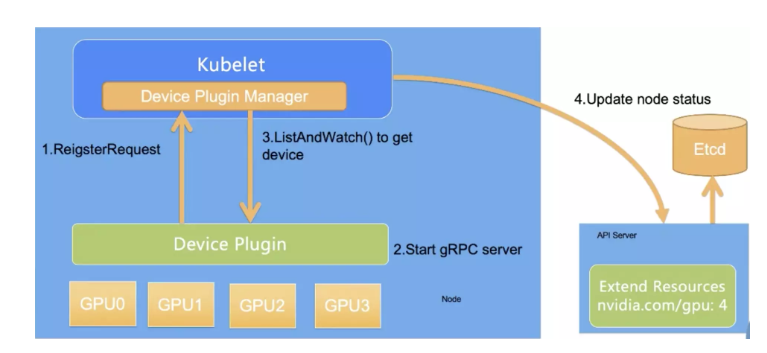

CloundNative-2

##   20  GPU管理和Device Plugin工作机制

     从kubernetes1.8版本开始，提供了设备插件框架，设备厂商无需修改kubernetes核心代码就可以将自己生产的设备的资源
     (kubernetes可管理的资源包括CPU、内存和存储资源)可以让kubelet使用(这一点与操作系统一样，所有设备厂商自己实现驱动
     
     1 Device Plugin 中API可以用来反映设备健康状况的方法名称是？ C

          A. Allocate

          B. Register

          C. ListAndWatch

          D. PreStartContainer
          
          
          
          
       
      
 
 
          第一步是 Device Plugin 的注册，需要 Kubernetes 知道要跟哪个 Device Plugin 进行交互。这是因为一个节点上可能有多个设备，
          需要 Device Plugin 以客户端的身份向 Kubelet 汇报三件事情：我是谁？就是 Device Plugin 所管理的设备名称，是 GPU 还是 RDMA；
          我在哪？就是插件自身监听的 unis socket 所在的文件位置，让 kubelet 能够调用自己；交互协议，即 API 的版本号；
          第二步是服务启动，Device Plugin 会启动一个 GRPC 的 server。在此之后 Device Plugin 一直以这个服务器的身份提供服务让 kubelet 来访问，
          而监听地址和提供 API 的版本就已经在第一步完成了；
          第三步，当该 GRPC server 启动之后，kubelet 会建立一个到 Device Plugin 的 ListAndWatch 的长连接， 
          用来发现设备 ID 以及设备的健康状态。当 Device Plugin 检测到某个设备不健康的时候，就会主动通知 kubelet。
          而此时如果这个设备处于空闲状态，kubelet 会将其移除可分配的列表。但是当这个设备已经被某个 Pod 所使用的时候，
          kubelet 就不会做任何事情，如果此时杀掉这个 Pod 是一个很危险的操作；
          第四步，kubelet 会将这些设备暴露到 Node 节点的状态中，把设备数量发送到 Kubernetes 的 api-server 中。
          后续调度器可以根据这些信息进行调度。
          

