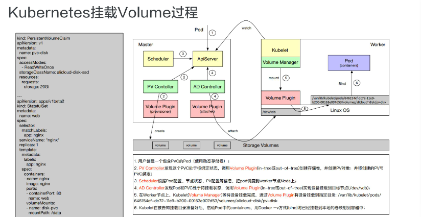

CloundNative-2

##   20  GPU管理和Device Plugin工作机制

     从kubernetes1.8版本开始，提供了设备插件框架，设备厂商无需修改kubernetes核心代码就可以将自己生产的设备的资源
     (kubernetes可管理的资源包括CPU、内存和存储资源)可以让kubelet使用(这一点与操作系统一样，所有设备厂商自己实现驱动
     
     1 Device Plugin 中API可以用来反映设备健康状况的方法名称是？ C

          A. Allocate

          B. Register

          C. ListAndWatch

          D. PreStartContainer
          
          
          
          

     
 
   

   

          第一步是 Device Plugin 的注册，需要 Kubernetes 知道要跟哪个 Device Plugin 进行交互。这是因为一个节点上可能有多个设备，
          需要 Device Plugin 以客户端的身份向 Kubelet 汇报三件事情：我是谁？就是 Device Plugin 所管理的设备名称，是 GPU 还是 RDMA；
          我在哪？就是插件自身监听的 unis socket 所在的文件位置，让 kubelet 能够调用自己；交互协议，即 API 的版本号；

          第二步是服务启动，Device Plugin 会启动一个 GRPC 的 server。在此之后 Device Plugin 一直以这个服务器的身份提供服务让 kubelet 来访问，
          而监听地址和提供 API 的版本就已经在第一步完成了；

          第三步，当该 GRPC server 启动之后，kubelet 会建立一个到 Device Plugin 的 ListAndWatch 的长连接， 
          用来发现设备 ID 以及设备的健康状态。当 Device Plugin 检测到某个设备不健康的时候，就会主动通知 kubelet。
          而此时如果这个设备处于空闲状态，kubelet 会将其移除可分配的列表。但是当这个设备已经被某个 Pod 所使用的时候，
          kubelet 就不会做任何事情，如果此时杀掉这个 Pod 是一个很危险的操作；

          第四步，kubelet 会将这些设备暴露到 Node 节点的状态中，把设备数量发送到 Kubernetes 的 api-server 中。
          后续调度器可以根据这些信息进行调度。
          
          单选  3.Device Plugin的AllocateResponse中可以接收如下哪些参数? ABC

          A. devices

          B. mounts

          C. envs

          D. cpus
          正确答案： A B C
        9.使用Kubernetes管理GPU资源可以利用Kubernetes的统一调度能力，使资源使用方能够用即申请，完即释放，从而盘活整个GPU资源池。

          正确

          错误
          正确答案： 正确  

          多选  10.Kubernetes通过哪些内部机制支持GPU管理？ bc 

          A. CNI Plugin

          B. Device Plugin

          C. Extended Plugin

          D. Cloud Provider

## k8s 本身通过  插件扩展机制来管理 gpu  分为两种 extend resources 和 Device Plugin Framework 

     extend resources通用的模式支持不同的异构设备，包括 RDMA、FPGA、AMD GPU 等等，而不仅仅是为 Nvidia GPU 设计的；
     evice Plugin Framework 允许第三方设备提供商以外置的方式对设备进行全生命周期的管理，而 Device Plugin Framework 建立 Kubernetes 和 Device Plugin 模块之间的桥梁。它一方面负责设备信息的上报到 Kubernetes，另一方面负责设备的调度选择。
     
     
   # Device Plugin 机制的缺陷
   需要指出的是 Device Plugin 整个工作机制和流程上，实际上跟学术界和工业界的真实场景有比较大的差异。这里最大的问题在于 GPU 资源的调度工作，实际上都是在 kubelet 上完成的。

而作为全局的调度器对这个参与是非常有限的，作为传统的 Kubernetes 调度器来说，它只能处理 GPU 数量。一旦你的设备是异构的，不能简单地使用数目去描述需求的时候，比如我的 Pod 想运行在两个有 nvlink 的 GPU 上，这个 Device Plugin 就完全不能处理。

更不用说在许多场景上，我们希望调度器进行调度的时候，是根据整个集群的设备进行全局调度，这种场景是目前的 Device Plugin 无法满足的。

更为棘手的是在 Device Plugin 的设计和实现中，像 Allocate 和 ListAndWatch 的 API 去增加可扩展的参数也是没有作用的。这就是当我们使用一些比较复杂的设备使用需求的时候，实际上是无法通过 Device Plugin 来扩展 API 实现的。

因此目前的 Device Plugin 设计涵盖的场景其实是非常单一的， 是一个可用但是不好用的状态。这就能解释为什么像 Nvidia 这些厂商都实现了一个基于 Kubernetes 上游代码进行 fork 了自己解决方案，也是不得已而为之。
  
##  21  Kubernetes存储架构及插件使
          转自 https://www.cnblogs.com/laobeipai/p/12311179.html  感觉很详细
# 什莫是CRD 对象
          k8s系统中controller扮演着重要角色，开发自定义controller是深入学习和理解controller的有效途径
          自定义API对象（Custom Resource Definition）自定义API对象（也就是CRD）
          
          Attach  挂载
          mount  本地设备 挂载到 Pod 在节点上的一个子目录中。
          bind 绑定
          Provision  提供 规定 就是由谁去创建的
          Detach 分离
          unmount 解除挂载
          Pending 在等待  待定
          bound bind  过去分词 已经绑定过
          Reconcile 调和
  
  ## AD controller 核心对象  核心逻辑
          DesiredStateofWorld 是集群中预期要达到的数据卷的挂载状态；
          ActualStateOfWorld 则是集群内部实际存在的数据卷挂载状态。

          desiredStateOfWorldPopulator 和 Reconcile
          
          desiredStateOfWorldPopulator 主要是用来同步集群的一些数据以及 DSW、ASW 数据的更新，它会把集群里面，
          比如说我们创建一个新的 PVC、创建一个新的 Pod 的时候，我们会把这些数据的状态同步到 DSW 中；

          Reconcile 则会根据 DSW 和 ASW 对象的状态做状态同步。它会把 ASW 状态变成 DSW 状态，在这个状态的转变过程中，
          它会去执行 Attach、Detach 等操作。
   # Volume Plugins
               我们之前提到的 PV Controller、AD Controller 以及 Volume Manager 其实都是通过调用 Volume Plugin
               提供的接口，比如 Provision、Delete、Attach、Detach 等去做一些 PV、PVC 的管理。
               而这些接口的具体实现逻辑是放在 VolumePlugin 中的
                    In-Tree 表示源码是放在 Kubernetes 内部的，和 Kubernetes 一起发布、管理与迭代，缺点及时迭代速度慢、灵活性差；
                  Out-of-Tree 类的 Volume Plugins 的代码独立于 Kubernetes，它是由存储商提供实现的，
                  目前主要有 Flexvolume 和 CSI 两种实现机制，可以根据存储类型实现不同的存储插件。
                  所以我们比较推崇 Out-of-Tree 这种实现逻辑
                  
          CSI 是通过 CRD 的形式实现的，所以 CSI 引入了这么几个对象类型：VolumeAttachment、CSINode、CSIDriver 
          以及 CSI Controller Server 与 CSI Node Server 的一个实现。     
         
         VolumeAttachment 描述一个 Volume 卷在一个 Pod 使用中挂载、卸载的相关信息。例如，对一个卷在某个节点上的挂载，
              我们通过 VolumeAttachment 对该挂载进行跟踪。AD Controller 创建一个 VolumeAttachment，
              而 External-attacher 则通过观察该   VolumeAttachment，根据其状态来进行挂载和卸载操作。
            CSIDriver，它描述了集群中所部署的 CSI Plugin 列表，需要管理员根据插件类型进行创建。 
            CSINode，它是集群中的节点信息，由 node-driver-registrar 在启动时创建。
            它的作用是每一个新的 CSI Plugin 注册后，都会在 CSINode 列表里添加一个 CSINode 信息。
  ##    DaemonSet 对象       
            DaemonSet用于再集群中的全部节点上同时运行一份指定的pod资源副本，后续新加入的工作节点也会自动创建一个相关的pod对象，
            当从集群中移除节点时，此类pod对象也将被自动回收而无须重建。也可以使用节点选择器及节点标签指定仅在部分
            具有特定特征的节点上运行指定的pod对象。

# in-tree  和out-of-tree 区别
          存储卷接入方案（In-Tree）
          插件机制（Out-Of-Tree），允许其他类型的存储服务接入 Kubernetes 系统服务

 
          单选  1.关于Volume的Provision、Attach、Mount操作，下面说法错误的是？ C

          A. PV controller只能负责Provision操作

          B. AD Controller只能负责Attach操作

          C. Volume Manager只能负责Mount操作
          
          多选  10.关于CSI组件，下面说法正确的有？

          A. PV Controller调用External Provisioner实现创建数据卷功能

          B. 有些存储类型可以不部署External Attacher

          C. Kubelet直接调用CSI Plugin实现数据卷的Mount/Unmount操作

          D. CSI Controller Server和CSI Node Server每个节点都需要部署
          正确答案： B C
  
  
          多选  8.关于Flexvolume，下面说法正确的有？

          A. Flexvolume可以支持Attach操作

          B. Flexvolume是一个守护进程

          C. Flexvolume可以支持Provision操作

          D. Flexvolume是运行在主机空间的程序
          正确答案： A D
          
          多选  6.关于pv、pvc绑定，下面说法正确的有？

          A. 必须Access Modes相同的pv、pvc才可以绑定

          B. PVC定义的Capacity必须等于PV的Capacity才可以绑定

          C. 可以通过Selector配置特定的PVC、PV绑定

          D. PVC找不到匹配的PV时，才会触发Provisioner创建PV
          正确答案： C D
          
               单选  5.关于存储卷回收策略，下面说法错误的是？

               A. Retain模式：PVC删除后，PV依然存在

               B. 动态生成的PV，默认为Retain模式

               C. Delete模式：PVC删除后，PV同时被删除

               D. Recycle模式：PVC删除后，PV可再次使用
               正确答案： B
