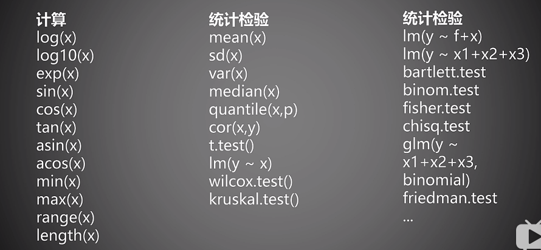
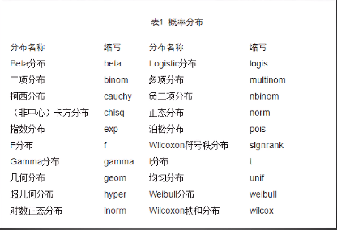
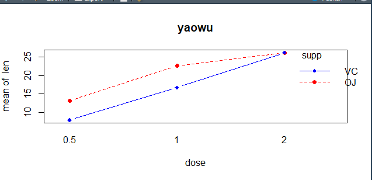

# R语言

处理大批量数据


数据: 是指对客观事件进行记录并可以鉴别的符号,是对客观事务的性质,状态以及相互关系等进行记载的物理肤好或这些物理符号的组合

通过数据分析来进行指导决策

> > > 数据分析的步骤:
> > >
> > > 1 数据采集
> > >
> > > 2 数据存储 
> > >
> > > 3数据统计 : 使用统计方法
> > >
> > > 4数据挖掘 指从大量的数据中通过算法搜索掩藏于其中信息的过程
> > >
> > > 5数据可视化
> > >
> > > 6 进行决策


# 大数据时代

R 语言的特点 :		

​		1 有效的数据处理和保存机制

​		2 拥有一整套数组和矩阵的操作运算符

​		3 一系列连贯而又完整的数据分析中间工具

​		4图形统计可以对数据直接进行分析和显示,可用于多种图形设备

​		5一种相当完善.简洁和高效的程序设计语言

​		6R 语言是彻底面向对象的统计编程语言

​		7 R语言和其它编程语言,数据库之间有很好的接口


getwd () 获取当前工作目录 记得加括号

ctrl + L  清屏

列出包的函数 ls("package:vcd")

> 从内存中移除程辑包：vcd
>
> detach("package:vcd")
> require(vcd)
> 载入需要的程辑包：vcd
>
> install.packages("vcd")
>
> remove.packages("vcd")

数据结构: 数据结构是计算机存储,组值数据的方式 数据结构是指一种或多种特定关系的数据元素的集合

R 中的数据类型

1 数值型 

2 字符串型

3逻辑型

4日期类型等


R 对象: object 它是指可以赋值给变量的任何事物,包括常量,数据结构,函数,甚至图形,对象拥有某种模式,它描述了此对象如何存储以及某个类


### 向量 vector

 用于存储数值型,字符型或逻辑型数据的一维数组

用函数**C**创建向量


向量化编程

```
> x <- c(1,2,3,4,5)
> y <- c(6,7,8,9,10)
> x
[1] 1 2 3 4 5
> y
[1]  6  7  8  9 10
> x * 2+y
[1]  8 11 14 17 20
```

向量化编程最大的优势就是避免使用循环

 x[-19] 只是不输出第19个元素

向量运算是R语言中的基本运算

> y <- seq(1,100,length.out = 10)
> y
>  [1]   1  12  23  34  45  56  67  78  89 100


> 求余
>
>  y %% x
>  [1] 1 0 3 4 3 0 3 6 9 1
>
> 整除运算
>
> y%/%x
>  [1] 0 4 5 6 7 8 8 8 8 9

长的向量个数必须是短的向量个数的整数倍

 ceiling(c(-2.3,3.1415))  不小于它的最小整数

> trunc(c(-2.3,3.1415))  取整 
> [1] -2  3  

> 
    四分位数
    quantile(vec)
    0%    25%    50%    75%   100% 
      1.00  25.75  50.50  75.25 100.00 
      
      which.max(t) 返回最大值的索引
#### 矩阵 (Matrix) 

是一个按照长方形阵列排列的复数或实数集合向量是一维的,而矩阵是二维的,需要有行和列


R 语言中不能用鼠标选择数据


线性代数相关知识    矩阵的相加  必须 矩阵的行和列相同

```
> n <- matrix(1:9,3,3)
> n
     [,1] [,2] [,3]
[1,]    1    4    7
[2,]    2    5    8
[3,]    3    6    9
> t <- matrix(2:10,3,3)
> t
     [,1] [,2] [,3]
[1,]    2    5    8
[2,]    3    6    9
[3,]    4    7   10
> n*t  内积
     [,1] [,2] [,3]
[1,]    2   20   56
[2,]    6   30   72
[3,]   12   42   90

外积  对应相乘在相加
> n %*%t 
     [,1] [,2] [,3]
[1,]   42   78  114
[2,]   51   96  141
[3,]   60  114  168
> 
```

####列表:

存储很多内容的一个集合 列表是一些对象的有序集合.列表中可以存储若干向量.矩阵,数据框,甚至其它列表的组合 

向量与列表 

1 在模式上和向量类似,都是一维数据集合

2向量只能存储一种数据类型,列表中的对象可以是R 中的任何数据结构,甚至列表本身


#### 数据框:

数据框是一种表格式的数据结构 数据框旨在模拟数据集,与其他统计软件 sas ,spss中的数据集的概念一致

数据集通常是由数据构成的一个矩形数组,行表示观测,列表示变量 不同的行业对于数据集的行和列叫法不同

矩阵与数据框

1 数据框形状上像矩阵

2 数据框是比较规则的列表

3 矩阵必须为同一数据类型

4数据框每一列必须同一类型,每一行可以不同

加载到数据框中

attach(mtcars)

从数据框中移除

detach(mtcars)

#### 因子

变量分类  : 1 名义型变量 2 有序型变量  3连续型变量

R 语言中  数值型 更容易成为连续型变量,字符串型更容易成为名义型变量 

因子  在R 中名义型变量和有序型变量称为因子 factor 

  缺失数据

为什莫出现缺失数据 

1 机器断电 ,设备故障导致某个测量值发生了丢失

2 测量根本没有发生,例如在做调查问卷时,有些问题没有回答,或有些问题是无效的回答

R 中 NA代表缺失值 NA 是不可用   not  available  

缺失值和0 两码事

> a <- c(NA,1:49)
> sum(a)
> [1] NA
> mean(a)
> [1] NA
>

 不同缺失值的差别

1 NA是存在的值 ,但是不知道是多少

2 NaN 是不存在的

3 lnf 存在 是无穷大 或者无穷小 但是不表示可能的值 

####  字符串 


时间序列分析 

1 对事件序列的描述

2 利用前面的结果进行预测


常见错误

### R 获取数据的三种途径

1 利用键盘来输入数据

2通过读取存储在外部文件上的数据

3通过访问数据库系统来获取数据


**BUG**  

Warning in install.packages :
  package ‘XML’ is not available (for R version 3.6.3)

install.packages("XML",repos='http://cran.us.r-project.org')  会跳转到http://lib.stat.cmu.edu/R/CRAN/  下载资源


写入文件  write  

cat 只是 将文件展示到屏幕中

```
      V1                                     V2
1   Ozone ,"Solar.R","Wind","Temp","Month","Day"
2       1                     ,41,190,7.4,67,5,1
3       2                       ,36,118,8,72,5,2
4       3                    ,12,149,12.6,74,5,3
5       4                    ,18,313,11.5,62,5,4
6       5                     ,NA,NA,14.3,56,5,5
7       6                     ,28,NA,14.9,66,5,6
8       7                     ,23,299,8.6,65,5,7
9       8                     ,19,99,13.8,59,5,8
10      9                      ,8,19,20.1,61,5,9
11     10                    ,NA,194,8.6,69,5,10
12     11                      ,7,NA,6.9,74,5,11
13     12                    ,16,256,9.7,69,5,12
14     13                    ,11,290,9.2,66,5,13
15     14                   ,14,274,10.9,68,5,14
16     15                    ,18,65,13.2,58,5,15
17     16                   ,14,334,11.5,64,5,16
18     17                     ,34,307,12,66,5,17
19     18                     ,6,78,18.4,57,5,18
20     19                   ,30,322,11.5,68,5,19
21     20                     ,11,44,9.7,62,5,20
22     21                       ,1,8,9.7,59,5,21
23     22                   ,11,320,16.6,73,5,22
24     23                      ,4,25,9.7,61,5,23
25     24                      ,32,92,12,61,5,24
26     25                    ,NA,66,16.6,57,5,25
27     26                   ,NA,266,14.9,58,5,26
28     27                       ,NA,NA,8,57,5,27
29     28                      ,23,13,12,67,5,28
30     29                   ,45,252,14.9,81,5,29
31     30                   ,115,223,5.7,79,5,30
32     31                    ,37,279,7.4,76,5,31
33     32                     ,NA,286,8.6,78,6,1
34     33                     ,NA,287,9.7,74,6,2
35     34                    ,NA,242,16.1,67,6,3
36     35                     ,NA,186,9.2,84,6,4
37     36                     ,NA,220,8.6,85,6,5
38     37                    ,NA,264,14.3,79,6,6
39     38                     ,29,127,9.7,82,6,7
40     39                     ,NA,273,6.9,87,6,8
41     40                    ,71,291,13.8,90,6,9
42     41                   ,39,323,11.5,87,6,10
43     42                   ,NA,259,10.9,93,6,11
44     43                    ,NA,250,9.2,92,6,12
45     44                      ,23,148,8,82,6,13
46     45                   ,NA,332,13.8,80,6,14
47     46                   ,NA,322,11.5,79,6,15
48     47                   ,21,191,14.9,77,6,16
49     48                   ,37,284,20.7,72,6,17
50     49                     ,20,37,9.2,65,6,18
51     50                   ,12,120,11.5,73,6,19
52     51                   ,13,137,10.3,76,6,20
53     52                    ,NA,150,6.3,77,6,21
54     53                     ,NA,59,1.7,76,6,22
55     54                     ,NA,91,4.6,76,6,23
56     55                    ,NA,250,6.3,76,6,24
57     56                      ,NA,135,8,75,6,25
58     57                      ,NA,127,8,78,6,26
59     58                    ,NA,47,10.3,73,6,27
60     59                    ,NA,98,11.5,80,6,28
61     60                    ,NA,31,14.9,77,6,29
62     61                      ,NA,138,8,83,6,30
63     62                    ,135,269,4.1,84,7,1
64     63                     ,49,248,9.2,85,7,2
65     64                     ,32,236,9.2,81,7,3
66     65                    ,NA,101,10.9,84,7,4
67     66                     ,64,175,4.6,83,7,5
68     67                    ,40,314,10.9,83,7,6
69     68                     ,77,276,5.1,88,7,7
70     69                     ,97,267,6.3,92,7,8
71     70                     ,97,272,5.7,92,7,9
72     71                    ,85,175,7.4,89,7,10
73     72                    ,NA,139,8.6,82,7,11
74     73                   ,10,264,14.3,73,7,12
75     74                   ,27,175,14.9,81,7,13
76     75                   ,NA,291,14.9,91,7,14
77     76                     ,7,48,14.3,80,7,15
78     77                    ,48,260,6.9,81,7,16
79     78                   ,35,274,10.3,82,7,17
80     79                    ,61,285,6.3,84,7,18
81     80                    ,79,187,5.1,87,7,19
82     81                   ,63,220,11.5,85,7,20
83     82                      ,16,7,6.9,74,7,21
84     83                    ,NA,258,9.7,81,7,22
85     84                   ,NA,295,11.5,82,7,23
86     85                    ,80,294,8.6,86,7,24
87     86                     ,108,223,8,85,7,25
88     87                     ,20,81,8.6,82,7,26
89     88                      ,52,82,12,86,7,27
90     89                    ,82,213,7.4,88,7,28
91     90                    ,50,275,7.4,86,7,29
92     91                    ,64,253,7.4,83,7,30
93     92                    ,59,254,9.2,81,7,31
94     93                      ,39,83,6.9,81,8,1
95     94                      ,9,24,13.8,81,8,2
96     95                      ,16,77,7.4,82,8,3
97     96                      ,78,NA,6.9,86,8,4
98     97                      ,35,NA,7.4,85,8,5
99     98                      ,66,NA,4.6,87,8,6
100    99                      ,122,255,4,89,8,7
101   100                    ,89,229,10.3,90,8,8
102   101                      ,110,207,8,90,8,9
103   102                    ,NA,222,8.6,92,8,10
104   103                   ,NA,137,11.5,86,8,11
105   104                   ,44,192,11.5,86,8,12
106   105                   ,28,273,11.5,82,8,13
107   106                    ,65,157,9.7,80,8,14
108   107                    ,NA,64,11.5,79,8,15
109   108                    ,22,71,10.3,77,8,16
110   109                     ,59,51,6.3,79,8,17
111   110                    ,23,115,7.4,76,8,18
112   111                   ,31,244,10.9,78,8,19
113   112                   ,44,190,10.3,78,8,20
114   113                   ,21,259,15.5,77,8,21
115   114                     ,9,36,14.3,72,8,22
116   115                   ,NA,255,12.6,75,8,23
117   116                    ,45,212,9.7,79,8,24
118   117                   ,168,238,3.4,81,8,25
119   118                      ,73,215,8,86,8,26
120   119                    ,NA,153,5.7,88,8,27
121   120                    ,76,203,9.7,97,8,28
122   121                   ,118,225,2.3,94,8,29
123   122                    ,84,237,6.3,96,8,30
124   123                    ,85,188,6.3,94,8,31
125   124                     ,96,167,6.9,91,9,1
126   125                     ,78,197,5.1,92,9,2
127   126                     ,73,183,2.8,93,9,3
128   127                     ,91,189,4.6,93,9,4
129   128                      ,47,95,7.4,87,9,5
130   129                     ,32,92,15.5,84,9,6
131   130                    ,20,252,10.9,80,9,7
132   131                    ,23,220,10.3,78,9,8
133   132                    ,21,230,10.9,75,9,9
134   133                    ,24,259,9.7,73,9,10
135   134                   ,44,236,14.9,81,9,11
136   135                   ,21,259,15.5,76,9,12
137   136                    ,28,238,6.3,77,9,13
138   137                     ,9,24,10.9,71,9,14
139   138                   ,13,112,11.5,71,9,15
140   139                    ,46,237,6.9,78,9,16
141   140                   ,18,224,13.8,67,9,17
142   141                    ,13,27,10.3,76,9,18
143   142                   ,24,238,10.3,68,9,19
144   143                      ,16,201,8,82,9,20
145   144                   ,13,238,12.6,64,9,21
146   145                     ,23,14,9.2,71,9,22
147   146                   ,36,139,10.3,81,9,23
148   147                     ,7,49,10.3,69,9,24
149   148                    ,14,20,16.6,63,9,25
150   149                    ,30,193,6.9,70,9,26
151   150                   ,NA,145,13.2,77,9,27
152   151                   ,14,191,14.3,75,9,28
153   152                      ,18,131,8,76,9,29
154   153                   ,20,223,11.5,68,9,30
```

read.table 重复读取csv 文件  会把行号也给读出来 


> 正常
>
> write.table(iris,file ="g:/newfile.txt",append = T)
> Warning message:
> In write.table(iris, file = "g:/newfile.txt", append = T) : 给文件加列名

>  **BUG**
>
>  write.table(iris,file ="g:/newfile.csv",append = T)
>  Error in file(file, ifelse(append, "a", "w")) : 无法打开链结
>  此外: Warning message:
>  In file(file, ifelse(append, "a", "w")) :
>   无法打开文件'g:/newfile.csv': Permission denied

> getwd()
> [1] "E:/R/r_workspace/RData"
> write.table(mtcars,gzfile("aa.txt.gz")) 在对应的工作空间生成对应的压缩包

R可以进行多种格式读写操作  为什莫还要操作R格式文件   

R  格式文件 便于传输,数据分析数据量比较大 保持数据的完整性 

###  数据转换 

 读取数据 得先加载必要的包  library


R 中 最基础的数据类型是向量  


```
取出 某一列
state$Income
 [1] 3624 6315 4530 3378 5114 4884 5348 4809 4815 4091 4963 4119 5107 4458 4628 4669
[17] 3712 3545 3694 5299 4755 4751 4675 3098 4254 4347 4508 5149 4281 5237 3601 4903
[33] 3875 5087 4561 3983 4660 4449 4558 3635 4167 3821 4188 4022 3907 4701 4864 3617
[49] 4468 4566

取出某一行
> state["Iowa",]
      x  state.region Population Income Illiteracy Life.Exp Murder HS.Grad Frost
Iowa IA North Central       2861   4628        0.5    72.56    2.3      59   140
      Area
Iowa 55941
```

取出前50 行 前10列

who1 <- wh0[c(1:50),c(1:10)]

 抽样  

 无返回的抽样 sample(x,30)

有返回的抽样 sample(x,60,replace = T)

删除第一列到第五列

 mtcars[,-1:-5]

删除第一行到第五行

mtcars[-1:-5,]

给它添加一列


data.frame(USArrests,state.division)


**BUG** 

> mtcars[order(mtcars$mpg,mtcars$disp),]
> Error in order(mtcars$mpg, mtcars$disp) : 参数1不是矢量

数据中心化 : 指数据集中的各项数据减去数据集的均值

数据标准化: 指在中心化之后在除以数据集的标准差,及数据各项数据减去数据集的均值再除以数据集的标准差

方差 = 标准差 的平方


##### reshape2 不懂 

%>%  管道符

 iris %>% group_by(Species)


```
> a =data.frame(x1 = c("A","B","C"),x2 = c(1,2,3))
> b =data.frame(x1 = c("A","B","C"),x3 = c(T,F,T))
 左连接  类别 mysl 的左连接 
> dplyr::left_join(a,b,by = "x1")
  x1 x2    x3
1  A  1  TRUE
2  B  2 FALSE
3  C  3  TRUE 
```

#### R 函数

学习R 语言 ,要学习R 语言的函数 R 函数是它的 精髓




选项和参数  

比如你要做一个西红柿炒鸡蛋  做 与不做 就是选项   参数 就是量 要多少 

主要分为三部分  

1 输入控制部分

2 输出控制部分

3 调节部分


### 概率论 

概率论是统计学的基础,R有很多用于处理概率,概率分布以及随机变量的函数,R 对每一个概率分布都有一个简称,这个名称用于识别与分布相联系的函数,这部分设计到很多统计学基础的理论知识,比如随机试验,样本空间,对立与互斥 随机事件与必然事件,概率密度,概率分布等 


R 概率分布

d 概率密度函数

p 分布函数

q 分布函数的反函数

r 产生相同分布的随机数




描述性统计函数


R 函数里面 包遵循后入为主  后面导进来的包 会覆盖前面的包

频数统计函数  因子专门来进行分组 

频数 / 总数  就是 频率值 

```
添加行 
> addmargins(x,1)
         Improved
Treatment None Some Marked
  Placebo   29    7      7
  Treated   13    7     21
  Sum       42   14     28 
  
  添加列
  > addmargins(x,2)
         Improved
Treatment None Some Marked Sum
  Placebo   29    7      7  43
  Treated   13    7     21  41
  
```

独立性检验 

独立性检验是根据频数信息判断两类因子彼此相关后相互独立的假设检验  所谓独立性就是指变量之间是独立的 没有关系

相关性分析

相关性分析是指 对两个活多个具备相关性的变量元素进行分析,从而衡量两个变量因素的相关密切程度,相关性的元素之间需要存在一定的联系或则概率才可以进行相关性分析,简单来说就是变量之间是否有关系

  

正相关               负相关

#### R 语言绘图

四大作图系统 

1 基础绘图系统

2 lattice包

3ggplot2包

4 grid 包

ls("package:graphics")

s3 系统面向对象编程  包括 属性 泛型函数 方法

一个完整的R函数会包括四部分 1 函数名称 2 函数声明 3 函数参数 4 函数体

偏度(skewness) 是统计数据分布偏斜方向和程度的数量,是统计数据分布非对称程度的数字特征

峰度(peakedness;kurtosis) 又称峰态系数 表征概率密度分布曲线 在平均值处峰值高低的特征数

循环与向量化操作

函数内部通过循环实现向量化操作


------

# 数据分析实战

回归 : regression 通常指哪些用一个或多个预测变量,也称自变量或解释变量,来预测响应变量,也称为因变量,效标变量或结果变量的方法


回归诊断

这个模型是否最佳?

模型多大程度满足QLS模型的统计假设

模型是否经得起更多数据的检验?

如果拟合出来的模型指标不好,该如何继续下去




 功效分析

功效分析: power analysis 可以帮助在给定置信度的情况下,判断检测到给定效应值所需的样本量,反过来,它可以在给定置信度水平情况下,计算在某样本量内能检测到给定效应值的概率

广义线性模型:

线性回归和方差分析都是基于正态分布的假设,广义线性模型扩展了线性模型的框架,他包含了非正态因变量的分析


主成分分析与因子分析步骤 :

 1 数据预处理

2 选择分析模型

3 判断选择的主要成分/因子数目

4选择主成分/因子

5 旋转主成分/因子

6 解释结果

7 计算主成分或因子得分


因子分析:

探索性因子分析法 简称EFA是一系列用来发现一组变量的潜在结构的方法,它通过寻找一组更小的,潜在或隐藏的结构来解释已观测道德.显示的变量间的关系

购物篮 63 

购物篮分析  啤酒与尿布


学习R 语言的难点

1 R是统计难点,会涉及到非常多统计学相关知识

2 软件的使用是通过在终端敲命令完成的

3 每一部分内容都需要深入研究


