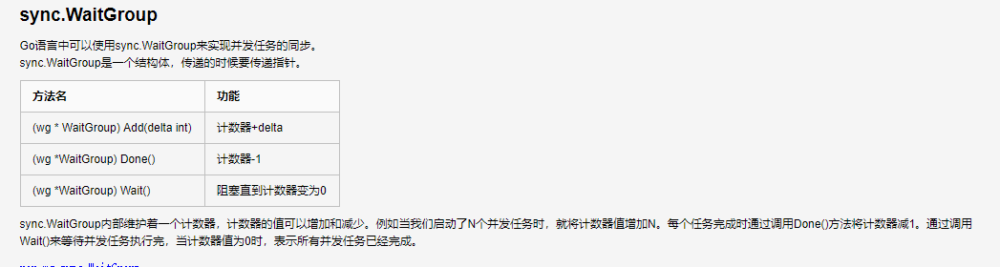

###go 

###2020/03/09


go -waitgroup



```
package main

import (
   "fmt"
   _ "fmt"
   "sync"
   _ "time"
)


//并行通信——数据各位同时传送；
//
//串行通信——数据一位位顺序传送。
var wg sync.WaitGroup
func hello(i int){
   defer wg.Done()
   fmt.Println("hello ",i)
}
func main()  {

   ////hello()
   //go hello()
   //fmt.Println("main goroutine done!")
   //time.Sleep(time.Second)
   //wg.Add(1)
   //go hello()
   //fmt.Println("main goroutine done!")
   //wg.Wait()

   for i:=0;i<10 ;i++{
      wg.Add(1)
      go hello(i)
   }
   wg.Wait()
}
***************************************
hello  9
hello  2
hello  3
hello  7
hello  6
hello  4
hello  5
hello  8
hello  1
hello  0
```


## 环境配置 

go path(src ,mod ,pkg )  goRoot(go 的依赖  类比jdk ) 不需要gobin    go env 查看一下 gopath 是否正确


interface{}接收任何数据类型


struct 用来定义复杂数据结构 ,可以包含多个字段(属性) 可以嵌套

go 中的struct 类型理解为类,可以定义方法,

struct类型是值类型


golang 破解码 

```
EFM5ESULZQ-eyJsaWNlbnNlSWQiOiJFRk01RVNVTFpRIiwibGljZW5zZWVOYW1lIjoi5rC45LmF5r+A5rS7IGlkZWEubWVkZW1pbmcuY29tIiwiYXNzaWduZWVOYW1lIjoiIiwiYXNzaWduZWVFbWFpbCI6IiIsImxpY2Vuc2VSZXN0cmljdGlvbiI6IiIsImNoZWNrQ29uY3VycmVudFVzZSI6ZmFsc2UsInByb2R1Y3RzIjpbeyJjb2RlIjoiSUkiLCJwYWlkVXBUbyI6IjIwMjAtMDUtMjMiLCJleHRlbmRlZCI6ZmFsc2V9LHsiY29kZSI6IkFDIiwicGFpZFVwVG8iOiIyMDIwLTA1LTIzIiwiZXh0ZW5kZWQiOmZhbHNlfSx7ImNvZGUiOiJEUE4iLCJwYWlkVXBUbyI6IjIwMjAtMDUtMjMiLCJleHRlbmRlZCI6dHJ1ZX0seyJjb2RlIjoiUlNDIiwicGFpZFVwVG8iOiIyMDIwLTA1LTIzIiwiZXh0ZW5kZWQiOnRydWV9LHsiY29kZSI6IlBTIiwicGFpZFVwVG8iOiIyMDIwLTA1LTIzIiwiZXh0ZW5kZWQiOmZhbHNlfSx7ImNvZGUiOiJSU0YiLCJwYWlkVXBUbyI6IjIwMjAtMDUtMjMiLCJleHRlbmRlZCI6dHJ1ZX0seyJjb2RlIjoiR08iLCJwYWlkVXBUbyI6IjIwMjAtMDUtMjMiLCJleHRlbmRlZCI6ZmFsc2V9LHsiY29kZSI6IkRNIiwicGFpZFVwVG8iOiIyMDIwLTA1LTIzIiwiZXh0ZW5kZWQiOnRydWV9LHsiY29kZSI6IkNMIiwicGFpZFVwVG8iOiIyMDIwLTA1LTIzIiwiZXh0ZW5kZWQiOmZhbHNlfSx7ImNvZGUiOiJSUzAiLCJwYWlkVXBUbyI6IjIwMjAtMDUtMjMiLCJleHRlbmRlZCI6dHJ1ZX0seyJjb2RlIjoiUkMiLCJwYWlkVXBUbyI6IjIwMjAtMDUtMjMiLCJleHRlbmRlZCI6dHJ1ZX0seyJjb2RlIjoiUkQiLCJwYWlkVXBUbyI6IjIwMjAtMDUtMjMiLCJleHRlbmRlZCI6ZmFsc2V9LHsiY29kZSI6IlBDIiwicGFpZFVwVG8iOiIyMDIwLTA1LTIzIiwiZXh0ZW5kZWQiOmZhbHNlfSx7ImNvZGUiOiJSU1YiLCJwYWlkVXBUbyI6IjIwMjAtMDUtMjMiLCJleHRlbmRlZCI6dHJ1ZX0seyJjb2RlIjoiUlNVIiwicGFpZFVwVG8iOiIyMDIwLTA1LTIzIiwiZXh0ZW5kZWQiOmZhbHNlfSx7ImNvZGUiOiJSTSIsInBhaWRVcFRvIjoiMjAyMC0wNS0yMyIsImV4dGVuZGVkIjpmYWxzZX0seyJjb2RlIjoiV1MiLCJwYWlkVXBUbyI6IjIwMjAtMDUtMjMiLCJleHRlbmRlZCI6ZmFsc2V9LHsiY29kZSI6IkRCIiwicGFpZFVwVG8iOiIyMDIwLTA1LTIzIiwiZXh0ZW5kZWQiOmZhbHNlfSx7ImNvZGUiOiJEQyIsInBhaWRVcFRvIjoiMjAyMC0wNS0yMyIsImV4dGVuZGVkIjp0cnVlfSx7ImNvZGUiOiJQREIiLCJwYWlkVXBUbyI6IjIwMjAtMDUtMjMiLCJleHRlbmRlZCI6dHJ1ZX0seyJjb2RlIjoiUFdTIiwicGFpZFVwVG8iOiIyMDIwLTA1LTIzIiwiZXh0ZW5kZWQiOnRydWV9LHsiY29kZSI6IlBHTyIsInBhaWRVcFRvIjoiMjAyMC0wNS0yMyIsImV4dGVuZGVkIjp0cnVlfSx7ImNvZGUiOiJQUFMiLCJwYWlkVXBUbyI6IjIwMjAtMDUtMjMiLCJleHRlbmRlZCI6dHJ1ZX0seyJjb2RlIjoiUFBDIiwicGFpZFVwVG8iOiIyMDIwLTA1LTIzIiwiZXh0ZW5kZWQiOnRydWV9LHsiY29kZSI6IlBSQiIsInBhaWRVcFRvIjoiMjAyMC0wNS0yMyIsImV4dGVuZGVkIjp0cnVlfSx7ImNvZGUiOiJQU1ciLCJwYWlkVXBUbyI6IjIwMjAtMDUtMjMiLCJleHRlbmRlZCI6dHJ1ZX0seyJjb2RlIjoiRFAiLCJwYWlkVXBUbyI6IjIwMjAtMDUtMjMiLCJleHRlbmRlZCI6dHJ1ZX0seyJjb2RlIjoiUlMiLCJwYWlkVXBUbyI6IjIwMjAtMDUtMjMiLCJleHRlbmRlZCI6dHJ1ZX0seyJjb2RlIjoiRFBBIiwicGFpZFVwVG8iOiIyMDIwLTA1LTIzIiwiZXh0ZW5kZWQiOnRydWV9XSwibWV0YWRhdGEiOiIwMTIwMjAwNDI0UFBBTTAwMDAwNSIsImhhc2giOiIxNzc1OTMwMS8wOi00MzM0MDU2MTIiLCJncmFjZVBlcmlvZERheXMiOjcsImF1dG9Qcm9sb25nYXRlZCI6ZmFsc2UsImlzQXV0b1Byb2xvbmdhdGVkIjpmYWxzZX0=-v8F/B6cQt3xneScQWoRVUAw6odR9y4JQsXkmZBz6AfnRmATlikIgK4y0dv8sMSulVJf+xqvJKDE5FK9NF56p5sOu9bbKWvJztcwn4gYxlgpdiYGPwbripZkqmRcVyG/1IzU1VF5wPkd0qRq4Ak2U9V+u+8TiSpICVmbnahBLYsHYP77YkWAPfyIGlry3DpmiDI1BgpcQw3+wjnJSIoaIou3NQdaMDqvUxHsJwGVrE4+ePSj/5OUMwjzDad8MGpsp/5hp9TGDKJW5w2tkldLndAyW6NYIpLZWD2qE9DWafV6jj52m108vNdCYNjRM958laaoSUyIZ0xLjkSU+e8NRKw==-MIIElTCCAn2gAwIBAgIBCTANBgkqhkiG9w0BAQsFADAYMRYwFAYDVQQDDA1KZXRQcm9maWxlIENBMB4XDTE4MTEwMTEyMjk0NloXDTIwMTEwMjEyMjk0NlowaDELMAkGA1UEBhMCQ1oxDjAMBgNVBAgMBU51c2xlMQ8wDQYDVQQHDAZQcmFndWUxGTAXBgNVBAoMEEpldEJyYWlucyBzLnIuby4xHTAbBgNVBAMMFHByb2QzeS1mcm9tLTIwMTgxMTAxMIIBIjANBgkqhkiG9w0BAQEFAAOCAQ8AMIIBCgKCAQEAxcQkq+zdxlR2mmRYBPzGbUNdMN6OaXiXzxIWtMEkrJMO/5oUfQJbLLuMSMK0QHFmaI37WShyxZcfRCidwXjot4zmNBKnlyHodDij/78TmVqFl8nOeD5+07B8VEaIu7c3E1N+e1doC6wht4I4+IEmtsPAdoaj5WCQVQbrI8KeT8M9VcBIWX7fD0fhexfg3ZRt0xqwMcXGNp3DdJHiO0rCdU+Itv7EmtnSVq9jBG1usMSFvMowR25mju2JcPFp1+I4ZI+FqgR8gyG8oiNDyNEoAbsR3lOpI7grUYSvkB/xVy/VoklPCK2h0f0GJxFjnye8NT1PAywoyl7RmiAVRE/EKwIDAQABo4GZMIGWMAkGA1UdEwQCMAAwHQYDVR0OBBYEFGEpG9oZGcfLMGNBkY7SgHiMGgTcMEgGA1UdIwRBMD+AFKOetkhnQhI2Qb1t4Lm0oFKLl/GzoRykGjAYMRYwFAYDVQQDDA1KZXRQcm9maWxlIENBggkA0myxg7KDeeEwEwYDVR0lBAwwCgYIKwYBBQUHAwEwCwYDVR0PBAQDAgWgMA0GCSqGSIb3DQEBCwUAA4ICAQAF8uc+YJOHHwOFcPzmbjcxNDuGoOUIP+2h1R75Lecswb7ru2LWWSUMtXVKQzChLNPn/72W0k+oI056tgiwuG7M49LXp4zQVlQnFmWU1wwGvVhq5R63Rpjx1zjGUhcXgayu7+9zMUW596Lbomsg8qVve6euqsrFicYkIIuUu4zYPndJwfe0YkS5nY72SHnNdbPhEnN8wcB2Kz+OIG0lih3yz5EqFhld03bGp222ZQCIghCTVL6QBNadGsiN/lWLl4JdR3lJkZzlpFdiHijoVRdWeSWqM4y0t23c92HXKrgppoSV18XMxrWVdoSM3nuMHwxGhFyde05OdDtLpCv+jlWf5REAHHA201pAU6bJSZINyHDUTB+Beo28rRXSwSh3OUIvYwKNVeoBY+KwOJ7WnuTCUq1meE6GkKc4D/cXmgpOyW/1SmBz3XjVIi/zprZ0zf3qH5mkphtg6ksjKgKjmx1cXfZAAX6wcDBNaCL+Ortep1Dh8xDUbqbBVNBL4jbiL3i3xsfNiyJgaZ5sX7i8tmStEpLbPwvHcByuf59qJhV/bZOl8KqJBETCDJcY6O2aqhTUy+9x93ThKs1GKrRPePrWPluud7ttlgtRveit/pcBrnQcXOl1rHq7ByB8CFAxNotRUYL9IF5n3wJOgkPojMy6jetQA5Ogc8Sm7RG6vg1yow==
```

