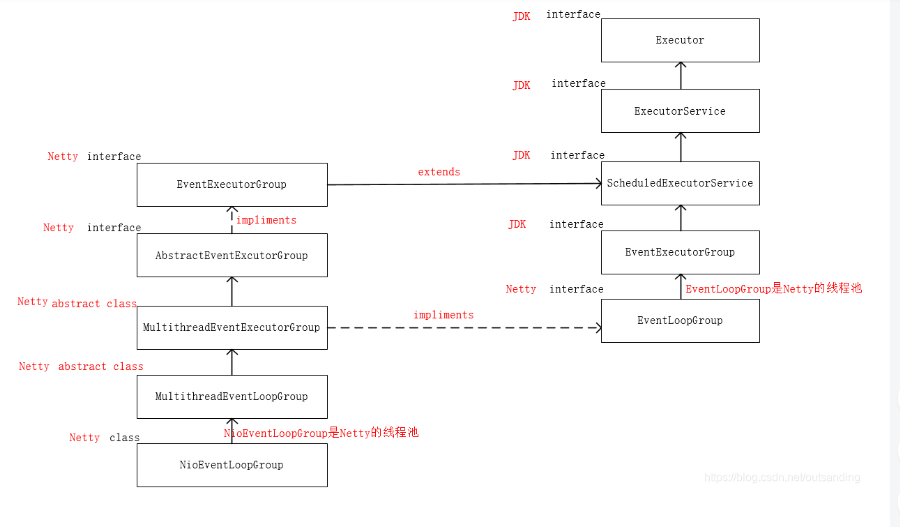
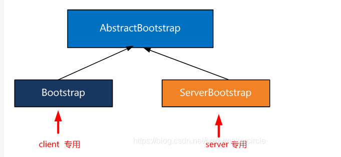
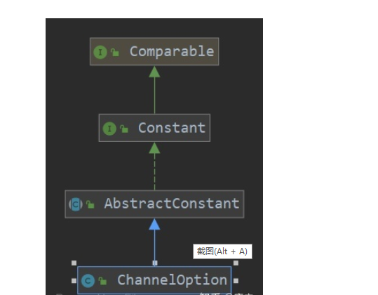

# github开源项目之解密

2021-1-18


谈到netty  就不得不提它的设计模式  经典的Reactor模式 

三种经典角色

```
Reactor 将I/O事件分派给对应的Handler

Acceptor 处理客户端新连接，并分派请求到处理器链中

Handlers 执行非阻塞读/写 任务
```

##netty-introduction-demo 

##1

```
//创建一个线程组实例对象
//服务端可以2个，客户端只能指定1个）
EventLoopGroup group = new NioEventLoopGroup();
EventLoopGroup NioEventLoopGroup   都是线程池
```

上面这行代码   得需要了解 

**NioEventloopGroup**   可以理解为一个线程池 内部维护了一组线程,每个线程负责处理多个channel (管道)上的事件 ,一个channel 只对应一个线程 (避免多线程下 数据同步问题)

返回的对象是 EventLoopGroup  




## 2

**Bootstrap b = new Bootstrap();**  

Bootstrap 是 Netty 提供的一个便利的工厂类，可以通过它来完成 Netty 的客户端或服务器端的 Netty 初始化。

当然，Netty 的官方解释说，可以不用这个启动器。

但是，一点点去手动创建channel 并且完成一些的设置和启动，会非常麻烦。还是使用这个便利的工具类，会比较好。

有两个启动器，分别应用在服务器和客户端。




“引导”（Bootstrapping）。到目前为止，我们对这个术语的使用还比较含糊，现在已经到了精确定义它的时候了。简单来说， 引导一个应用程序是指对它进行配置， 并使它运行起来的过程。


```
名称	描述
Bootstrap group(EventLoopGroup g)	设置用于处理channel所有事件的eventLoop

Bootstrap channel(class),Bootstrap channelFactory	指定channel的实现类，或者工厂类作为参数

Bootstrap localAddress(socketaddress)	指定channel应该绑定的本地地址。指定channel应该绑定到的地址，
如果没有指定，将由操作系统创建一个随机的地址。或者，也可以通过bind()或者connect方法指定localAddress

Bootstrap option(channelOption,T)	设置channelOption,其将被应用到每个新创建的channel的channelConfig。这些选项将会通过bind或者connect方法设置到channel。这个方法对于已经被创建的线程无效

Bootstrap attr(key,val)	指定新创建的channel属性值，作用同上

Bootstrap handler(ChannelHandler)	设置将被添加到ChannelPipeline以接收事件通知的channelHandler

Bootstrap clone()	创建一个Boostrap的克隆，具有和原始bootstrap相同的设置信息

Boostrap remoteAddress	设置远程地址，或者通过connect方法指定

channelFuture connect()	连接到远程节点并返回一个channelFuture,其将会在连接操作完成后接到通知

channelFuture bind()	绑定channel并返回一个channelFuture，其将会在绑定操作完成后接收到通知，在那之后必须调用channel，connect方法来建立连接。
```

```
import io.netty.channel.ChannelHandler; 
@ChannelHandler.Sharable
```

  标有@Sharable的Handler，代表了他是一个可以被分享的handler，这就是说服务器注册了这个handler后，可以分享给多个客户端使用，如果没有使用该注解，则每次客户端请求时，都必须重新创建一个handler。

*注：使用该方法的handler变成的共享了，所以不要在里面定义可变的属性，否则有可能会出现安全问题。*

## 3

what is channelFuture 

首先想到的是 Future  java.util.concurrent.Future 并发包  

netty 中的future 继承了jdk的 java.util.concurrent.Future 

chanelFuture 接口 继承了  netty 中的Future接口  

Netty的**Future**都是与异步I/O操作相关的,因此命名为**ChannelFuture**,代表它与Channel操作相关.

####channelOption



常量的一些配置


## netty-serialization-demo

**FSTSerialize** 

FST fast-serialization 是重新实现的 Java 快速对象序列化的开发包。序列化速度更快（2-10倍）、体积更小，而且兼容 JDK 原生的序列化。