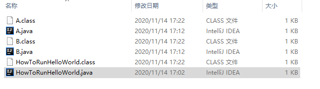

# java 高级编程 

#### 2020-11-14 


####  一个Java代码是如何运行的呢 


jdk 的bin 目录 javac.exe (编译源代码 , 比如 Test.java 文件 ) Java.exe (执行 字节码  , Test.class 文件 )

代码

```
package com.test;

public class A {
	
	public String tel;
	public int age;
	
	public A(String tel, int age) {
		this.tel = tel;
		this.age = age;
	}
	public String getTel() {
		return tel;
	}
	public int getAge() {
		return age;
	}
	public void setTel(String tel) {
		this.tel = tel;
	}
	public void setAge(int age) {
		this.age = age;
	}
	@Override
	public String toString() {
		return "A [tel=" + tel + ", age=" + age + "]";
	}
	
}

package com.test;

public class B {
	
	public String name;
	public String sex;
	
	
	public B(String name, String sex) {
		this.name = name;
		this.sex = sex;
	}
	public String getName() {
		return name;
	}
	public String getSex() {
		return sex;
	}
	public void setName(String name) {
		this.name = name;
	}
	public void setSex(String sex) {
		this.sex = sex;
	}
	@Override
	public String toString() {
		return "B [name=" + name + ", sex=" + sex + "]";
	}
	
}

package com.test;

public class HowToRunHelloWorld {

	public static void main(String[] args) {
		
		System.out.println("is as now ");
		A a = new A("0314-111",22);
		B b = new B("张三", "男");
		System.out.println("A-----"+a);
		System.out.println("B-----"+b);
	}

}

```


Bug1 :  javac或者 javac.exe 执行 路径下的 HowToRunHelloWorld.java 代码   因为设置的 张三 男   编码gbk 的不可映射字符  >   javac -encoding utf-8 G:\idea_eclipse_workspace\DataStructers\src\com\test\*.java

Bug2 运行 单独运行  HowToRunHelloWorld.java   因为 该类  引用了 A B  两个 类  , 所以   没有编译 B A 类  就无法找到 该符号   \*.java  就行 

出现如下图 




得到class 文件 但是如何执行呢  用 java 执行字节码文件   报  找不到或无法加载主类


在 src 下  java 执行 **包名 加 类名**  就可以了 

javap 查看 你编译的.class 文件 

javap -v A.class > A.txt

```
Classfile /G:/idea_eclipse_workspace/DataStructers/src/com/test/A.class
  Last modified 2020-11-14; size 856 bytes
  MD5 checksum ba95cdbf038418d21ea3e4c4727827e4
  Compiled from "A.java"
public class com.test.A
  minor version: 0    //  次版本号 
  major version: 52   // 主版本号   
  
  // jdk 版本号规则  5 6 7 8  分别对应49  50 51 52 
  
  flags: ACC_PUBLIC, ACC_SUPER  // 访问标志 
Constant pool:    // 常量池 
   #1 = Methodref          #13.#33        // java/lang/Object."<init>":()V
   #2 = Fieldref           #12.#34        // com/test/A.tel:Ljava/lang/String;
   #3 = Fieldref           #12.#35        // com/test/A.age:I
   #4 = Class              #36            // java/lang/StringBuilder
   #5 = Methodref          #4.#33         // java/lang/StringBuilder."<init>":()V
   #6 = String             #37            // A [tel=
   #7 = Methodref          #4.#38         // java/lang/StringBuilder.append:(Ljava/lang/String;)Ljava/lang/StringBuilder;
   #8 = String             #39            // , age=
   #9 = Methodref          #4.#40         // java/lang/StringBuilder.append:(I)Ljava/lang/StringBuilder;
  #10 = String             #41            // ]
  #11 = Methodref          #4.#42         // java/lang/StringBuilder.toString:()Ljava/lang/String;
  #12 = Class              #43            // com/test/A
  #13 = Class              #44            // java/lang/Object
  #14 = Utf8               tel
  #15 = Utf8               Ljava/lang/String;
  #16 = Utf8               age
  #17 = Utf8               I
  #18 = Utf8               <init>
  #19 = Utf8               (Ljava/lang/String;I)V
  #20 = Utf8               Code
  #21 = Utf8               LineNumberTable
  #22 = Utf8               getTel
  #23 = Utf8               ()Ljava/lang/String;
  #24 = Utf8               getAge
  #25 = Utf8               ()I
  #26 = Utf8               setTel
  #27 = Utf8               (Ljava/lang/String;)V
  #28 = Utf8               setAge
  #29 = Utf8               (I)V
  #30 = Utf8               toString
  #31 = Utf8               SourceFile
  #32 = Utf8               A.java
  #33 = NameAndType        #18:#45        // "<init>":()V
  #34 = NameAndType        #14:#15        // tel:Ljava/lang/String;
  #35 = NameAndType        #16:#17        // age:I
  #36 = Utf8               java/lang/StringBuilder
  #37 = Utf8               A [tel=
  #38 = NameAndType        #46:#47        // append:(Ljava/lang/String;)Ljava/lang/StringBuilder;
  #39 = Utf8               , age=
  #40 = NameAndType        #46:#48        // append:(I)Ljava/lang/StringBuilder;
  #41 = Utf8               ]
  #42 = NameAndType        #30:#23        // toString:()Ljava/lang/String;
  #43 = Utf8               com/test/A
  #44 = Utf8               java/lang/Object
  #45 = Utf8               ()V
  #46 = Utf8               append
  #47 = Utf8               (Ljava/lang/String;)Ljava/lang/StringBuilder;
  #48 = Utf8               (I)Ljava/lang/StringBuilder;
{
  public com.test.A(java.lang.String, int);
    descriptor: (Ljava/lang/String;I)V
    flags: ACC_PUBLIC
    Code:
      stack=2, locals=3, args_size=3
         0: aload_0
         1: invokespecial #1                  // Method java/lang/Object."<init>":()V
         4: aload_0
         5: aload_1
         6: putfield      #2                  // Field tel:Ljava/lang/String;
         9: aload_0
        10: iload_2
        11: putfield      #3                  // Field age:I
        14: return
      LineNumberTable:
        line 8: 0
        line 9: 4
        line 10: 9
        line 11: 14

  public java.lang.String getTel();
    descriptor: ()Ljava/lang/String;
    flags: ACC_PUBLIC
    Code:
      stack=1, locals=1, args_size=1
         0: aload_0
         1: getfield      #2                  // Field tel:Ljava/lang/String;
         4: areturn
      LineNumberTable:
        line 13: 0

  public int getAge();
    descriptor: ()I
    flags: ACC_PUBLIC
    Code:
      stack=1, locals=1, args_size=1
         0: aload_0
         1: getfield      #3                  // Field age:I
         4: ireturn
      LineNumberTable:
        line 16: 0

  public void setTel(java.lang.String);
    descriptor: (Ljava/lang/String;)V
    flags: ACC_PUBLIC
    Code:
      stack=2, locals=2, args_size=2
         0: aload_0
         1: aload_1
         2: putfield      #2                  // Field tel:Ljava/lang/String;
         5: return
      LineNumberTable:
        line 19: 0
        line 20: 5

  public void setAge(int);
    descriptor: (I)V
    flags: ACC_PUBLIC
    Code:
      stack=2, locals=2, args_size=2
         0: aload_0
         1: iload_1
         2: putfield      #3                  // Field age:I
         5: return
      LineNumberTable:
        line 22: 0
        line 23: 5

  public java.lang.String toString();
    descriptor: ()Ljava/lang/String;
    flags: ACC_PUBLIC
    Code:
      stack=2, locals=1, args_size=1
         0: new           #4                  // class java/lang/StringBuilder
         3: dup
         4: invokespecial #5                  // Method java/lang/StringBuilder."<init>":()V
         7: ldc           #6                  // String A [tel=
         9: invokevirtual #7                  // Method java/lang/StringBuilder.append:(Ljava/lang/String;)Ljava/lang/StringBuilder;
        12: aload_0
        13: getfield      #2                  // Field tel:Ljava/lang/String;
        16: invokevirtual #7                  // Method java/lang/StringBuilder.append:(Ljava/lang/String;)Ljava/lang/StringBuilder;
        19: ldc           #8                  // String , age=
        21: invokevirtual #7                  // Method java/lang/StringBuilder.append:(Ljava/lang/String;)Ljava/lang/StringBuilder;
        24: aload_0
        25: getfield      #3                  // Field age:I
        28: invokevirtual #9                  // Method java/lang/StringBuilder.append:(I)Ljava/lang/StringBuilder;
        31: ldc           #10                 // String ]
        33: invokevirtual #7                  // Method java/lang/StringBuilder.append:(Ljava/lang/String;)Ljava/lang/StringBuilder;
        36: invokevirtual #11                 // Method java/lang/StringBuilder.toString:()Ljava/lang/String;
        39: areturn
      LineNumberTable:
        line 26: 0
}
SourceFile: "A.java"

```


jvm 运行时数据区

线程独占(虚拟机栈  本地方法栈 程序计数器) : 每个线程都会有它独立的空间  ,随线程生命周期二创建 和销毁

线程共享(方法区 堆内存  ) : 所有线程都能访问 这块内存区域  随虚拟机或者GC 而创建和销毁 


#### 线程的运行状态 

```
package com.test;

public class ThreadDemo {

		
	// 定义静态变量 
	public static Thread thread1;
	public static ThreadDemo obj;
	
	public static void main(String[] args) throws Exception {
		
		// 第一种状态切换  新建--运行--终止
		Thread thread1 = new Thread(new Runnable() {
			
			@Override
			public void run() {
				System.out.println("thread1当前状态是"+Thread.currentThread().getState());
				System.out.println("thread1 执行了");
			}
		});
		System.out.println("没调用start 方法 thread1 的当前状态为"+thread1.getState());
		thread1.start();
		
	// 	thread1.sleep(sleep);
	
	sleep 是静态方法 不能这样用 会有警告的  因为静态方法 是属于类的  下面的 Thread.sleep 没有任何警告
	
		Thread.sleep(sleep);
		System.out.println("调用start之后  方法 thread1 的当前状态为"+thread1.getState());
		
		/*
		 * 没调用start 方法 thread1 的当前状态为NEW 
		 * thread1当前状态是RUNNABLE 
		 * thread1 执行了 调用start之后 方法
		 * thread1 的当前状态为TERMINATED
		 */
		// 线程已经结束了 再次调用 会报异常  java.lang.IllegalThreadStateException
		thread1.start();
	}

}

```


		//	thread.stop();// 该方法已经被禁用   而且容易产生安全问题
		thread.interrupt();


cpu性能优化 运行时指令重排 

```
x = 100
y = z
 
 执行顺序   读取z 的值 
 将 z 赋值给y 
 将 100 写入x 
```

指令重排的场景 : 当 cpu 写缓存时 发现缓存区域块 正被其它cpu占用 ,为了提高cpuu 处理性能 可能将后面的读缓存 优先执行 

指令重排要遵循 as - if - serial 语义 : 不管你怎末重排序 (编译器和处理器为了提高并行度 )    (单线程)程序的执行结果不能被改变 ,编译器  runtime 和处理器都必须  as - if - serial  语义 也就是说  编译器和处理器 不会对存在数据依赖关系的操作做 重排序  或者 说  结果 不会发生改变


文件共享  一个线程去写入数据  一个线程去读取数据 

变量共享 

线程协作  jdk API 

jdk 中 对于多线程协作完成某一任务的场景 ,提供了对应api的支持

多线程协作的典型场景是  生产者 - 消费者模型   

比如 线程 1 去买包子  没有包子 不再执行 (消费者)  线程2 生产包子 通知线程1 继续执行


// suspend  挂起线程  resume  恢复线程

     @Deprecated   // 舍弃
    public final void resume() {
        checkAccess();
        resume0();
    }


​    
    /**
    	 *    线程一直被挂起  无法恢复线程 所以 死锁 
    	 * @throws InterruptedException
    	 */
    	public  void suspendResumeDeadLockTest() throws InterruptedException {
    		Thread thread = new Thread(() -> {
    			if(baoZiDian == null) {
    				System.out.println("1 没包子 进入等待");
    				synchronized (this) {
    				Thread.currentThread().suspend();// 挂起线程
    				}
    				
    			}
    			System.out.println("2 买到包子 回家");
    		});
    		thread.start();// 启动线程
    		// 3 秒之后 
    		Thread.sleep(3000);
    		 baoZiDian = new Object();
    		 synchronized (this) {
    			 thread.resume();// 恢复线程
    		}
    		 thread.resume();// 恢复线程
    		 System.out.println("3 通知消费者");
    		
    	}
    	
    	不要用if 判断 是否进入等待状态 
    	官方建议应该在循环中 检查等待条件  原因是处于 等待状态的线程可能会收到错误警报和伪唤醒   如果不在循环中检查等待条件 程序就会没有满足结束条件的情况下退出 
    	比如 while 循环


#### 线程封闭概念 

多线程访问共享可变数据 时涉及到 线程间数据同步的问题 并不是所有时候  都要用到共享数据  所以需要线程封闭 

shu数据被封闭在各自的线程之中  ,就不需要 同步  这种通过将数据封闭在线程中而避免使用同步的技术称为线程封闭 

线程封闭  常见的有 ThreadLocal 局部变量 

ThreadLocal<T> var = new  ThreadLocal<T>(); 线程级别的变量 

 会自动在每一个线程上 创建一个T的副本 ,副本之间 彼此独立 互不影响 

可以用ThreadLocal 存储一些参数  以便在线程中多个方法中使用 ,用来代替方法传参的做法


线程池流程图 


1 如果 创建  使用 和处理资源 (可能是一个对象或者一个变量) 永远不会逃脱单个线程的控制 ,该资源的使用是线程安全的

2 创建 不可变的共享对象来保证对象在线程间共享时 不会被修改( 比如一个变量  只有get 方法  没有set 方法   或者 没有update 方法),从而实现线程安全


原子操作 可以是一个步骤 ,也可以是多个操作步骤 ,但是其顺序不可以被打乱 也不可以被切割而只执行其中的一部分 (不可中断性)  将整个操作是做一个整体是原子性的核心特性    

比如 i++  三步骤   

加载  i    ------>  对其加 1 ------>  赋值 操作


CAS 机制 比较和交换  compare  and swap 属于硬件同步原语  ,处理器提供了基本内存操作的原子保证 ,cas 操需要输入两个数值  ,一个旧值 A (期望操作前的值 ) ,一个新值 B  ,操作之前先比较有没有发生变化 ,如果没有发生变化 ,才叫换成新 值  ,发生了变化 则不交换

ava 中锁的概念 

自旋锁 : 为了不放弃CPU 执行事件 ,循环的使用cas 技术  对 数据尝试 进行更新 直至成功

悲观锁 :假定会发生冲突 ,同步所有对数据的相关操作   从读数据就开始上锁 

乐观锁 : 假定没有冲突 ,在修改数据是  如果发现数据和之前获取的不一致 ,则读最新数据 修改后重试修改 

独享/写锁 给资源加上写锁 ,线程可以修改资源  其它线程不能在加锁 

共享读/锁 给资源加上读锁 后只能读 不能改  其它线程也只能加读锁  不能加 写锁 

Lock :

 lock 获取锁的方法 ,若 锁被其它线程获取 ,则等待 

lockInterruptibly  在锁的获取过程中 可以中断当前线程 

tryLock 尝试非阻塞的获取锁,理解返回

unlock  释放锁 


重入锁 你做了一次加锁   必然要进行一次解锁 


维护一对关联锁 ,一个用于 只读操作 ,一个用于写入 ;读锁可以有多个读线程同时持有 ,写锁是排他的 ,适合 读取线程比写入线程多的场景 改进互斥锁的性能  场景  如下  缓存组件  集合的并发线程安全性改造


锁降级 指的是 写锁降级成为读锁 把持住 当前拥有的写锁的同时 ,在获取到读锁 随后释放写锁的过程


写锁是线程独占 读锁是共享  所以  写读 是  是个


同步锁的本质  排队

同步的方式  : 独享锁 单个队列窗口  共享锁 多个队列窗口 方式: 插队抢 (不公平锁)   先来后到抢锁(公平锁)

没抢到锁的处理方式 : 快速尝试多次(CAS 自旋锁) 阻塞等待 唤醒阻塞线程的方式(叫号) 全部通知  通知下一个 

AQS抽象队列同步器

提供了对资源占用 始放 线程的等待 唤醒  等接口和具体实现

acquire acquireShared  定义了资源争用的逻辑  如果没拿到 则等待  

tryAcquire  tryAcqiureShared  实际执行占用资源的操作  

release  releaseShared 定义释放资源的逻辑   释放之后  通知后续节点进行争抢 

tryRelease   tryrelease  Shared   实际执行支援释放的操作


#### copyOnWriteArrayList

跟arrayList 相比 优点  并发安全  缺点:

1 多了内存占用 写数据是copy 一份完整的数据 ,单独进行操作 占用双份内存

2  数据一致性 ,数据写完后 ,其他线程 不一定是马上读取到最新内容


#### queue 

非阻塞queue 实现的是queue 

```
public abstract class AbstractQueue<E>
    extends AbstractCollection<E>
    implements Queue<E> {
```

阻塞queue 实现的是    BlockingQueue

```
public class ArrayBlockingQueue<E> extends AbstractQueue<E>
        implements BlockingQueue<E>, java.io.Serializable {
```


forkjoinpool 是executorService 接口的实现  它专为可以递归分解成小块的工作而设计 fork/join 框架将任务分配给线程池中的工作线程 充分利用多处理器的优势  提高程序性能  

如果 (当前工作部分足够小)

 直接做这项工作 

其它 

把当前工作分成两部分 

调用这两个部分并等待结果 

将此代码包装在fork/joinTask子类中  通常是 RecursiveTask(可以返回结果 )或 RecursiveAction 


ForkJoin 就是为了任务拆分而设计的  

ForkJoin 偏理论  用的不太多   FutureTask 用的多 

Future 表示异步计算的结果  提供了用于检查计算是否完成 等待计算完成以及获取结果的方法 

如果接口之间 存在依赖关系 比如先后调用的  不适合多线程 

Future 和 callable 一般起使用


同步异步的区别

```
同步就相当于是 当客户端发送请求给服务端，在等待服务端响应的请求时，客户端不做其他的事情。当服务端做完了才返回到客户端。这样的话客户端需要一直等待。用户使用起来会有不友好。

异步就是，当客户端发送给服务端请求时，在等待服务端响应的时候，客户端可以做其他的事情，这样节约了时间，提高了效率。

存在就有其道理 异步虽然好 但是有些问题是要用同步用来解决，比如有些东西我们需要的是拿到 

返回的数据

在进行操作的。这些是异步所无法解决的。
```


线程  锁 网络编程   数据结构 

tcp udp 

udp 无连接 不可靠 占用资源少  用在音视频 方面 不要求每时每刻数据都拿到  偶尔丢一个包也可以 造成卡顿 无可厚非 

或者 智慧城市  比如路灯系统  报告 路灯的状态  之类 也是udp 

**BIO** 阻塞io 的含义 

阻塞  blocking    资源不可用时 , IO 请求一直阻塞 直到 反馈结果 (有数据 或超时)]

非阻塞 资源不可用时 . IO 请求离开返回  返回数据标识 资源 不可用 

同步  synchronous 应用阻塞 在发送或接收 数据的状态  直到数据成功传输或者返回失败 

异步  asynchronous 应用发送或接收数据后立刻返回 实际处理是异步执行

阻塞和非阻塞是获取资源的方式  

同步异步  是程序如何处理资源的逻辑设计 

代码中使用的API     ServerSocket  accept , inputStream read 都是阻塞的API 操作系统底层API中 默认Socket 操作 都是bolcking型  send  /recv 等接口 都是阻塞

NIO 核心组件  

**buffer** 缓冲区

​	本质上是一个可以写入数据的内存块(类似数组) 然后可以再次读取,此内存块包含在NIO Buffer对象中  该对象中提供了一组方法 可以更轻松地使用内存块  相比较 直接队数据组的操作 buffer AOI 更加容易操作 和管理 

三个重要属性 capacity 容量  Position 位置  limit 限制 

**bytebuffer 内存类型**

bytebuffer 为新跟那个关键代码提供了直接内存(direct 堆外) 和非直接内存(heap)两种实现

堆外内存获取的方式  BuyteBuffer  directByteBuffer = BuyteBuffer  .allocateDirect(noBytes)

jvm 堆内存中开辟了一个空间 值 为 a 内存因子 1  进行io读写时  jvm 会进行一次copy此时内存因子  为2  然后将数据2 a 写入

也可以这样理解 

进行网络io 或者文件Io 是比 heapBuffer 少一次copy  (file/socket----osMemory ---jvmHeap)GC会移动对象内存 在写file或socket的过程中jvm 的实现中 会先把数据复制到堆外 在进行写入 

用堆外内存 的好处 就是GC 范围之外  降低GC压力 实现了自动管理  directByteBuffer 有一个cleaner 对象 (PhantomReference) cleaner 被gc 前会执行clean 方法出发DirectByteBuffer定义的Deallocator


建议 : 性能确实可观的时候才去使用  比如增删改查就是不需要使用 

分配给大型 长寿命(网络传输 文件读写场景)

通过虚拟机参数 MaxDirectMeomorySize限制内存大小防止耗尽整个机器的内存 (因为不受jvm监控 回收 )

**channel** 通道


byteBuffer 是给谁用的  ,他只是一个缓冲区  最终是给channel 使用 为什莫给channel 使用 因为传统io 读写   (如上图 ) 要建立连接  其次 要用到IO流 进行读写 


使用channel   既可以 建立连接 也能够进行io读写

write 在尚未写入任何内容是就可能 返回了需要在循环中调用write

read read方法可能 直接返回根本不读取任何数据 根据返回的int值判断读取了多少字节

int bytesRead = socketChannel.read(byteBuffer) ;//读取服务端返回读取缓冲区的数据  0 没有读到内容 -1 通道已经关闭 

serverSocketChannel.accept() 如果该通道处于 	非阻塞模式如果没有挂起的连接 ,立即返回null 必须检查返回的socketChannle是否为null


**selector 选择器**

selector 是一个java NIO 组件 可以检查一个或多个NIO通道 并确定哪些通道已经准备好进行数据读取或写入 实现 单个线程可以管理多个通道  从而管理多个网络连接 

解决之前的循环检查   低效率问题

一个线程使用selector 监听多个channel 的不同事件 四个时间分别对应selectionKey 四个常量

1 connect 连接      selectionKey.OP_CONNECT

2 Accept 准备就绪 (OP_ACCEPT)

3 Read 读取 IO_READ

4 write 写入 OP_WRITE


NIO 为开发者提供了共嗯那个丰富且强大的IO处理的API  但是在应用到网络应用开发的过程中 直接使用jdk 提供的API 比较繁琐 而且要想将性能进行提升 光有nio还不够 还需要将多线程技术与之结合起来

因为网络编程本身的复杂性 以及jdl API 开发的使用难度较高 所以队JDK NIO进行封装 增强后的网络编程框架 如 netty  mina 


### Netty

netty 是一个高性能 高扩展性的异步事件驱动的网络应用程序框架 它极大的简化了Tcp 和Udp客户端和服务器开发等 网络编程 

Netty 四个重要内容 

Reactor线程模型 一种高性能的多线程程序设计思路

Netty中 定义的channel概念 增强版的通道概念

channelPipeline职责链设计模式 事件处理机制

内 存   管理增的byteBuffer缓冲区

入站事件 和出站事件 

入站事件 通常指I/O线程生成了入站数据  或者可以理解为 从socket 底层自己往上冒上来的事件都是入站的  比如EventLoop收到selector的OP_READ事件 入站处理器调用socketChannel.read(ByteBuffer)接收到数据后 ,这将导致通道的channelPipeline包含的下一个中的channelRead方法被调用 

出站事件 经常是指I/O线程执行实际的输出操作   可以理解为  想主动往socket底层操作的事件都是出站 比如bind 方法 是请求server socket绑定 到给定的SocketAddress 这将导致 ChannelPipeline中包含的下一个出站处理器中的bind方法被调用 


hadnler 上下文 

handlerChainContext  记录上一个节点  下一个节点


用户在管道中有一个或多个channelHandler来接收I/O事件 (例如读取) 和请求i/o操作(例如写入和关闭)

一个典型的服务器在每个通道的 管道中都有以下处理程序,但是根据协议和业务逻辑的复杂性和特征 可能会有所不同 

协议解码器  ------将二进制数据 (例如 byteBuffer)转换为java对象 

协议编码器 ----将java对象转换为 二进制数据 

业务逻辑处理程序  --- 执行实际的业务逻辑 


责任链设计模式的运用保证了netty的高度可扩展性


ByteBuf 是解决ByteBuffer的问题和满足网络应用程序开发人员的日常需求和设计的

Jdk 中 ByteBuffer的缺点

 无法动态扩容 ,不能动态扩展和收缩  ,当数据大于 ByteBUffer 容量是,会发生索引越界异常 

Api使用很复杂 

读写的时候需要手工调用flip() 和rewind ()等方法 使用时 需要非常谨慎使用这些api 否则容易出错 


短链接 : 请求/响应之后,关闭已经简历的tcp连接,下次请求再建立一次连接 

长连接 : 请求/响应之后,不关闭 tcp连接 多次请求 ,复用同一个连接

为了避免频繁创建连接/释放连接 带来的性能损耗,以及消息获取的实时性,采用长连接的形式 


粘包 Nagle 算法-客户端累积一定量或者缓冲一段时间在传输,服务端缓冲区堆积,导致的多个请求粘在一起

拆包 : 发送的数据大于发送缓冲区 进行分片传输,服务端缓冲去堆积,导致服务端读取的请求数据不完整


websocket

websocket 协议是基于tcp 的一种新的网络协议 它的出现实现了浏览器与服务器全双工(full-duplex)通信: 允许服务器主动发送信息给客户端

 

纯cpu 计算 线程数量越少越好  和cpu 核数 接近就行 

如果是阻塞 型任务 ,线程太多  切换 任务 太频繁 ,占用内存 太少的话 没有利用多核的特性 


jps 是jdk 提供的一个查看当前java 进程的小工具


当你不希望你的处理程序 阻塞 主线程的话 ,那么可以new 一个子线程 

```
为何 你要new 一个子线程 


	public static void main(String[] args) throws IOException {
		final Socket  socket = new Socket(HOST, PORT);

		new Thread(new Runnable() {
			@Override
			public void run() {
				System.out.println("客户端启动成功");
				while (true){
					try {
						String message = "hello is my first socket";
						System.out.println("客户端发送数据"+message);
						socket.getOutputStream().write(message.getBytes());
					}catch (Exception e){
						System.out.println("写数据异常");
					}

					sleep();
				}
			}
		}).start();

一个java程序从main开始之后，进程启动，为整个程序提供各种资源，而此时将启动一个线程，这个线程就是主线程，它将调度资源，进行具体的操作。Thread、Runnable的开启的线程是主线程下的子线程，是父子关系，此时该java程序即为多线程的，这些线程共同进行资源的调度和执行。


```

如何手写一个简单socket 呢

1 服务器端监听客户端端口 

2 accept方法 建立连接

3 客户端写入数据    也就是 服务端 接收到数据 

4 服务端  的主业务逻辑 

5 服务端 发送给 客户端数据 


simple-socket.png


​            


netty服务端启动

1 创建服务端channel

2 初始化服务端channel 

3 注册channel

4 端口绑定        


反射创建服务端channel 

newSocket() 通过jdk 来创建底层 jdk channel 

NioServerSocketChannelConfig ()  tcp参数配置  

AbstractNioChannel()  

configureBlocking(false) 阻塞模式

AbstractChannel 创建id(channle 的唯一标识 ) unsafe pipeline                                                                                                                               


服务端启动核心路径总结 

1newChannel() 调用jdk底层创建一个jdkChannel 然后netty将其包装为自己的一个channel  ,同时创建属于自己的属性 比如pipeline  

2init() 初始化服务端channel  最主要的给服务端channel添加一个连接处理器

3register()  注册select or  netty 将jdk底层的channel 注册到事件轮询器selector,并把netty的服务端channel 作为一个attachMent 绑定到 jdk底层的channel,实现本地监听 

netty会重新向服务端注册一个opSelector事件

4 doBind


#### NioEventLoop  

1 默认情况下  Netty 服务端起多少线程 何时启动 

默认2倍的CPU 

2 Netty 是如何解决jdk 空轮训bug的

3  Netty如何保证异步串行无锁化 

#### ThreadPerTaskExecutor

> 每次执行任务都会创建一个线程实体 
>
> NioEventLoop 线程明明规则 是nioEventLoop-1-xx


#### newchild()

保存线程执行器 ThreadPerTaskExecutor 

创建一个MpscQueue

创建一个selector

#### Netty 新连接入处理逻辑 

检测新连接 --> 创建NioSocketChannel --> 分配线程及注册selector --> selector注册读事件 


服务端channel   读取一条连接

 客户端channel  读取一条数据 

#### Pipeline 

netty中读写事件的传播 

#### 问题

netty 是如何判断channelHandler 类型的

对于channelHandler的添加应该遵循什么样的顺序

用户手动触发事件传播 不同的触发方式有什莫样的区别 


pipeLine在创建channel的时候被创建 

pipeline 节点数据结构  ChannelHandlerContext

pipeline中的两大哨兵 head 和 tail 


inBind 和pipeline中的channel 事件正相关 

outBind 和pipeline的channel 事件逆相关 


#### ByteBuf

netty内存结构  堆内内存和堆外内存

butebuf 结构 更细致的说  0 <= readIndex << writeIndex<capicaty

ByteBuf  分类

1  Pooled (从预先分配好的内存分配)和Unpooled(直接调用APi 进行分配内存 ) 

Unsafe jdk Unsafe 对象  可以直接拿到 对象的内存地址 基于内存地址可以进行读写操作 

2 Unsafe (直接拿到byteBuf在jvm中具体的内存  可以直接调用jdk 的unsafe 进行读写  )和非Un safe (不会依赖jdk底层的unsafe对象)

3 Heap(对上直接对内存进行分配,受GC 回收机制 管理 )和Direct(直接调用jdk 的内存进行分配  不受JVM 管理  ,没有GC  需要自己手动进行释放内存 )

#### directArena 分配direct内存的流程 

从对象池里面拿到PookedByteBuf 进行复用 

从缓存上进行内存分配 

从内存堆里面进行内存分配 

netty内存规格介绍 

0        **tiny**    512B   **small**         8K     **normal**     16M   **huge**


进行切分 

16M 对应的chunk 

8K 对应的page 

0~ 8K  对应的 subPage 


#### 命中缓存的分配逻辑 

netty 跟缓存相关的数据结构 是MemoryRegionCache 


#### 命中缓存的分配流程

找到对应size 的MemoryRegionCache 

从queue 中弹出一个entity 	给ByteBuf

将弹出的entry 扔到对象池进行复用


arena 


####  

page级别的内存分配 allocateNormal

####subpage级别的内存分配 allocateTiny

定位一个SubPage 对象

初始化SubPage

初始化PooledByteBuf

#### ByteBuf 的回收机制

连续的内存区段加到缓存

标记连续的内存区段为未使用 


### Netty 解码


ByteToMessageDecoder 解码步骤

累加字节流

调用子类的decode放啊进行解析

将解析到的ByteBuf向下传播 


#### Netty编码

如何把对象编程字节流 ,最终写到socket底层

tail 节点 把对象转换为byte 字节  write 经过层层pipeline 到达encoder 在encoder的具体实现类进行写入 判断写入阈值 写完之后 刷新缓存 ,释放对象  然后传到head节点 


writeAndFlush 

1 从tail 节点开始往前传播

2 逐个调用channelHandler的write 方法

3 逐个调用channelHandler的flush 方法


编码器的处理逻辑 MessageToByteEncoder

匹配对象 --> 分配内存 -->编码实现 --> 释放对象-->传播数据-->释放内存


### Netty性能优化工具类解析


####轻量级对象池Recycler 

创建对象的时候不需要每次都new 直接从对象池Recycler 中获取 ,如果用完之后 在还给对象池  ,保证你拿到的每一个对象 都是刚开始的对象

#### 回收对象到Recycler

同线程回收对象 

异线程回收对象


