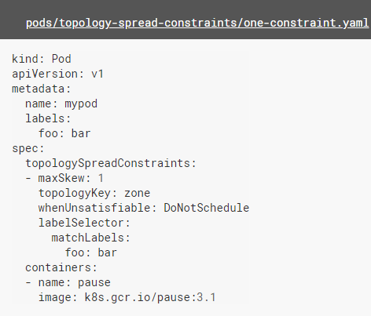
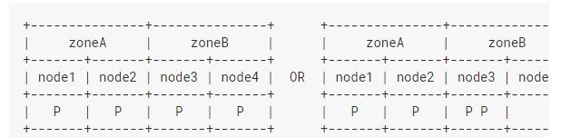

# pod拓扑扩展约束

可以使用_拓扑扩展约束_来控制 [Pods](https://kubernetes.io/docs/concepts/workloads/pods/pod-overview/) 在集群内故障域之间的分布。这可以帮助实现高可用以及提升资源利用率。

## pod 扩展约束

先决条件	

​	确保EvenPodsSpread功能已开启,[API Server](https://kubernetes.io/docs/reference/generated/kube-apiserver/) **和** [scheduler](https://kubernetes.io/docs/reference/generated/kube-scheduler/) 中都要开启。

Constraint 约束 

skew 偏离 歪斜

topologySpreadConstraints 定义一个或多个 `topologySpreadConstraint` 来指示 kube-scheduler 如何将每个传入的 Pod 根据与现有的 Pod 的关联关系在集群中部署

- **maxSkew** 描述 pod 分布不均的程度。这是给定拓扑类型中任意两个拓扑域中匹配的 pod 之间的最大允许差值。它必须大于零。

- **topologyKey** 是节点标签的键。如果两个节点使用此键标记并且具有相同的标签值，则调度器会将这两个节点视为处于同一拓扑中。调度器试图在每个拓扑域中放置数量均衡的 pod。

- whenUnsatisfiable

   指示如果 pod 不满足扩展约束时如何处理：

  - `DoNotSchedule`（默认）告诉调度器不用进行调度。
  - `ScheduleAnyway` 告诉调度器在对最小化倾斜的节点进行优先级排序时仍对其进行调度。

- **labelSelector** 用于查找匹配的 pod。匹配此标签的 pod 将被统计，以确定相应拓扑域中 pod 的数量。

    

  `topologyKey: zone` 意味着均匀分布将只应用于存在标签对为 “zone:” 的节点上。`whenUnsatisfiable: DoNotSchedule` 告诉调度器，如果传入的 pod 不满足约束，则让它保持挂起状态。

  如果调度器将传入的 pod 放入 “zoneA”，pod 分布将变为 [3, 1]，因此实际的倾斜为 2（3 - 1）。这违反了 `maxSkew: 1`。此示例中，传入的 pod 只能放置在 “zoneB” 上：

  

  可以调整 pod 规格以满足各种要求：

  - 将 `maxSkew` 更改为更大的值，比如 “2”，这样传入的 pod 也可以放在 “zoneA” 上。

  - 将 `topologyKey` 更改为 “node”，以便将 pod 均匀分布在节点上而不是区域中。在上面的例子中，如果 `maxSkew` 保持为 “1”，那么传入的 pod 只能放在 “node4” 上。

  - 将 `whenUnsatisfiable: DoNotSchedule` 更改为 `whenUnsatisfiable: ScheduleAnyway`，以确保传入的 pod 始终可以调度（假设满足其他的调度 API）。但是，最好将其放置在具有较少匹配 pod 的拓扑域中。（请注意，此优先性与其他内部调度优先级（如资源使用率等）一起进行标准化。

    ###  与PodAffinity/PodAntiAffinity 相比较

    Affinity 密切关系

    ​	

    - 对于 `PodAffinity`，可以尝试将任意数量的 pod 打包到符合条件的拓扑域中。
    - 对于 `PodAntiAffinity`，只能将一个 pod 调度到单个拓扑域中。

    ​