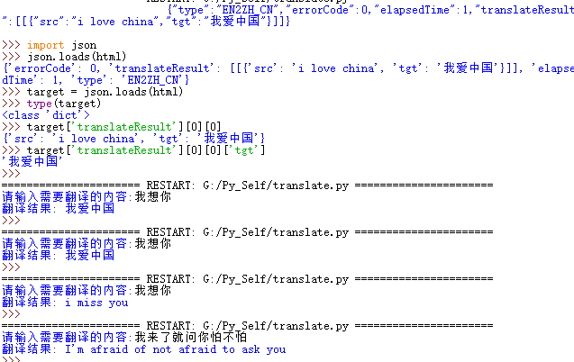
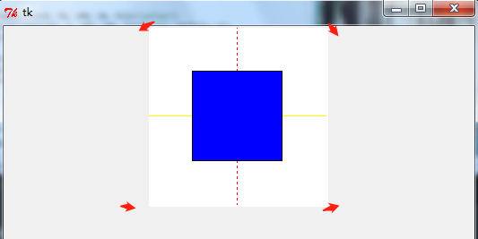
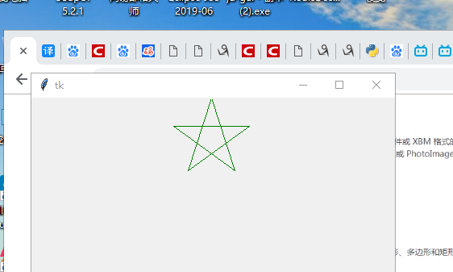

# python

​                                                                                   **-- 2020/03/02**

查看本地python  版本  pyhton

运用本地电脑自带的编辑器  idle 


idle 是一个python shell 就是一个通过键入文本与程序交互的途径   >>> 表示python  已经准备好了 

BIF == Built  -in functions 内置函数  

只需要直接调用即可

   想要查看Python中的内置函数，在IDLE中输入>>> dir(__builtins__)	 具体查看某个内置函数怎末用 help(builtins)

#### 变量

变量名可以包括字母数字下划线 但变量名不能以数字开头 
变量大小写 不一样的作用

字符串  单引号和双引号是一样的

转义字符   \

>>> 'Let\'s go!'
>>> "Let's go!"

str = 'C:\\now' 

 print (str)
C:\now

原始字符串

str = r'c:\now\a'

-------

三重字符串

 str =""" 我是谁
我来自哪里
我我想去哪
但又要去哪里呢
"""

>>> print(str)
>>>  我是谁
>>> 我来自哪里
>>> 我我想去哪
>>> 但又要去哪里呢
>>
>>


python  猜数小问题  缩进 一半是4个 pycharm  >>settings>>editor>>code style >>python  一定要注意缩进

```
第一个python  猜数字小游戏 
print('-------爱你鱼C---------')
temp = input('你输入的数字是啥呢:')
guess = int(temp)
while guess != 8:
    temp = input('猜错了,不妨在输入一次:')
    guess = int(temp)
    if guess == 8:
        print("一下子就猜中了")
        print("不玩了")
    else:
        if guess > 8:
            print("大了大了")
        else:
            print("小了小了")
print("游戏结束不玩了")

```
3>2 and 1<2  true   比较运算符  优先级高于逻辑运算符

int  float str bool


sinstance() 与 type() 区别：

- type() 不会认为子类是一种父类类型，不考虑继承关系。
- isinstance() 会认为子类是一种父类类型，考虑继承关系。

如果要判断两个类型是否相同推荐使用 isinstance()  (内置函数)。

>>> type(5.20)
>>> <class 'float'>
>>> isinstance(520,int)
>>> True

##### 算术操作符

10 // 8  等于 1

python  也是一门面向对象的编程语言


range(2,9)  for i in range(2,9) :

​     print(i)   打印出 2,3,4,5,67,8

range(1,10,2)  13 5 7 9  步长为2 

普通

列表  混合列表  空列表  append方法添加数据    extend   member.insert(0,'李四')

>>> member
>>> ['李四', 1, '张三', 2, 3, 4, 5, 6, 7, 8, 9]

member.remove(2)  直接删除 2 这个元素

del member[1]删除第一个元素  del member 删除这个列表

mem.pop()  删除最后一个元素

####   数据分片 

>>> mem
>>> ['李四', '张三', 3, 4, 5, 6, 7]
>>> mem[1:3]
>>> ['张三', 3]
>>> mem[1:2]
>>> ['张三']
>>> mem[:]
>>> ['李四', '张三', 3, 4, 5, 6, 7]
>>> mem[1:]
>>> ['张三', 3, 4, 5, 6, 7]
>>> mem[:3]
>>> ['李四', '张三', 3]
>>>


元组 tuple 和列表 list

list 是可变的对象，元组 tuple 是不可变的对象！

由于 tuple 不可变，所以使用 tuple 可以使代码更安全！

元组里只有一个元素的时候，逗号（，）非常重要

str ='xiaojiayu'

str.capitalize()  首字母变成大写

"{0} love {1}_{2}".format("I","bian","cheng")
'I love bian_cheng'

### list 列表


a= list() 

>>> a
>>> []
>>> a= "i love biancheng"
>>> b= list(a)  迭代 
>>> b
>>> ['i', ' ', 'l', 'o', 'v', 'e', ' ', 'b', 'i', 'a', 'n', 'c', 'h', 'e', 'n', 'g']
>>>

#### 函数

>>> def saysome(name,words):
	print(name+"->"+words)

​	关键字参数
>>> saysome('改变世界','it')
>>> 改变世界->it
>>> saysome(words='改变世界','it')
>>> SyntaxError: positional argument follows keyword argument
>>> saysome(words='改变世界',name ='it')
>>> it->改变世界
>>>

>>> def sayHai(name = 'yh',words='改变自己'):
	print(name+"--->"+words)

​	默认参数
>>> sayHai()
>>> yh--->改变自己
>>> sayHai('改变他人')
>>> 改变他人--->改变自己
>>> sayHai(words='改变自我')
>>> yh--->改变自我
>>>

#### 收集参数  或 可变参数

>>> def test(*params):
	print('参数的长度是',len(params))
	print('第二个参数是',params[1])


>>> test('yh','赵飞燕','曹操',1,'荀彧')
>>> 参数的长度是 5
>>> 第二个参数是 赵飞燕
>>>


全局变量 尽量不要去修改它,但可以访问 

 count =5

>>> def MyFun():
	count =10
	print(10)


>>> MyFun()
>>> 10
>>> print(count)
>>> 5
>>>

>>> def MyFun():
	global count
	count =10
	print(10)


>>> MyFun	()
>>> 10
>>> print(count)
>>> 10
>>>

>>> lambda  表达式
>>>
>>> lambda x:2*x+1
>>> <function <lambda> at 0x000001F98575AB70>
>>> g= lambda x: 2*x+1
>>> g(5)
>>> 11

list(filter(lambda x: x%2,range(10)))
[1, 3, 5, 7, 9]

map  映射 

list(map(lambda x: x*2,range(10)))
[0, 2, 4, 6, 8, 10, 12, 14, 16, 18]


爬虫的话要定义递归的深度  

递归

    def digui(n):
    if n == 1:
        return 1
    else:
        return n * digui(n-1)
        number = int(input("请输入一个数"))
    
    result = digui(number)
    
    print("%d 的阶乘是: %d" %(number,result))

斐波那契数列

    def fab(n):
    if n<1:
        print("输入有错")
        return -1;
    
    if n== 1 or n==2:
        return 1
    else:
        return  fab(n-1)+fab(n-2)
        result = fab(20)
    
    if result != -1:
    print("总共有 %d 小兔子诞生" % result)


    汉诺塔游戏

    def hanuoi(n,x,y,z):

        if n == 1:
            print(x,'-->',z)
        else:
            hanuoi(n-1,x,z,y)#将n-1 个盘子从x 移到y上
            print(x,'-->',z)#将最低下的最后一个盘子从x 移到z 上
            hanuoi(n-1,y,x,z)#将y 上的n-1个盒子移到z  上
    n = int(input("请输入汉诺塔的层数"))
    hanuoi(n,'x','y','z')

​    

​    

>>> brand=["李宁","耐克","阿迪达斯"]
>>> slogan =['一切皆有可能','just do  it','Impossible is  noting']
>>>
>>> >> print('耐克的口号是:'+slogan[brand.index('耐克')])
>>> >> 耐克的口号是:just do  it

字典 是 映射类型

 dict3 = dict(yh ="自律",hy = "贪玩")

>>> dict3
>>> {'hy': '贪玩', 'yh': '自律'}
>>>
>>> 

访问字典的方法 values  item  keys


浅拷贝

a = {1:'one',2:'two',3:'three'}

b = a.copy()

{1: 'one', 2: 'two', 3: 'three'}

c =a

>>> id(a)
>>> 1842276478216
>>> id(b)
>>> 1842276591944
>>> id(c)
>>> 1842276478216

#### 读取文件


	f.seek(0,0)

	0

	lines = list(f)

	lines

	['object HelloScala{\n', '\tdef main(args: Array[String] ){\n', '\t\n', '\tprintln("hello ,scala,i love scala")\n', '\t}\n', '\n', '\n', '\n', '}']

	for eachLine in lines:

​	
	print(eachLine)
	object HelloScala{
	def main(args: Array[String] ){
	println("hello ,scala,i love scala")
	}
	}

### pickle

my_list = [233,52,'小甲鱼',['another list'] ]

 pickle_file = open('e:\\my_list.pkl','wb')

pickle.dump(my_list,pickle_file)

 pickle_file.close()

 pickle_file = open('e:\\my_list.pkl','rb')

>>> my_list2 = pickle.load(pickle_file)
>>> print(my_list2)
>>> [233, 52, '小甲鱼', ['another list']] 

### Exception


    try:

      f = open('我是一个文件')
      print(f.read())
      f.close()
    except OSError as reason:
      print('文件出错了,错误原因'+str(reason))


      try:
        sum = 1+'1'
        f = open('我是一个文件')
        print(f.read())
        f.close()
    
    except OSError as reason:
        print('文件出错了,错误原因'+str(reason))
    except TypeError as reason:
        print('类型出错了错误的原因是:'+str(reason))
        
      运行结果如下:
      
    类型出错了错误的原因是:unsupported operand type(s) for +: 'int' and 'str'    
      只要有异常 会直接抛出异常不会走剩下的代码


  raise  会直接引发一个异常

raise ZeroDivisionError('除数为0的异常')

    6/3  >>> 2.0 浮点数除法，
    6//3  >>>2  表示整数除法。


    def showMaxFactor(num):
        count = num // 2
        while count > 1:
            if num % count == 0:
                print('%d最大的约数是' %(num,count))
                break
            count -= 1
        else:
            print('%d 是素数' % num)
    num = int(input('请输入一个数:'))
    showMaxFactor(num)

#### easygui

 1 访问https://sourceforge.net/projects/easygui/ 

2 下载 easygui-0.96zip 

> > > 解压之后又两个文件为setup.py和easygui.py两个文件。
> > >
> > > 在python/Lib/site-packages文件夹下面新建easygui文件夹。
> > >
> > > 将easygui.py文件放入到easygui文件夹里面。

3 添加配置  我的电脑–属性–高级系统设置–高级–环境变量–新建一个新的系统变量

变量名为PYTHONPATH

G:\MLAna\Lib\site-packages\easygui

4 配好后重新打开idle  import easygui 即可使用


class MyList(list):

	pass  ##  占位符号

	MyList 继承list  

class B:

	def fun(self):
		print('我是小b')  python 的self  相当于 c   this 指针
ooa :面向对象分析

oop:面向对象编辑

ood:面向对象设计

### self 是什莫  

   类中的方法第一个参数必须是 self ，不然实例无法正确调用类中的方法，也就是说，如果方法中第一个参数不是 self(广义的)，那么这个方法是没有任何价值的，因为实例无法调用它，一个无法被调用的方法真不知道有什么用。


1. 类中的方法第一个参数是 self 的才可以被实例调用。
2. 类中带 self 的参数都是 实例 的，实例对这个参数拥有所有权，即实例中所有的方法都可以使用实例的参数。


      a=A()

    print(a)

    a=A

    print(a)

    print(A)

    结果如下：

    <__main__.A object at 0x0000020A69C81780>

    <class '__main__.A'>

    <class '__main__.A'>

    分析：

    a=A()  是有地址的，这说明他是一个实体，比如 int a  中的 a 一样

    a=A    是没有地址的，发现他和A打印的结果一毛一样，这说明他就是A，也就是一个类名，

       等价于上一句中 int a 中的 int

       >>> p = Person()
    >>> p
    <__main__.Person object at 0x000002870A7C6AC8>
    >>> d = Person
    >>> d
    <class '__main__.Person'>
name mangling 名字重整

__ 下划线 开始的属性是私有属性  


	class Person():
	__name = '小甲鱼'
	def getName(self):
		return self.__name
		
	p =  Person()	
		p.getName()
	'小甲鱼'
	
	p._Person__name
	'小甲鱼'
python   多重继承 

python 类对象删除 属性值 还是存在

### 跟类相关的BIF 

  issubclass (class ,classinfo) :

> > > 一个类可以认为是自己的子类
> > >
> > > classinfo 可以是类对象组成的元组,只要class 与其中任何一个候选类的子类 则返回True 
> > >
> > > >>> class A:
> > > 	pass
> > >
> > > >>> class B(A):
> > > 	pass
> > >
> > > >>> issubclass(B,A)
> > > >>> True
> > > >>> issubclass(B,B)
> > > >>> True
> > > >>> issubclass(B,object)
> > > >>> True
> > > >>> class  C:
> > > 	pass
> > >
> > > >>> issubclass(B,C)
> > > >>> False
> > > >>>

isinstance(object ,classinfo) 检查object 是否是classinfo 的实例对象

> > 1:如果第一参数不是object  则永远返回false 
> >
> > 2: 如果第二个参数不是类或者由类对象组成的元组,则会抛出一个typrError 异常

hasattr 判断是否有这个属性

class C:

	def __init__(self,x=0):
		self.x = x


>>> c1 = C()
>>> hasattr(c1,'x')
>>> True
>>> hasattr(c1,x)
>>> Traceback (most recent call last):
>>>   File "<pyshell#24>", line 1, in <module>
    hasattr(c1,x)
NameError: name 'x' is not defined

getattr  setattr delattr  都跟属性相关  

property  通过属性设置属性

	class C:
	def __init__(self,size = 10):
		self.size = size
	def getSize(self):
		return self.size
	def setSize(self,value):
		self.size = value
	def delSzie(self):
		del self.size
	x = property(getSize,setSize,delSzie)


>>> c1 = C()
>>> c1.getSize()
>>> 10
>>> c1.x
>>> 10
>>> c1.x = 18
>>> c1.x
>>> 18
>>> c1.size
>>> 18
>>> c1.getSize()
>>> 18
>>> del c1.x
>>> c1.size
>>> Traceback (most recent call last):
>>>   File "<pyshell#55>", line 1, in <module>
>>>
>>> c1.size
>>
>>AttributeError: 'C' object has no attribute 'size'


构造和析构   

> >
>
> init  new  
>
> del 

###  new__

class CapStr(str): # 继承str  

	def __new__(cls,string):
		string = string.upper()
		return str.__new__(cls,string)


>>> a = CapStr('I love biancheng')
>>> a
>>> 'I LOVE BIANCHENG'

>>> class C:
	def __init__(self):
		print("我是init 方法 我被调用了")
	def __del__(self):
		print("我是del 方法 我被调用了")


>>> c1 = C()
>>> 我是init 方法 我被调用了
>>> c2=c1
>>> c3 =c2
>>> del c3
>>> del c2
>>> del c1
>>> 我是del 方法 我被调用了  创建的实例 以及实例对象的引用都被删除后操才可以执行del 方法


	class Try_int(int):
	def __add__(self,other):
		return self + other
	def __sub__(self,other):
		return self-other
		递归超过了最大的深度
		RecursionError: maximum recursion depth exceeded 请求过深


		>>> class Try_int(int):
		def __add__(self,other):
			return int(self) + int(other)
		def __sub__(self,other):
			return int(self)-int(other)


	>>> a = Try_int(3)
	>>> b = Try_int(6)
	>>> a+b
	9
	>>> a-b
	-3
描述符 :就是将某种特种类型的类的实例指派给另一个类的属性

get  用于访问属性 它返回属性的值

set 将在属性分配操作调用,不返回任何内容

delete 控值删除操作,不返回任何内容

#### protocols  协议


生成器  yield 


a,b = b ,a+b  等价于 a= b  b = a+b


Python中的真假测试对于整数而言，0为假，非0为真。

对于 （ if not(i % 2) and (i % 3)）  

not (i%2)为真的条件是：i%2为假，即i%2==0，即i能被2整除；i%3为真的条件是i%3!=0，即i不能被3整除。

容器 --> 数据的分装

函数 --> 语句的封装

类 --> 方法和属性的封装

模块-->模块就是程序

>>> __name__  
>>> '__main__' 显示的是主函数
>>>
>>> import 模块名字     as 别名  
>>>
>>> 别名.__name__ 就是他的 模块名字 
>>
>>搜索路径 init           

python 自己带着电池 

用一种方法 最好是只有一种方法来做一件事

电池就是python 的标准库


json 其实是一种轻量级的数据交换格式

### 爬虫有道翻译

# ####  url = 'http://fanyi.youdao.com/translate_o?smartresult=dict&smartresult=rule'  

##### url= 'http://fanyi.youdao.com/translate?smartresult=dict&smartresult=rule'


爬虫url 带o 的话会报错,去掉o 如上第二个就不会报错  不太理解

import urllib.request
import urllib.parse
import json

content = input('请输入需要翻译的内容:')
url= 'http://fanyi.youdao.com/translate?smartresult=dict&smartresult=rule'

data = {}

data['i']=content
data['type']=' AUTO'
data['doctype']= 'json'
data['version']= '2.1'
data['keyfrom']= 'fanyi.web'
data['smartresult']= 'dict'
data['client']= 'fanyideskweb'
data['salt']= '15843310877703'
data['ts']= '1584331087770'
data['action']= 'FY_BY_CLICKBUTTION'

data=urllib.parse.urlencode(data).encode('utf-8')

response = urllib.request.urlopen(url,data)
html = response.read().decode('utf-8')
target = json.loads(html)
print("翻译结果: %s" %(target['translateResult'][0][0]['tgt']))



代理

import urllib.request

url = 'https://www.kuaidaili.com'

proxy_support = urllib.request.ProxyHandler({'http':'118.212.106.230:9999'})
opener = urllib.request.build_opener(proxy_support)
urllib.request.install_opener(opener)
response = urllib.request.urlopen(url)
html = response.read().decode('utf-8')
print(html)

会报错

     Traceback (most recent call last):
      File "G:/proxy.py", line 10, in <module>
    return self.shell.write(s, self.tags) print(html)File "G:\MLAna\lib\idlelib\PyShell.py", line 1344, in write UnicodeEncodeError: 'UCS-2' codec can't encode characters in position 32908-32908: Non-BMP character not supported in Tk
    
    大致意思 就是 python 自带的idle 运行此程序报错 换个编辑器就行  在pycharm 运行没问题


pass是一个在Python中不会被执行的语句。在复杂语句中，如果一个地方需要暂时被留白，它常常被用于占位符。

def speak(self):     

​	  pass

正则匹配

import re

re.search(r'\d\d\d\.\d\d\d.\d\d\d\.\d\d\d','192.168.123.111')
<_sre.SRE_Match object; span=(0, 15), match='192.168.123.111'>


###  正则表达式 

如果你需要重复地使用某个正则表达式,那么你可以先将该正则表达式编译成模式对象 我们使用re.compile()方法来编译  	

>>> p =re.compile(r'[A-Z]')
>>> type(p)
>>> <class '_sre.SRE_Pattern'>


####   爬虫 

python 3.5  pip  install scrapy  就行     

如何验证scrapy  安装成功

import  scrapy 不报错 就行  

或者 win +R  cmd   输入scrapy (这种我的有问题 ,具体也不太清楚)


crapy Engine(引擎): 负责Spider、ItemPipeline、Downloader、Scheduler中间的通讯，信号、数据传递等。

Scheduler(调度器): 它负责接受引擎发送过来的Request请求，并按照一定的方式进行整理排列，入队，当引擎需要时，交还给引擎。

Downloader（下载器）：负责下载Scrapy Engine(引擎)发送的所有Requests请求，并将其获取到的Responses交还给Scrapy Engine(引擎)，由引擎交给Spider来处理，

Spider（爬虫）：它负责处理所有Responses,从中分析提取数据，获取Item字段需要的数据，并将需要跟进的URL提交给引擎，再次进入Scheduler(调度器)，

Item Pipeline(管道)：它负责处理Spider中获取到的Item，并进行进行后期处理（详细分析、过滤、存储等）的地方.

Downloader Middlewares（下载中间件）：你可以当作是一个可以自定义扩展下载功能的组件。

Spider Middlewares（Spider中间件）：你可以理解为是一个可以自定扩展和操作引擎和Spider中间通信的功能组件（比如进入Spider的Responses;和从Spider出去的Requests）


爬虫遇到的问题 页面是抓去了 但是没有内容  refer = none 


#### python 3   tkinter 画布


```
from tkinter import *

root=Tk()
##Canvas  是一个画布  长宽为200   背景色  为 白色
w = Canvas(
		   root,
		   width=200,
		   height=200,
		   background="white"
		  )
w.pack()
			
yellowLine = w.create_line(0,100,200,100,fill=‘yellow‘)  画线  黄色 坐标为 (0,100) , (200,100)

redLine=w.create_line(100,0,100,200,fill=‘red‘,dash=(4,4)) 画线 红色 (100,0) ,(100,200) 分成四份
dash=(4,4) 不写也没事 
buleRect=w.create_rectangle(50,50,150,150,fill=‘blue‘)  换一个矩形  对角线坐标(50,50) (150,150)
或者也可以这样理解  x = 50  y = 50  x= 150 y= 150 四条线  确定一个矩形  

mainloop()
```




五角星 


    from tkinter import *

    import math as m

    root = Tk()
    w = Canvas(root,width=200,height=100)
    w.pack()
    五角星的中心点
    center_x = 100
    center_y = 50
    r = 50
    
    points=[
    # 第一个点  左上点 A 
    center_x - int(r*m.sin(2*m.pi /5)),
    center_y - int(r*m.cos(2*m.pi /5)),
    # 右上点 C  72
    center_x + int(r*m.sin(2*m.pi/5)),
    center_y - int(r*m.cos(2*m.pi/5)),
    # 左下角点E  36
    center_x -int(r*m.sin(m.pi /5)),
    center_y +int(r*m.cos(m.pi/5)),
    
    #顶点 B
    center_x ,
    center_y -r,
    
    #右下角 的点 D 36
    center_x + int(r*m.sin(m.pi /5)),
    center_y + int(r*m.cos(m.pi/5))
    ]
    
    w.create_polygon(points,outline="green",fill="")
    
    mainloop()





    from tkinter import *
    
    root = Tk()
    
    '''
    
    photo = PhotoImage(file = "g:/test.gif")
    
    Label(root,image=photo).pack()
    
    def callback():
    
    print("正中靶心")
    0 最左边 1 最右边  0.5 中间
    Button(root,text="点我",command =callback).place(relx = 0.5,rely = 0.5,anchor= CENTER)
    
    '''
    
    
    ##  0.75  0.5 0.25 相当于 主框 的 3/4 1/2  1/4 
    Label(root,bg= "red").place(relx=0.5,rely=0.5,relheight=0.75,relwidth=0.75,anchor = CENTER)
    
    Label(root,bg= "yellow").place(relx=0.5,rely=0.5,relheight=0.5,relwidth=0.5,anchor = CENTER)
    
    Label(root,bg= "green").place(relx=0.5,rely=0.5,relheight=0.25,relwidth=0.25,anchor = CENTER)
    
    
    
    mainloop()
    

​    
#   
