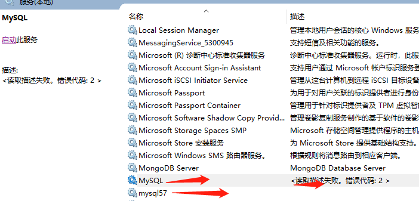
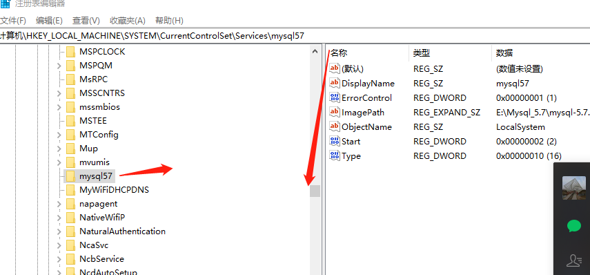
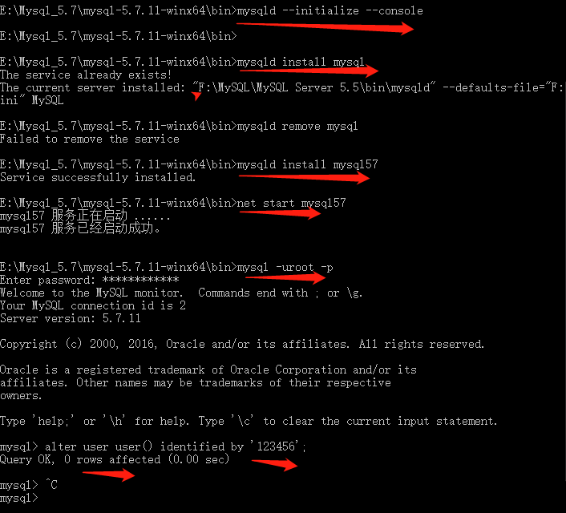

win 10 系统 mysql 5.5   重装5.7  

   自学cloud  Apollo  需要 mysql 5.65以上 只能卸载 之前的老版本 重装新版本  用的是压缩版

解压即可用

 1 首先卸载 mysql旧版数据库 解压5.7.11到指定位置

2复制 my-default.ini 改为 my.ini

> > > [mysqld]
> > > server_id=2
> > > port=3306
> > > basedir=E:\\Mysql_5.7\\mysql-5.7.11-winx64
> > > datadir=E:\\Mysql_5.7\\mysql-5.7.11-winx64\\data

3 进入到 bin 目录  mysqld --initialize --console 

会生成密码  2020-02-29T02:52:50.799276Z 1 [Note] A temporary password is generated for root@localhost: **CX_tjNygj8zA** 

4  打开 services.msc关闭服务 regedit  打开注册表 

原本的 Mysql  已经禁用  但是还回报错  只能重新创建一个新的服务   mysq57

该目录下删除mysql  整个文件夹    mysql 57 也是重新创建的 

当出现mysql>证明已经安装成功

select version();  显示mysql  版本 

