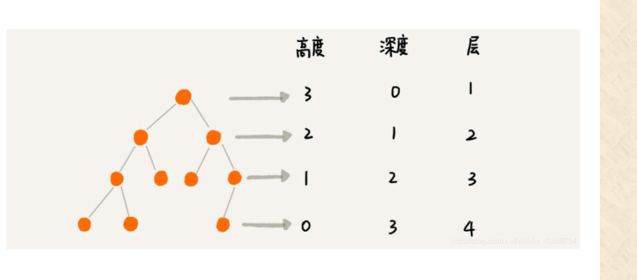
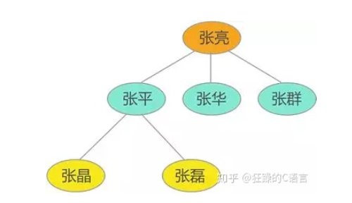
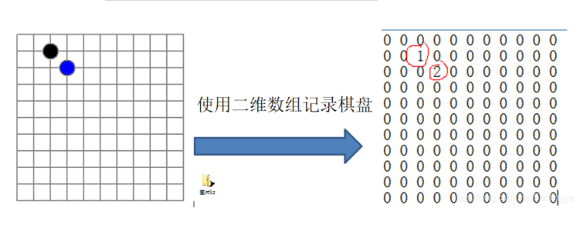
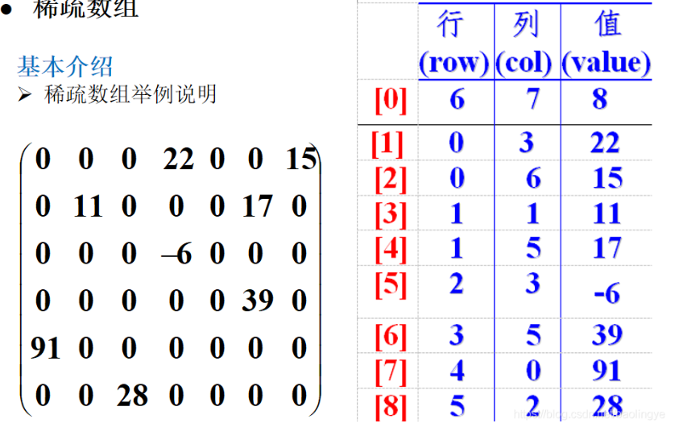
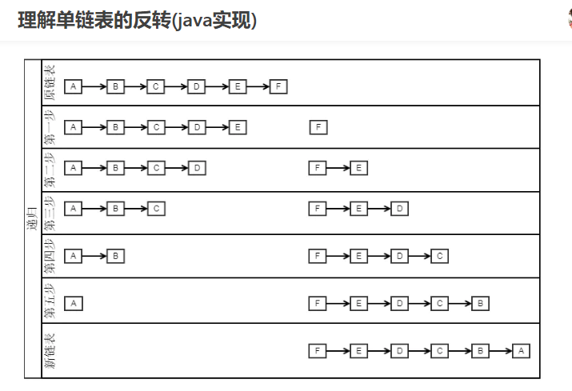
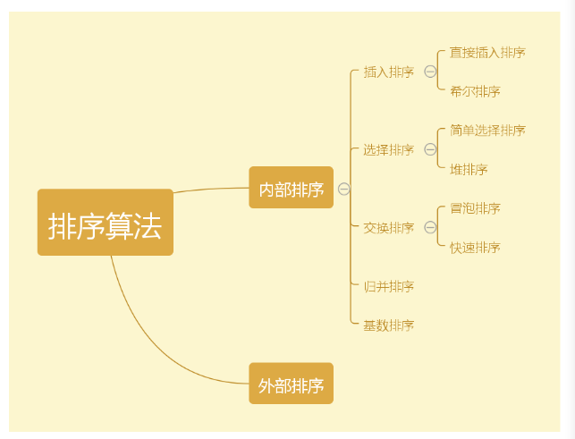

# 算法	

神魔是数据:数据之间相互存在的一种或多种特定的关系的元素的集合

逻辑结构:

​	1 集合结构 

​	2 线性结构

​	3 树形结构

​	4 图形结构

逻辑结构:

​	1 顺序存储结构

​	2 链式存储结构


线性表  **List**

a1-->a2 --->a3 -->a4 ...... -->an-1 ---> an

a1是 a2 的前驱 ,a2是a1 的后继     a1 没有前驱  an 没有后继

```
ArrayList
	
	扩容
	Object[] newArray = new Object[s+(s<MIN_CAPACITY_INCREMENT/2)? MIN_CAPACITY_INCREMENT : s >>1]
	
	容量为12的话 
	s = 4  扩容4+12 =16 
	s = 14 扩容 14 +14/2= 21
	
	
	
```

 

```
LinkedList  
 链表 
 public class LinkedList<E>
    extends AbstractSequentialList<E>
    
    transient Node<E> first; 头指针
    transient Node<E> last; 尾指针

```

​	

**线性结构** ---> 最常用的数据结构  元素之间存在一对一的线性关系  线性结构  又分为 顺序结构 和链式结构  

顺序结构存储的称为顺序表顺序表中存储元素是连续的

链式存储的线性表 称为链表  链表中的存储元素不一定是连续的  元素节点中存放的 是   元素值 和相邻的地址信息 

线性结构常见的有 数组 队列 链表和栈 

**非线性结构** : 包括 二维数组 多维数组 广义表 树结构 图结构 

**稀疏数组** : 当一个数组大部分元素为0 或者同一个值的数组时, 可以用稀疏数组保存该数组 

 row 行  col 列 value 值  

队列 :  有序列表 可以用数组	或链表实现

遵循先入先出的原则 先存入队列的数据 先取出  后存入的数据 后取出


**fifo**是指first in，first out。。。是队列程序

**lifo**是指last in，first out。。。。是堆栈程序

队列是一个有序列表 可以用数组或链表来实现  遵循先入先出的原则 先存入的 队列的数据 要先取出  后存入的数据要后取出 

bug1  问题并优化

 1 目前数据使用一次就不能复用  没有达到服用的效果

2 将这个数组使用算法  ,该近成 一个环形数组   取模 %


链表 LinkedList  以 节点的方式来存储

每个节点包含date 域 ,next 域  指向下一个节点 

如图: 发现链表的各个节点  不一定是连续存放

链表 分带头节点的链表 和没有头节点的链表  根据实际的需求来确定

头节点  1  不存放具体的数据

2    表示单链表头 


最后一个数据  next  为null 

需要按照编号的顺序来添加

​	1 首先找到添加的节点的位置 ,是通过辅助变量 (指针) 通过遍历来搞定

​	2 新的节点.next = temp.next 

​	3 将temp .next = 新的节点 


单向链表 缺点 

1 查找方向 只能是一个方向 而双向链表可以向前 或者 向后查找

2 查找但钱链表不能自我删除 需要辅助节点 而双向链表 则可以实现自我删除 


栈  stack 

栈 是一个陷入后出的有序列表

栈 是限制线性表中元素的插入和删除 只能在先线性表中的同一端进行的一种特殊线性表 允许插入和删除 的一段  为 变换的一段 称为top  栈顶  另一端 为栈底 bottom 

根据栈的定义可知 最先放入栈中元素在栈底  最后放入的元素在栈 顶 删除元素 则 最后放入的最先删除   最先 放入的元素最后 删除 


前缀表达式 - * + 3456  从右往左

中缀表达式(3+4)*5 -6

后缀表达式 (又叫做 逆波兰计算器)3  4 + 5 * 6 - 从 左往右

```
前缀表达式 的计算机求值 
从右至左 扫描表达式 
	遇到数字时  将其压栈  遇到运算发 将其栈顶的两个元素弹栈
    比如 (3+4)*5 -6  前缀表达式就是  - * + 3456 
    1 从右至左 扫描 ,将  6543 压入栈  
    2 遇到+ 运算符 弹出3 和4 3 为  栈顶 元素   4 为次顶元素  计算出3 + 4 的值 得 7  再 将 7 入栈  
    3 接下来是*运算符  弹栈 7 和5  计算出7*5 = 35 将 35 入栈
    4最后是- 运算符  弹栈 35 6 计算35 -6 的值  即 29   先弹出的数  减去 后弹出的数 
    
```


 java 中 matches  方法 

| \d   | 任意一个数字，0~9 中的任意一个                   |
| ---- | ----------------------------------- |
| \w   | 任意一个字母或数字或下划线，也就是 AZ,az,0~9,_ 中任意一个 |
| \s   | 包括空格、制表符、换页符等空白字符的其中任意一个            |
| .    | 小数点可以匹配除了换行符（\n）以外的任意一个字符           |


**递归**

递归就是方法自己调用自己,每次调用时传入不同的变量

```
递归需要遵守的原则:
	1) 执行一个方法时 ,就创建一个新的受保护的独立空间(栈空间)
	2) 方法的局部变量是独立的,不会相互影响
	3) 递归必须向退出递归的条件逼近 ,否则就会无限递归了
	4) 当一个方法执行完毕 ,或者遇到return,就会返回,遵守谁调用,就将结果返回给谁,同时当方法执行完毕或者返回时 ,该方法也就执行完毕
	5) 如果方法中使用的是引用类型变量(比如数组) ,就会共享该引用类型的数据
```


**排序**   将一组数据  按照指定的顺序进行排列的过程

内部排序  将需要处理的所有数据都加载到内部存储器中进行排序

外部排序 数据量过大 无法全部加载到内存中 需要借助外部存储进行排序

度量一个程序执行时间的两种方法

1) 事后统计的方法  存在两个问题 一是要对设计的算法的运行性能进行评测 ,需要实际运行该程序,二是所得时间的 统计量依赖计算机的硬件 软件等环境因素 这种方式,要在同一台计算机的相同状态下 运行,才能比较哪个算法速度更快

2) 事前估算的方法   通过分析某个算法的时间复杂度来判断哪个算法更优


时间频度 : 一个算法中的语句执行次数称为语句频度或时间频度

**插入排序**

插入式排序属于内部排序法,是对于欲排序的元素以插入的方式寻找该元素的适当位置,以达到排序的目的

当需要插入的数是较小的数时 ,后移的次数明显增多,对效率有影响


归并排序  是利用归并的思想实现的排序方法,  采用经典的分治策略(将问题分成一些小的问题然后递归求解,治的阶段 将得到的各答案修补在一起 ) 

斐波那契查找算法 

（1）如果与给定关键字相同，则查找成功，返回在表中的位置；

（2）如果给定关键字大，向右查找并减小2个斐波那契区间；

（3）如果给定关键字小，向左查找并减小1个斐波那契区间；

（4）重复过程，直到找到关键字（成功）或区间为空集（失败）。


存储数据有哪几种方式:

1 数组 2 链式存储 3 树存储方式

优缺点 

  1) 树  优点 通过下标方式访问元素 速度快, 对于有序数组 ,还可以使用二分查找提高检索速度 

 缺点 : 如果检索具体某个值 或者插入值 (按一定顺序) 会整体移动 效率较低 

2) 优点 在一定程度上对数组存储播放时有优化(比如 插入一个数值节点  只需要将插入节点  链接到 链表 中即可 删除效率也很好)

缺点 在进行检索式 效率比较低   比如检索某个值 需要从头节点 开始遍历 

3) 树存储方式的分析

 能提高数据存储 读取的效率  比如二叉树排序树  既可以保证数据的检索速度,同时也可以保证数据的插入删除 修改的速度


二叉树 遍历说明

前序 遍历 先输出父节点 再遍历左子树   和 右子树 

中序遍历 先遍历左子树 在输出父节点 再遍历右字树

后序遍历 : 先遍历左子树 再遍历右子树 最后输出父节点


根据父节点的输出顺序 来区分 


大顶堆 升序   小顶堆降序


二叉树的 高度深度 层数




图的遍历 : 即对 节点的访问 一个图有多个节点 如何遍历这些节点  需要特定的策略  一般有两种访问策略

1) 深度优先遍历 DFS  2 ) 广度有限遍历 

Depth First Search   深度有限搜索  从访问节点出发,初始访问节点可能有多个邻接节点 深度优先便利的策略就是首先访问第一个邻接节点 然后再以这个被访问的邻接节点作为初始节点 访问它的第一个邻接节点 可以这样理解 每次都在访问当前节点后首先访问当前节点的第一个邻接节点

这样的访问策略 是优先往纵向挖掘深入 而不是对一个节点的所有临节点 进行横向访问

深度优先搜索是一个递归的过程


------


# 2020-09-26

####  兴趣是最好的老师 

#### 神魔是数据结构 

​	**直白的讲  研究数据的存储方式** 

​	数据结构是研究数据存储方式的一门学科，它囊括的都是各种存储结构，而数组只是各种编程语言中的基本数据类型，并不属于数据结构的范畴。

 	一直依赖  数据存储  用变量  或者数组  集合 进行存储   ,但是，**例子1** 如果要存储这样一组数据：{张亮，张平，张华，张群，张晶，张磊}，数据之间具有这样的关系：张亮是张平、张华和张群的父亲，同时张平还是张晶和张磊的父亲，数据之间的关系如图 1 所示：



如果还用 数组 集合  变量 进行存储  ,数据存储是没有问题 ,但是无法体现数据之间的逻辑关系  后期根本无法用    针对此类数据 提供专门的数结构进行存储

**例子二** 

 导航是初由旅行的必备神器 ,无论哪种 导航软件 ,其导航的实现都需要大量地图数据的支持 很显然这些数据绝对不能使用变量或数组进行存储   ,那对于数据的使用简直是个悲剧     针对此类数据  采用图存储结构  

#### 数据结构存储分类 大致如下

- [ ] ​	线性表 : 顺序表  链表  . 栈   队列
- [ ] ​        树结构 : 包括普通树,二叉树 线索二叉树 
- [ ] ​        图结构 


**线性表** : 并不是一种具体的存储结构 它包含  顺序存储结构和链式存储结构   它 是顺序表和链式表的统称 

 栈和队列 属于线性表  是特殊的线性表，因为它们对线性表中元素的进出做了明确的要求

**栈**  LIFO 原则  后入先出   只能从一端进出

**队列** FIFO 先入先出  从线性表的一端进入 ,另一端出去 

**树**存储结构  适合存储 具有  "一对多" 关系的数据

**图**存储结构适合存储具有 "多对多"关系的数据


### 1 稀疏数组


 引入实际的需求 在编写五子棋程序时，有存盘退出和续上盘的功能 



如上图 二维数组很多值默认值 为0,记录了很多无用的数据 所以引出这个 稀疏数组的概念

当一个数组中大部分元素为０，或者为同一个值的数组时，可以使用稀疏数组来保存该数组，稀疏数组的处理方法是：

- 记录数组一共有几行几列，有多少个不同的值
- 把具有不同值的元素的行列及值记录在一个小规模的数组中，从而缩小程序的规模




#### 应用实例

- 使用稀疏数组，来保留类似的二维数组(棋盘、地图等等)

- 把稀疏数组存盘，可以重新恢复原来的二维数组数

  ```
  /定义一个整型数组:3行4列

  int a = new int3;

  //获取行数---3行

  int lenY = a.length;

  //获取列数---4列

  int lenX = a[0].length;

  ```

  ​


### 2队列

  队列是一种先进先出的数据结构 ,就像排队一样先到先买 ,  遵循 FIFO 先进先出原则

**数组与集合**的区别:

```
相同点
集合和数组都是Java中的容器。

存储元素的区别 : 
        1.1，数组既可以存储基本数据类型,又可以存储引用数据类型,基本数据类型存储的是值,引用数据类型存储的是地址值

        1.2，集合只能存储引用数据类型(对象)集合中也可以存储基本数据类型,但是在存储的时候会自动装箱变成对象


长度的区别:
        2.1，数组长度是固定的,不能自动增长

        2.2，集合的长度的是可变的,可以根据元素的增加而增长


使用选择
         3.1，果元素个数是固定的推荐用数组

         3.2，如果元素个数不是固定的推荐用集合

 

相互转换
4.1，集合转数组

Collection中toArray(T[] a)泛型版的集合转数组

4.2，数组转集合

Arrays工具类的asList(T... a) 方法，参数为可变参数
```

**2.1队列假溢出**	

全部出队后，将无法继续入队，这样的情况也叫做“假溢出”，即使数组中，明明还有空间可以利用，但是却无法使用。为了解决这样的问题，就引入了一个叫“**循环队列**”这么一个方法。那么什么叫循环队列呢？
**循环队列定义：** 为了克服顺序队列中假溢出，通常将一维数组Queue[0]到Queue[MAXSIZE - 1]看成是一个首尾相连接的圆环，即Queue[0]与Queue[MAXSIZE - 1]相连接在一起，将这样形式的队列成为循环队列。


### 3链表


1 链表 有无头节点的优劣  

```
1 链表 无序添加 数据节点 
 linkedList.addNoSort(hero1);
linkedList.addNoSort(hero4);
linkedList.addNoSort(hero2);
linkedList.addNoSort(hero3);
效果图 
HeroNode [no=1, name=宋江, nickName=及时雨]
HeroNode [no=4, name=林冲, nickName=豹子头]
HeroNode [no=2, name=卢俊义, nickName=玉麒麟]
HeroNode [no=3, name=吴用, nickName=智多星]


1 链表 有序添加 数据节点 
linkedList.addBySort(hero1);
linkedList.addNoSort(hero4);
linkedList.addBySort(hero3);
linkedList.addBySort(hero2);

效果图 
HeroNode [no=1, name=宋江, nickName=及时雨]
HeroNode [no=2, name=卢俊义, nickName=玉麒麟]
HeroNode [no=3, name=吴用, nickName=智多星]
HeroNode [no=4, name=林冲, nickName=豹子头]

删除节点
被删除的节点 ,将不会有其它引用指向 ,会被垃圾回收机制回收 
```


**自己去实现HashMap**

 神魔是hash  : hash 一般译为散列  hash 是指一个过程这个过程将任意长度的输入 ,通过hash 算法 变成 固定长度的输出,所输出的称为哈希值  这种变换是一种压缩映射 也即哈希值所占的空间一般来说远小于输入值的空间，不同的输入可能会哈希出相同的输出（概率很小）。

**哈希算法**

​     将任意长度的二进制值映射为较短的固定长度的二进制值，这个小的二进制值称为哈希值。哈希值是一段数据唯一且极其紧凑的数值表示形式。如果散列一段明文而且哪怕只更改该段落的一个字母，随后的哈希都将产生不同的值。要找到散列为同一个值的两个不同的输入，在计算上是不可能的，所以数据的哈希值可以检验数据的完整性。一般用于快速查找和加密算法

   散列表:   又称为哈希表,是一种数据集 ,其中数据项的存储方式尤其有利于将来快速的查找 

另一种 散列的解释 : 散列表Hash table，也叫哈希表），是根据关键码值(Key value)而直接进行访问的[数据结构。也就是说，它通过把关键码值映射到表中一个位置来访问记录，以加快查找的速度。这个映射函数叫做[散列函数，存放记录的数组叫做[散列表]


 为了将数据项保存到散列表中 我们需要设计一个散列函数  

 比如 54 ,   26 ,  93, 17,   77,    31 

有一种常用的散列方法是 求余数 将数据项 除以散列表的大小 


Q : 为什莫必须是2 的幂次呢?

A: 2 的幂次方  才能用 & 运算代替 模运算 


```
单链表的反转 
public static Node reverseList(Node node) {
    Node pre = null;
    Node next = null;
    while (node != null) {
        next = node.next;
        node.next = pre;
        pre = node;
        node = next;
    }
    return pre;
}


依旧是1->2->3->4

准备两个空结点 pre用来保存先前结点、next用来做临时变量
在头结点node遍历的时候此时为1结点
next = 1结点.next(2结点)
1结点.next=pre(null)
pre = 1结点
node = 2结点

进行下一次循环node=2结点
next = 2结点.next(3结点)
2结点.next=pre(1结点)=>即完成2->1
pre = 2结点
node = 3结点
进行循环...


```

注意 第一步 F 它的 next 是null  (我觉得可以这样理解)



###  

### 4栈  : 应用实例


前缀中缀 后缀表达式

​	

```
中缀表达式：1 + (2 + 3) × 4 - 5  人能识别的 算术表达式
前缀表达式：- + 1 × + 2 3 4 5  从右往左
后缀表达式：1 2 3 + 4 × + 5 -   从左往右   前缀后缀 计算机识别比较简单
```


char 底层 也是一个数字  char 和int 可以互转


### 5 递归

```
程序调用自身的编程技巧称为递归（ recursion）。
	通常来说，为了描述问题的某一状态，必须用到该状态的上一个状态；而如果要描述上一个状态，又必须用到上一个状态的上一个状态…… 这样用自己来定义自己的方法就是递归。
	
回溯: 回溯算法实际上一个类似枚举的搜索尝试过程，主要是在搜索尝试过程中寻找问题的解，当发现已不满足求解条件时，就“回溯”返回，尝试别的路径。
思路如下：当前局面下，我们有若干种选择，所以我们对每一种选择进行尝试。如果发现某种选择违反了某些限定条件，此时 return；如果尝试某种选择到了最后，发现该选择是正确解，那么就将其加入到解集中。 
在这种思想下，我们需要清晰的找出三个要素：选择 (Options)，限制 (Restraints)，结束条件 (Termination)。
```

### 6排序



 


1 冒泡排序